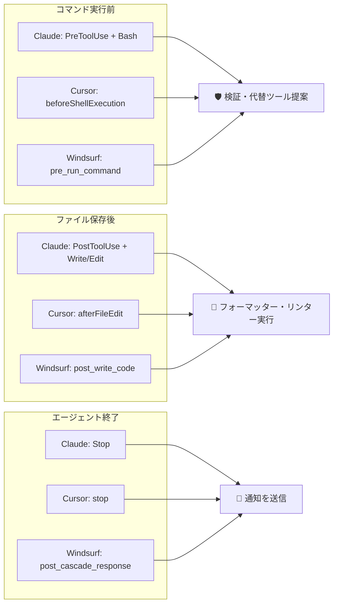

<p align="center">
  
</p>

<h1 align="center">claw-hooks</h1>

<p align="center">
  シンプルなTOML設定でClaude Code・Cursor・Windsurfに対応 - コマンドブロック、自動フォーマット、通知
</p>

<p align="center">
  <a href="https://github.com/owayo/claw-hooks/actions/workflows/ci.yml">
    
  </a>
  <a href="https://github.com/owayo/claw-hooks/releases/latest">
    
  </a>
  <a href="LICENSE">
    
  </a>
</p>

<p align="center">
  <a href="README.md">English</a> |
  <a href="README.ja.md">日本語</a>
</p>

---

## 機能

- 🦀 **Rust製** - 低オーバーヘッド、軽量シングルバイナリ、超高速（起動<10ms）
- ⚡ **Killコマンドブロック** - `kill`, `pkill`, `killall`, `taskkill`をブロックし、[safe-kill](https://github.com/owayo/safe-kill)を提案
- 🗑️ **RMコマンドブロック** - `rm`, `rmdir`, `del`, `erase`をブロックし、[safe-rm](https://github.com/owayo/safe-rm)を提案
- 💾 **DDコマンドブロック** - ディスク上書き事故を防ぐため、オプションで`dd`をブロック
- 🌳 **AST解析** - [tree-sitter-bash](https://github.com/tree-sitter/tree-sitter-bash)を使用した正確なコマンド解析（sudo、bash -c、パイプ内のコマンドを検出）
- 🔧 **カスタムコマンドフィルター** - 正規表現サポート付きのカスタムフィルターを定義
- 📁 **拡張子フック** - ファイル変更時に外部ツール（フォーマッター、リンター）を実行
- 🔔 **Stopフック** - エージェントループ終了時にコマンドを実行（通知、git commit（[git-sc](https://github.com/owayo/git-smart-commit)等）、クリーンアップ等）
- 🔌 **マルチエージェント対応** - Claude Code、Cursor、Windsurfに対応

## なぜ claw-hooks？

ネイティブフックは単純なタスクでも複雑なPython/Bashスクリプトが必要です。claw-hooksはシンプルなTOML設定に削減します。

### ネイティブフック（複雑）

**Claude Code** - `rm`コマンドをブロックするにはPythonスクリプトが必要:

```python
#!/usr/bin/env python3
import json
import sys

def main():
    input_data = json.loads(sys.stdin.read())
    tool_name = input_data.get("tool_name", "")
    tool_input = input_data.get("tool_input", {})

    if tool_name == "Bash":
        command = tool_input.get("command", "")
        dangerous = ["rm ", "rm -", "rmdir"]
        if any(cmd in command for cmd in dangerous):
            result = {
                "decision": "block",
                "message": "🚫 Dangerous command blocked"
            }
            print(json.dumps(result))
            sys.exit(2)

    print(json.dumps({"decision": "approve"}))
    sys.exit(0)

if __name__ == "__main__":
    main()
```

さらに`settings.json`で設定:

```json
{
  "hooks": {
    "PreToolUse": [{
      "matcher": "Bash",
      "hooks": [{"type": "command", "command": "python3 /path/to/hook.py"}]
    }]
  }
}
```

**Cursor/Windsurf** - 異なるJSON構造をパースする同様の複雑さ。

**代替案: 正規表現ワンライナー** - 保守が困難で機能も限定的:

```json
{
  "hooks": {
    "PreToolUse": [{
      "matcher": "Bash",
      "hooks": [{
        "type": "command",
        "command": "jq -r '.tool_input.command // \"\"' | grep -qE '^rm(dir)?\\b' && { echo '🚫 Dangerous command blocked' >&2; exit 2; }; exit 0"
      }]
    }]
  }
}
```

正規表現アプローチの問題点:
- ❌ `sudo rm`、`cd /tmp && rm`、パイプ内のコマンドを検出できない
- ❌ 複数のブロックコマンドを追加しにくい
- ❌ コマンドタイプごとのカスタムメッセージ不可
- ❌ jq依存が必要
- ❌ エージェントごとに異なる正規表現が必要

**拡張子フック（フォーマッター/リンター）** - さらに複雑:

```bash
# 正規表現ワンライナー - 保守不能になる
jq -r '.tool_input.file_path // ""' | xargs -I{} sh -c 'case "{}" in *.rs) rustfmt "{}" ;; *.py) ruff format "{}" && ruff check --fix "{}" ;; *.ts|*.tsx) biome format --write "{}" && biome lint --write "{}" ;; esac'
```

またはPythonスクリプト:

```python
#!/usr/bin/env python3
import json
import sys
import subprocess
import os

def main():
    input_data = json.loads(sys.stdin.read())
    tool_name = input_data.get("tool_name", "")
    tool_input = input_data.get("tool_input", {})

    if tool_name in ["Write", "Edit", "MultiEdit"]:
        file_path = tool_input.get("file_path", "")
        ext = os.path.splitext(file_path)[1]

        commands = {
            ".rs": ["rustfmt {}"],
            ".py": ["ruff format {}", "ruff check --fix {}"],
            ".ts": ["biome format --write {}", "biome lint --write {}"],
            ".tsx": ["biome format --write {}", "biome lint --write {}"],
        }

        if ext in commands:
            for cmd in commands[ext]:
                subprocess.run(cmd.format(file_path), shell=True)

    print(json.dumps({"decision": "approve"}))

if __name__ == "__main__":
    main()
```

### claw-hooks（シンプル）

**危険なコマンドのブロックは2行:**

```toml
rm_block = true
rm_block_message = "🚫 Use safe-rm instead"
```

**拡張子フックはシンプルなマップ:**

```toml
[extension_hooks]
".rs" = ["rustfmt {file}"]
".py" = ["ruff format {file}", "ruff check --fix {file}"]
".ts" = ["biome format --write {file}", "biome lint --write {file}"]
".tsx" = ["biome format --write {file}", "biome lint --write {file}"]
```

**なぜ高精度か:**
- ✅ tree-sitter-bashによるAST解析で正確なコマンド検出
- ✅ クォート対応（コマンドを検出、クォート内の引数は無視）
- ✅ `sudo rm`、`cd /tmp && rm`、パイプ内のコマンドも検出
- ✅ ラッパー・サブシェル対応（sudo、bash -c、xargs）
- ✅ 単一バイナリ、Python/jq依存なし

一度設定するだけ:

```json
{
  "hooks": {
    "PreToolUse": [{
      "matcher": "Bash",
      "hooks": [{"type": "command", "command": "claw-hooks hook"}]
    }]
  }
}
```

### 比較

| 機能 | ネイティブフック | claw-hooks |
|------|------------------|------------|
| 危険なコマンドをブロック | コマンドごとに25行以上のPython | TOML 1行 |
| カスタムフィルター | フィルターごとに新しいスクリプト | `[[custom_filters]]`に追加 |
| 拡張子フック（フォーマッター） | 複雑なファイル検出スクリプト | `[extension_hooks]`マップ |
| マルチエージェント対応 | エージェントごとに異なるスクリプト | 単一バイナリ + `--format` |
| 停止通知 | カスタム通知スクリプト | `[[stop_hooks]]`設定 |

## 動作要件

- **OS**: macOS, Linux, Windows
- **依存**: なし（単一バイナリ）

## インストール

### ソースから

```bash
git clone https://github.com/owayo/claw-hooks.git
cd claw-hooks
cargo build --release
```

バイナリ: `target/release/claw-hooks`

### ビルド済みバイナリ

[Releases](https://github.com/owayo/claw-hooks/releases)からダウンロード。

## クイックスタート

```bash
# デフォルト設定を生成
claw-hooks init

# 安全なコマンドでテスト（許可）
echo '{"hook_event_name":"PreToolUse","tool_name":"Bash","tool_input":{"command":"git status"}}' | claw-hooks hook
# 出力: {"decision":"approve"}

# 危険なコマンドでテスト（ブロック）
echo '{"hook_event_name":"PreToolUse","tool_name":"Bash","tool_input":{"command":"rm -rf /"}}' | claw-hooks hook
# 出力: {"decision":"block","message":"🚫 Use safe-rm instead..."}
```

## 使用方法

### コマンド

| コマンド | 説明 |
|---------|------|
| `hook` (別名: `run`) | stdinからフックイベントを処理 |
| `init` | デフォルト設定を生成 |
| `check` | 設定を検証 |
| `version` | バージョンを表示 |

### オプション

| オプション | 短縮形 | 説明 |
|-----------|--------|------|
| `--format` | `-f` | 入力形式: `claude` (デフォルト), `cursor`, `windsurf` |
| `--config` | `-c` | 設定ファイルのパス |
| `--help` | `-h` | ヘルプを表示 |

### 例

```bash
# Claude Codeフックを処理（デフォルト）
claw-hooks hook

# Cursorフックを処理
claw-hooks hook --format cursor

# Windsurfフックを処理
claw-hooks hook --format windsurf

# カスタム設定を使用
claw-hooks hook --config /path/to/config.toml
```

## エージェント統合

### Claude Code

`~/.claude/settings.json`（ユーザー）または`.claude/settings.json`（プロジェクト）に追加:

```json
{
  "hooks": {
    "PreToolUse": [
      {
        "matcher": "Bash",
        "hooks": [{ "type": "command", "command": "claw-hooks hook" }]
      }
    ],
    "PostToolUse": [
      {
        "matcher": "Write|Edit|MultiEdit",
        "hooks": [{ "type": "command", "command": "claw-hooks hook" }]
      }
    ],
    "Stop": [
      {
        "matcher": "",
        "hooks": [{ "type": "command", "command": "claw-hooks hook" }]
      }
    ]
  }
}
```

### Cursor

`~/.cursor/hooks.json`（ユーザー）または`<project>/.cursor/hooks.json`（プロジェクト）に追加:

```json
{
  "version": 1,
  "hooks": {
    "beforeShellExecution": [
      { "command": "claw-hooks hook --format cursor" }
    ],
    "afterFileEdit": [
      { "command": "claw-hooks hook --format cursor" }
    ],
    "stop": [
      { "command": "claw-hooks hook --format cursor" }
    ]
  }
}
```

### Windsurf (Cascade)

`~/.codeium/windsurf/hooks.json`（ユーザー）または`.windsurf/hooks.json`（プロジェクト）に追加:

```json
{
  "hooks": {
    "pre_run_command": [
      { "command": "claw-hooks hook --format windsurf", "show_output": true }
    ],
    "post_write_code": [
      { "command": "claw-hooks hook --format windsurf", "show_output": true }
    ],
    "post_cascade_response": [
      { "command": "claw-hooks hook --format windsurf", "show_output": true }
    ]
  }
}
```

## 設定

デフォルトの場所: `~/.config/claw-hooks/config.toml`（全プラットフォーム共通）

```toml
# コマンドブロック
rm_block = true                    # rm/rmdir/del/eraseをブロック（デフォルト: true）
kill_block = true                  # kill/pkill/killall/taskkillをブロック（デフォルト: true）
dd_block = true                    # ddコマンドをブロック（デフォルト: true）

# カスタムメッセージ（推奨: safe-rm/safe-killツールと併用）
# safe-rm: https://github.com/owayo/safe-rm
# safe-kill: https://github.com/owayo/safe-kill
rm_block_message = "🚫 Use safe-rm instead: safe-rm <file> (validates Git status and path containment). Only clean/ignored files in project allowed."
kill_block_message = "🚫 Use safe-kill instead: safe-kill <PID> or safe-kill -n <name> (like pkill). Use -s <signal> for signal."
dd_block_message = "🚫 dd command blocked for safety."

# デバッグログ
debug = false
# log_path = "~/.config/claw-hooks/logs"  # デフォルト: config.tomlと同じディレクトリ

# カスタムコマンドフィルター（正規表現対応）
[[custom_filters]]
command = "yarn"
message = "`yarn`の代わりに`pnpm`を使用してください"

# argsモード: コマンド（正規表現） + 引数マッチング
[[custom_filters]]
command = "npm"
args = ["install", "i", "add"]         # ブロック対象: npm install, npm i, npm add
message = "`npm`の代わりに`pnpm`を使用してください"

[[custom_filters]]
command = "pip3?"                       # 正規表現: pip または pip3 にマッチ
args = ["install", "uninstall"]
message = "`uv pip`を使用してください"

# 正規表現のみモード（argsを指定しない場合）
[[custom_filters]]
command = "python[23]? -m pip"         # より複雑なパターン
message = "`uv pip`を使用してください"

[[custom_filters]]
command = "docker"
args = ["rm", "rmi", "system prune"]   # ブロック対象: docker rm, docker rmi
message = "ユーザーに直接実行を依頼してください"

# 拡張子フック（ファイル書き込み/編集時にトリガー）
# マップ形式: ".ext" = ["cmd1 {file}", "cmd2 {file}"]
[extension_hooks]
".rs" = ["rustfmt {file}"]
".go" = ["gofmt -w {file}", "golangci-lint run {file}"]
".py" = ["ruff format {file}", "ruff check --fix {file}"]
".ts" = ["biome format --write {file}", "biome lint --write {file}"]
".tsx" = ["biome format --write {file}", "biome lint --write {file}"]
".css" = ["biome format --write {file}", "biome lint --write {file}"]

# Stopフック（エージェントループ終了時にトリガー）
[[stop_hooks]]
command = "afplay /System/Library/Sounds/Glass.aiff"  # macOS通知音

# [[stop_hooks]]
# command = "notify-send 'エージェント完了'"  # Linux通知
```

### カスタムフィルターの動作

カスタムフィルターは2つのモードをサポートしています:

**正規表現モード**（デフォルト）: `command`のみ指定した場合、正規表現パターンとして扱われます。

```toml
[[custom_filters]]
command = "python[23]? -m pip"    # 複雑な正規表現パターン
message = "uv pipを使用してください"
```

**argsモード**: `args`を指定した場合、`command`は正規表現パターンとしてコマンド名に対してマッチされ、argsのいずれかにマッチするとフィルターが発動します。

```toml
[[custom_filters]]
command = "npm"                    # 正規表現パターン（コマンド名）
args = ["install", "i", "add"]     # 第1引数がこれらのいずれかにマッチ
message = "pnpmを使用してください"

[[custom_filters]]
command = "pip3?"                  # pip と pip3 両方にマッチ
args = ["install", "uninstall"]    # 第1引数がこれらのいずれかにマッチ
message = "uv pipを使用してください"
```

両モードとも `;`、`&&`、`||`、`|` でチェーンされたコマンドも検出します:

```bash
# ブロック: セミコロンの後の yarn を検出
echo "install"; yarn install
# → {"decision":"block","message":"`yarn`の代わりに`pnpm`を使用してください"}

# 許可: "yarn" はクォート内（コマンドではない）、pnpm は OK
echo "not yarn install"; pnpm install
# → {"decision":"approve"}
```

クォート内のコマンドは無視されます（引数であり、コマンドではないため）。

## フォーマット検出ロジック

各AIエージェントは異なるJSON構造を送信します。claw-hooksは`--format`を使用してパース方法を決定します。

### Claude Code (`--format claude`)

Claude Code公式フック仕様を使用:

```jsonc
// PreToolUse/PostToolUseイベント
{
  "hook_event_name": "PreToolUse",
  "tool_name": "Bash",
  "tool_input": { "command": "..." },
  "session_id": "...",
  "cwd": "/path/to/project"
}

// Stopイベント（tool_name/tool_inputなし）
{
  "hook_event_name": "Stop",
  "stop_hook_active": true,
  "session_id": "..."
}
```

対応フックイベント: `PreToolUse`, `PostToolUse`, `Stop`, `Notification`, `UserPromptSubmit`, `SessionStart`, `SessionEnd`

### Cursor (`--format cursor`)

JSONにイベントタイプを含みません。フィールドの存在で検出:

| JSONフィールド | 検出されるフック | 内部マッピング |
|---------------|-----------------|----------------|
| `command` | `beforeShellExecution` | PreToolUse + Bash |
| `file_path` / `filePath` | `afterFileEdit` | PostToolUse + Write |
| `status` | `stop` | Stop |

### Windsurf (`--format windsurf`)

`agent_action_name`フィールドを使用:

| agent_action_name | 内部マッピング |
|-------------------|----------------|
| `pre_run_command` | PreToolUse + Bash |
| `post_write_code` | PostToolUse + Write |
| `post_cascade_response` | Stop |

### イベントマッピング



## 入出力リファレンス

### 入力 (stdin)

```json
{
  "hook_event_name": "PreToolUse",
  "tool_name": "Bash",
  "tool_input": { "command": "rm -rf /tmp/test" },
  "session_id": "abc123"
}
```

### 出力 (stdout)

**許可**: `{"decision":"approve"}`

**ブロック**: `{"decision":"block","message":"Use safe-rm instead..."}`

### 終了コード

| コード | 意味 |
|--------|------|
| `0` | 許可 |
| `2` | ブロック |

## パフォーマンス

| 項目 | 値 |
|------|-----|
| 起動時間 | 10ms未満 |

## 開発

### 前提条件

- Rust 1.75+
- Cargo

### ビルド

```bash
cargo build           # デバッグ
cargo build --release # リリース
```

### テスト

```bash
cargo test
cargo test -- --nocapture  # 詳細出力
```

### リント

```bash
cargo clippy
cargo fmt --check
```

## ライセンス

[MIT](LICENSE)

## コントリビュート

コントリビュートは歓迎します！お気軽にPull Requestを送ってください。
