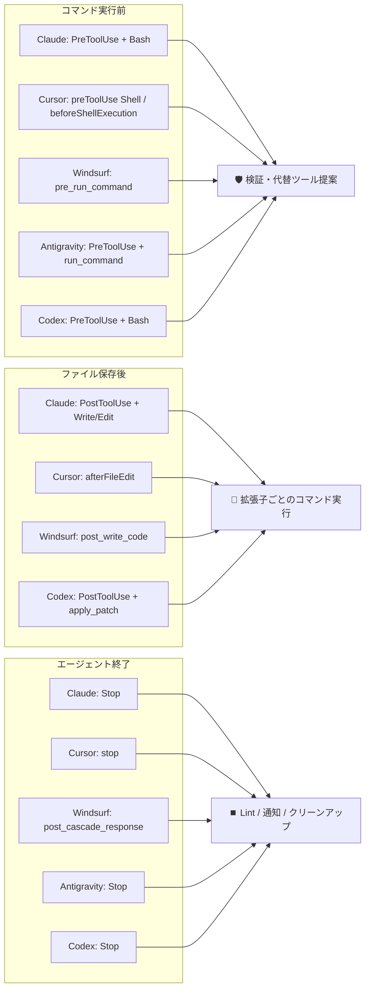

<p align="center">
  
</p>

<h1 align="center">claw-hooks</h1>

<p align="center">
  シンプルなTOML設定でClaude Code・Cursor・Windsurf・Antigravity CLI・Codex CLIに対応 - コマンドブロック、自動フォーマット、Stop時自動化
</p>

<p align="center">
  <a href="https://github.com/owayo/claw-hooks/actions/workflows/ci.yml">
    
  </a>
  <a href="https://github.com/owayo/claw-hooks/releases/latest">
    
  </a>
  <a href="LICENSE">
    
  </a>
</p>

<p align="center">
  <a href="README.md">English</a> |
  <a href="README.ja.md">日本語</a>
</p>

---

## 機能

- 🦀 **Rust製** - 低オーバーヘッド、軽量シングルバイナリ、超高速（起動<10ms）
- ⚡ **Killコマンドブロック** - `kill`, `pkill`, `killall`, `taskkill`をブロックし、[safe-kill](https://github.com/owayo/safe-kill)を提案
- 🗑️ **RMコマンドブロック** - `rm`, `rmdir`, `del`, `erase`をブロックし、[safe-rm](https://github.com/owayo/safe-rm)を提案
- 💾 **DDコマンドブロック** - ディスク上書き事故を防ぐため、オプションで`dd`をブロック
- 🌳 **AST解析** - [tree-sitter-bash](https://github.com/tree-sitter/tree-sitter-bash) でラッパー（`sudo`、`timeout`、`command`、`exec`、`pkexec`、`gosu`、`su`）、サブシェル、パイプ、`eval`、`find -exec`、`bash -c`/`-lc`、コマンド置換、ブレースグループ、制御構文（`if`/`for`/`while`/`case`）、basename/拡張子/大文字小文字の正規化、シェル quote removal 形式を扱う。文字列フォールバックパーサー（非 `ast-parser` ビルド）も同等のカバレッジを維持
- 🔧 **カスタムコマンドフィルター** - 正規表現サポート付きのカスタムフィルターを定義
- 📁 **拡張子フック** - ファイル保存・編集完了後にのみ外部ツール（フォーマッター、リンター）を実行し、lint 出力を Claude Code / Codex CLI に `additionalContext` で送信。Antigravity CLI も `PostToolUse` は発火するが、ペイロードに元の `toolCall` が含まれず編集ファイルを特定できないため、ファイル単位の拡張子フックは Stop hooks のプロジェクト全体 lint で代替
- ⏹️ **Stopフック** - エージェントループ終了時にコマンドを実行（通知、git commit（[git-sc](https://github.com/owayo/git-smart-commit)等）、クリーンアップ等）
- 🧹 **Stop時プロジェクト全体Lint** - プロジェクト構成ファイル（`Cargo.toml`、`tsconfig.json` 等）を自動検出して lint/typecheck を実行。失敗はエージェントに返却（Windsurf はベストエフォート）
- ⏱️ **フックタイムアウト** - フックごとに設定可能（デフォルト 60 秒）。Unix ではプロセスグループ全体を SIGKILL するため、`sh -c '...'` 経由の孫プロセスも残らず停止
- 📏 **出力長制限** - エージェントのコンテキスト溢れを防ぐマルチバイト安全な切り詰め（デフォルト 1000 文字）
- 🗜️ **出力圧縮** - 装飾文字の連続（`.`、`=`、`-`、`─`、`━`、`^`、`·`、`→`、`_`）、`\r` で上書きされる進捗バー、cargo の繰り返し `Compiling`/`Blocking` ログ、共通絶対パスのプレフィックス、rustc/ruff/biome のマルチライン span 下線や枠線、Biome の空白可視化マーカーや重複行番号ペアを圧縮。本来の診断情報には触れない
- 🛡️ **デバッグログ安全性** - 永続化するのはイベント/ツール/セッションとバイト数サマリーのみ。生コマンド、ファイル本文、エージェントメッセージ、整形済み formatter/linter 出力はディスクに残さない（本文確認は `--trace` の stderr 経由のみ）
- 🛑 **入力サイズ上限** - stdin は 4 MiB 上限。巨大ペイロードや不正 UTF-8 は OOM kill ではなくフェイルクローズドで止める（空 stdout 異常終了は Antigravity/Codex に「判定スキップ＝フェイルオープン」と誤解されるため、その挙動を回避）
- 📂 **プロジェクト設定マージ** - プロジェクトルートに `.claw-hooks.toml` を配置してグローバル設定をプロジェクトごとに上書き/拡張
- 🔌 **マルチエージェント対応** - Claude Code、Cursor、Windsurf、Antigravity CLI、Codex CLIに対応

## なぜ claw-hooks？

エージェント標準のフックは、危険コマンドのチェック 1 つ、フォーマッター 1 つに対しても Python/Bash スクリプトをエージェントごとに用意する必要があります。claw-hooks ならこれが TOML 設定だけで済みます。

```toml
# 危険コマンドをブロック
rm_block = true
rm_block_message = "🚫 Use safe-rm instead"

# 保存時に自動フォーマット
[extension_hooks]
".rs"  = ["rustfmt {file}"]
".py"  = ["ruff format --check {file}", "ruff check --preview --select=I,F,DOC {file}"]
".ts"  = ["biome check {file}"]
".tsx" = ["biome check {file}"]
```

…各エージェントのフック設定で claw-hooks を一度呼び出すだけ:

```json
{
  "hooks": {
    "PreToolUse": [{
      "matcher": "Bash",
      "hooks": [{"type": "command", "command": "claw-hooks hook"}]
    }]
  }
}
```

素朴な `grep -E '^rm '` では `sudo rm`、`cd /tmp && rm`、`bash -lc 'rm …'`、パイプ、`xargs`、ブレースグループ、プロセス置換、特権昇格ラッパー（`pkexec` / `gosu` / `su <user> cmd`）、シェル quote-removal 形式（`r\m`、`$'r\x6d'`）を取りこぼします。claw-hooks は tree-sitter-bash（同等カバレッジの文字列フォールバックパーサーつき）でこれらすべてに対処します。単一バイナリ、Python/jq 依存なし、Claude Code / Cursor / Windsurf / Antigravity / Codex で同じ挙動になります。

<details>
<summary>同等のネイティブ Python フックの例</summary>

```python
#!/usr/bin/env python3
import json, sys

data = json.loads(sys.stdin.read())
if data.get("tool_name") == "Bash":
    cmd = data.get("tool_input", {}).get("command", "")
    if any(s in cmd for s in ("rm ", "rm -", "rmdir")):
        print(json.dumps({
            "hookSpecificOutput": {
                "hookEventName": "PreToolUse",
                "permissionDecision": "deny",
                "permissionDecisionReason": "🚫 Dangerous command blocked",
            }
        }))
        sys.exit(2)
sys.exit(0)
```

これをエージェントごと、危険コマンドごと、フォーマッターごとに複製し、quote/ラッパー処理を毎回再実装することになります。
</details>

### 拡張子フックのルール

- 各コマンドテンプレートには `{file}` プレースホルダーを 1 つだけ含めます。
- 保存後・編集後イベントのみ: Claude `PostToolUse` (`Write`/`Edit`)、Cursor `afterFileEdit`、Windsurf `post_write_code`、Codex `PostToolUse` + `apply_patch`。Antigravity の `PostToolUse` も発火するが、ペイロードに元の `toolCall` が含まれず編集ファイルパスを復元できないため、プロジェクト全体の lint/typecheck を Stop hooks で回します。
- Codex の `PostToolUse` + `Bash` はパススルー。`apply_patch` は変更ファイルパスを抽出して拡張子フックに渡します（削除のみの patch はスキップ）。
- パスに `../`、リダイレクトメタ文字（`<`、`>`）、タブ、改行、NUL バイトを含むものは拒否。必須フィールドを欠くペイロードはフェイルクローズドで拒否。

### 比較

| 機能 | ネイティブフック | claw-hooks |
|------|------------------|------------|
| 危険なコマンドをブロック | コマンドごとに25行以上のPython | TOML 1行 |
| カスタムフィルター | フィルターごとに新しいスクリプト | `[[custom_filters]]`に追加 |
| 拡張子フック（フォーマッター） | 複雑なファイル検出スクリプト | `[extension_hooks]`マップ |
| lint出力をエージェントに送信 | 手動でJSON構築 | 自動（Claude Code、Codex CLI）、Antigravity CLI は Stop hooks 経由* |
| マルチエージェント対応 | エージェントごとに異なるスクリプト | 単一バイナリ + `--format` |
| Stopフック（lint、通知等） | ユースケースごとにスクリプト作成 | `[[stop_hooks]]`設定 |

\* lint/フォーマッターの出力は、対応するフックランタイムでは `additionalContext` 経由で自動送信され、エージェントが警告を修正できます。

## 動作要件

- **OS**: macOS, Linux, Windows
- **依存**: なし（単一バイナリ）

## インストール

### Homebrew (macOS/Linux)

```bash
brew install owayo/claw-hooks/claw-hooks
```

### ソースから

```bash
git clone https://github.com/owayo/claw-hooks.git
cd claw-hooks
cargo build --release
```

バイナリ: `target/release/claw-hooks`

### GitHub Releases から

**macOS (Apple Silicon)**
```bash
curl -L https://github.com/owayo/claw-hooks/releases/latest/download/claw-hooks-aarch64-apple-darwin.tar.gz | tar xz
sudo mv claw-hooks /usr/local/bin/
```

**macOS (Intel)**
```bash
curl -L https://github.com/owayo/claw-hooks/releases/latest/download/claw-hooks-x86_64-apple-darwin.tar.gz | tar xz
sudo mv claw-hooks /usr/local/bin/
```

**Linux (x86_64)**
```bash
curl -L https://github.com/owayo/claw-hooks/releases/latest/download/claw-hooks-x86_64-unknown-linux-gnu.tar.gz | tar xz
sudo mv claw-hooks /usr/local/bin/
```

**Linux (ARM64)**
```bash
curl -L https://github.com/owayo/claw-hooks/releases/latest/download/claw-hooks-aarch64-unknown-linux-gnu.tar.gz | tar xz
sudo mv claw-hooks /usr/local/bin/
```

**Windows**

[Releases](https://github.com/owayo/claw-hooks/releases/latest) から `claw-hooks-x86_64-pc-windows-msvc.zip` をダウンロードし、展開してPATHに追加してください。

## クイックスタート

```bash
# デフォルト設定を生成
claw-hooks init

# 安全なコマンドでテスト（許可）
echo '{"hook_event_name":"PreToolUse","tool_name":"Bash","tool_input":{"command":"git status"}}' | claw-hooks hook
# 出力: {"hookSpecificOutput":{"hookEventName":"PreToolUse","permissionDecision":"allow"}}

# 危険なコマンドでテスト（ブロック）
echo '{"hook_event_name":"PreToolUse","tool_name":"Bash","tool_input":{"command":"rm -rf /"}}' | claw-hooks hook
# 出力: {"hookSpecificOutput":{"hookEventName":"PreToolUse","permissionDecision":"deny","permissionDecisionReason":"🚫 Use safe-rm instead..."}}
```

## 使用方法

### コマンド

| コマンド | 説明 |
|---------|------|
| `hook` (別名: `run`) | stdinからフックイベントを処理 |
| `init` | デフォルト設定を生成 |
| `check` | 設定を検証 |
| `version` | バージョンを表示 |

### オプション

| オプション | 短縮形 | 説明 |
|-----------|--------|------|
| `--format` | `-f` | 入力形式: `claude` (デフォルト), `cursor`, `windsurf`, `agy` (Antigravity CLI), `codex` |
| `--config` | `-c` | 設定ファイルのパス |
| `--help` | `-h` | ヘルプを表示 |

### 例

```bash
# Claude Codeフックを処理（デフォルト）
claw-hooks hook

# Cursorフックを処理
claw-hooks hook --format cursor

# Windsurfフックを処理
claw-hooks hook --format windsurf

# Antigravity CLIフックを処理
claw-hooks hook --format agy

# Codex CLIフックを処理
claw-hooks hook --format codex

# カスタム設定を使用
claw-hooks hook --config /path/to/config.toml
```

## エージェント統合

### Claude Code

`~/.claude/settings.json`（ユーザー）または`.claude/settings.json`（プロジェクト）に追加:

```json
{
  "hooks": {
    "PreToolUse": [
      {
        "matcher": "Bash",
        "hooks": [{ "type": "command", "command": "claw-hooks hook" }]
      }
    ],
    "PostToolUse": [
      {
        "matcher": "Write|Edit|MultiEdit",
        "hooks": [{ "type": "command", "command": "claw-hooks hook" }]
      }
    ],
    "Stop": [
      {
        "matcher": "",
        "hooks": [{ "type": "command", "command": "claw-hooks hook" }]
      }
    ]
  }
}
```

### Cursor

`~/.cursor/hooks.json`（ユーザー）または`<project>/.cursor/hooks.json`（プロジェクト）に追加:

```json
{
  "version": 1,
  "hooks": {
    "preToolUse": [
      { "command": "claw-hooks hook --format cursor", "failClosed": true }
    ],
    "beforeShellExecution": [
      { "command": "claw-hooks hook --format cursor", "failClosed": true }
    ],
    "afterFileEdit": [
      { "command": "claw-hooks hook --format cursor" }
    ],
    "stop": [
      { "command": "claw-hooks hook --format cursor" }
    ]
  }
}
```

> **コマンドブロック用フックには `failClosed: true` を推奨します。** Cursor は既定でフェイルオープンです。正常なブロック（exit 2 / `permission: deny`）は `failClosed` なしでも機能しますが、claw-hooks 自体がクラッシュ・タイムアウトした場合、`failClosed: true` を設定していないと Cursor はコマンドを通してしまいます。`afterFileEdit`/`stop` では付けません（フォーマッター/lint のクラッシュでエージェントを止めるべきではないため）。

### Windsurf (Cascade)

`~/.codeium/windsurf/hooks.json`（ユーザー）または`.windsurf/hooks.json`（プロジェクト）に追加:

```json
{
  "hooks": {
    "pre_run_command": [
      { "command": "claw-hooks hook --format windsurf", "show_output": true }
    ],
    "post_write_code": [
      { "command": "claw-hooks hook --format windsurf", "show_output": true }
    ],
    "post_cascade_response": [
      { "command": "claw-hooks hook --format windsurf", "show_output": true }
    ]
  }
}
```

### Antigravity CLI

`~/.gemini/config/hooks.json`（ユーザー）または `<project>/.agents/hooks.json`（プロジェクトワークスペース）に追加:

```json
{
  "claw-hooks": {
    "PreToolUse": [
      {
        "matcher": "run_command",
        "hooks": [{ "type": "command", "command": "claw-hooks hook --format agy" }]
      }
    ],
    "Stop": [
      { "type": "command", "command": "claw-hooks hook --format agy" }
    ]
  }
}
```

注意点:
- Antigravity の `PostToolUse` イベントには元の `toolCall` が含まれません。そのためファイル単位の拡張子フックは利用できません。代わりに Stop hooks でプロジェクト全体の lint/typecheck を回し、失敗を `{"decision":"continue","reason":"..."}` でエージェントに再投入してください。
- `PreInvocation` / `PostInvocation` は claw-hooks のスコープ外（モデル呼び出し前後のオーケストレーション）なので、自動的にパススルーされます。これらのイベントは hook 登録不要です。
- Antigravity hooks 公式仕様: <https://antigravity.google/docs/customizations/hooks>

### Codex CLI

`~/.codex/hooks.json`（ユーザー）に追加:

```json
{
  "hooks": {
    "PreToolUse": [
      {
        "matcher": "Bash",
        "hooks": [
          {
            "type": "command",
            "command": "claw-hooks hook --format codex"
          }
        ]
      }
    ],
    "PermissionRequest": [
      {
        "matcher": "Bash",
        "hooks": [
          {
            "type": "command",
            "command": "claw-hooks hook --format codex"
          }
        ]
      }
    ],
    "PostToolUse": [
      {
        "matcher": "Bash|apply_patch|Edit|Write",
        "hooks": [
          {
            "type": "command",
            "command": "claw-hooks hook --format codex"
          }
        ]
      }
    ],
    "Stop": [
      {
        "hooks": [
          {
            "type": "command",
            "command": "claw-hooks hook --format codex"
          }
        ]
      }
    ]
  }
}
```

Codex hooks はデフォルトで有効です。明示的に機能フラグを設定する場合は、現行の `[features] hooks` キーを使用してください。旧 `codex_hooks` エイリアスは非推奨です。

## 設定

デフォルトの場所: `~/.config/claw-hooks/config.toml`（全プラットフォーム共通）

```toml
# コマンドブロック
rm_block = true                    # rm/rmdir/del/eraseをブロック（デフォルト: true）
kill_block = true                  # kill/pkill/killall/taskkillをブロック（デフォルト: true）
dd_block = true                    # ddコマンドをブロック（デフォルト: true）

# カスタムメッセージ（推奨: safe-rm/safe-killツールと併用）
# safe-rm: https://github.com/owayo/safe-rm
# safe-kill: https://github.com/owayo/safe-kill
rm_block_message = "🚫 Use safe-rm instead: safe-rm <file> (validates Git status and path containment). Only clean/ignored files in project allowed."
kill_block_message = "🚫 Use safe-kill instead: safe-kill <PID> or safe-kill -n <name> (like pkill). Use -s <signal> for signal."
dd_block_message = "🚫 dd command blocked for safety."

# デバッグログ
debug = false
# log_path = "~/.config/claw-hooks/logs"  # デフォルト: config.tomlと同じディレクトリ
# デバッグログにはフックイベントの概要のみを記録し、生のコマンド、ファイル本文、エージェントメッセージは保存しません

# フックコマンドタイムアウト（秒）（デフォルト: 60、最大: 86400）
# report=true のStopフックと拡張子フックコマンドに適用されます。
# このタイムアウトを超えたコマンドはkill（SIGKILL）され、失敗として報告されます。
# report=false のStopフックはデタッチ起動され、完了を待ちません。
# hook_timeout = 60

# 出力最大長（文字数）（デフォルト: 1000、0 = 無制限）
# AIエージェントのコンテキストウィンドウ溢れを防止
# output_max_length = 1000

# カスタムコマンドフィルター（正規表現対応）
[[custom_filters]]
command = "yarn"
message = "`yarn`の代わりに`pnpm`を使用してください"

# argsモード: コマンド（正規表現） + 引数マッチング
[[custom_filters]]
command = "npm"
args = ["install", "i", "add"]         # ブロック対象: npm install, npm i, npm add
message = "`npm`の代わりに`pnpm`を使用してください"

[[custom_filters]]
command = "pip3?"                       # 正規表現: pip または pip3 にマッチ
args = ["install", "uninstall"]
message = "`uv pip`を使用してください"

# 正規表現のみモード（argsを指定しない場合）
[[custom_filters]]
command = "python[23]? -m pip"         # より複雑なパターン
message = "`uv pip`を使用してください"

[[custom_filters]]
command = "docker"
args = ["rm", "rmi", "system prune"]   # ブロック対象: docker rm, docker rmi
message = "ユーザーに直接実行を依頼してください"

# 拡張子フック（ファイル書き込み/編集時にトリガー）
# マップ形式: ".ext" = ["cmd1 {file}", "cmd2 {file}"]
# 出力（stdout/stderr）は、対応するフックランタイムでは additionalContext としてAIエージェントに送信
# 各コマンドテンプレートは {file} をちょうど1回含める必要があります
# 親ディレクトリ遡りパス（../）は安全のため拒否されます
# シェルのリダイレクトメタ文字（<, >）を含むパスは安全のため拒否されます
# タブ/改行/NUL は引数分割や不正なパスを防ぐため拒否されます
# Windows では `cmd /c` のメタ文字（%, !, ^, "）も変数展開インジェクション防止のため拒否されます
[extension_hooks]
".css" = ["biome format --write {file}", "biome lint --write {file}"]
".py" = ["ruff format --check {file}", "ruff check --preview --select=I,F,DOC {file}"]
".rs" = ["rustfmt {file}"]
".ts" = ["biome check {file}"]
".tsx" = ["biome check {file}"]

# Stopフック（エージェントループ終了時にトリガー）
# 配列内のすべてのコマンドは並列実行されます。
# conditionなしのフックはデフォルトで report=false となりデタッチ起動されます。
# stdout/stderr は破棄されるため、必要ならコマンド側でリダイレクトしてください。
# [[stop_hooks]]
# commands = ["afplay /System/Library/Sounds/Glass.aiff"]  # macOS通知音

# [[stop_hooks]]
# commands = ["notify-send 'エージェント完了'"]  # Linux通知

# 条件付きStopフック（Stop時にプロジェクト全体のlintを実行）
# プロジェクト構成ファイルの存在とツールの利用可能性を検出し、lint/typecheckを実行。
# 失敗時は、Stop時フィードバックに対応したエージェントでは結果をAIへ返し、
# エージェントが問題を修正します（Windsurf はベストエフォート）。
# conditionフィールド（AND条件）: file_exists, command_exists
[[stop_hooks]]
commands = ["cargo clippy --all-targets --all-features -- -D warnings", "cargo fmt --check"]
condition = { file_exists = "Cargo.toml" }

[[stop_hooks]]
commands = ["pnpm exec tsc --noEmit"]
condition = { file_exists = "tsconfig.json" }

[[stop_hooks]]
commands = ["ruff format .", "ruff check --preview --fix --select=I,F,DOC --unsafe-fixes"]
condition = { file_exists = "pyproject.toml", command_exists = "ruff" }

[[stop_hooks]]
commands = ["biome check --write ."]
condition = { file_exists = "package.json" }
```

### プロジェクトごとの設定

claw-hooksはデフォルトでグローバル設定ファイル（`~/.config/claw-hooks/config.toml`）を使用します。プロジェクトごとに動作をカスタマイズする方法は3つあります:

**1. `.claw-hooks.toml` — 自動検出されるプロジェクト設定（推奨）**

プロジェクトルートに `.claw-hooks.toml` を配置するだけです。claw-hooksはカレントディレクトリ直下の `.claw-hooks.toml` を自動検出し、グローバル設定とマージします。`--config` フラグは不要です。

```toml
# my-project/.claw-hooks.toml

# 上書き: このプロジェクトでは dd ブロックを無効化
dd_block = false

# 上書き: プロジェクト固有の拡張子フック（グローバルを完全置換）
[extension_hooks]
".rs" = ["rustfmt {file}"]
".ts" = ["biome check {file}"]

# マージ: 追加のStopフック（グローバルのStopフックに追加）
[[stop_hooks]]
commands = ["pnpm exec tsc --noEmit"]
condition = { file_exists = "tsconfig.json" }
```

**マージルール:**

| フィールド | ルール | 動作 |
|-----------|--------|------|
| `extension_hooks` | **上書き** | プロジェクトの定義がグローバルを完全置換 |
| `custom_filters` | **上書き** | プロジェクトの定義がグローバルを完全置換 |
| `stop_hooks` | **マージ** | グローバルとプロジェクトの両方が実行される |
| `rm_block`, `kill_block`, `dd_block` | **上書き** | プロジェクトの値が優先 |
| `*_block_message`, `hook_timeout`, `output_max_length` | **上書き** | プロジェクトの値が優先 |
| `debug`, `log_path`, `nano_buddy` | **グローバル専用** | プロジェクト設定では使用不可 |

省略されたフィールドはグローバルの値を維持します。空の配列（例: `custom_filters = []`）を設定すると、グローバルの値を明示的にクリアします。

`claw-hooks check` で検証できます — プロジェクト設定が見つかったかどうかと、その有効性を報告します。

**2. `--config` — 設定ファイルの完全置換**

`--config` を使用して完全な設定ファイルを指定し、グローバル設定を完全に置き換えます:

```toml
# my-project/.claude/claw-hooks.toml
rm_block = true
kill_block = true
dd_block = false  # このプロジェクトでは dd を許可

[extension_hooks]
".rs" = ["rustfmt {file}"]
```

```json
// my-project/.claude/settings.json
{
  "hooks": {
    "PreToolUse": [{
      "matcher": "Bash",
      "hooks": [{ "type": "command", "command": "claw-hooks hook --config .claude/claw-hooks.toml" }]
    }],
    "PostToolUse": [{
      "matcher": "Write|Edit|MultiEdit",
      "hooks": [{ "type": "command", "command": "claw-hooks hook --config .claude/claw-hooks.toml" }]
    }],
    "Stop": [{
      "matcher": "",
      "hooks": [{ "type": "command", "command": "claw-hooks hook --config .claude/claw-hooks.toml" }]
    }]
  }
}
```

**3. 条件付きStopフック — プロジェクト自動検出**

`file_exists` 条件付きのStopフックは、作業ディレクトリに基づいてプロジェクトタイプを自動判定します。単一のグローバル設定で複数のプロジェクトタイプに対応できます:

```toml
# ~/.config/claw-hooks/config.toml

# Rustプロジェクトのみで実行（Cargo.toml が存在する場合）
[[stop_hooks]]
commands = ["cargo clippy -- -D warnings"]
condition = { file_exists = "Cargo.toml" }

# TypeScriptプロジェクトのみで実行（tsconfig.json が存在する場合）
[[stop_hooks]]
commands = ["pnpm exec tsc --noEmit"]
condition = { file_exists = "tsconfig.json" }
```

3つのアプローチはすべて組み合わせ可能です。グローバル設定で共通ルールを定義し、`.claw-hooks.toml` でプロジェクト固有の上書きを行い、条件付きStopフックでプロジェクトタイプの自動検出を活用できます。

### 条件付きStopフック（プロジェクト全体Lint）

`condition`フィールドを持つStopフックは、プロジェクトの構成ファイルに応じてlint/typecheckコマンドを実行します。`commands`配列内のすべてのコマンドは**並列実行**されます。失敗したコマンドの出力はすべて収集され、AIエージェントにブロック理由としてまとめて返されます。
**タイムアウトの扱い:** `hook_timeout` は最大 `86400` 秒まで指定できます。報告対象のStopフック（`report = true`）では、`hook_timeout` を超えたコマンドを claw-hooks がプロセスツリーごと強制終了（SIGKILL）し、タイムアウトをブロック理由として返します。直接の子プロセスが終了しても、バックグラウンド孫プロセスが stdout/stderr パイプを保持している場合もタイムアウト扱いにするため、`sh -c 'sleep 60 &'` のようなコマンドでフックタイムアウトを回避できません。通常のコマンド失敗（終了コード `124` を自ら返す場合を含む）も引き続きブロック対象です。`report = false` のStopフックは stdin/stdout/stderr を null にしてデタッチ起動されるため、claw-hooks は完了待ちも `hook_timeout` の強制も行いません。必要ならコマンド自体を timeout ツールで包んでください。

ただし Windsurf は例外で、`post_cascade_response` が非同期の事後フックであるため、Stopフック自体は実行されても失敗はベストエフォート扱いとなり、AI エージェントへのブロックとしては返されません。

**Stopフックのフィールド:**

| フィールド | 型 | デフォルト | 説明 |
|-----------|------|-----------|------|
| `commands` | `string[]` | (必須) | 実行するコマンド（同じstage内で並列実行） |
| `condition` | `object` | (なし) | 実行条件（AND条件: `file_exists`, `command_exists`） |
| `stage` | `1-5` | `5` | 実行順序。小さいstageが先に実行される。同じstage内のフックは並列実行。 |
| `report` | `bool` | (自動) | 結果をAIエージェントに返すかどうか。デフォルト: `condition`ありなら`true`、なしなら`false`。 |

**conditionフィールド**（AND条件 — 指定されたすべての条件が真である必要があります）:

| フィールド | 説明 |
|-----------|------|
| `file_exists` | 作業ディレクトリにこのファイルが存在する場合のみ実行 |
| `command_exists` | このコマンドがPATH上に存在する場合のみ実行（Windows の `PATHEXT` を考慮。Unix では実行ビットが必要。`./tool` や `/usr/bin/tool` のような明示パスも判定可能） |

```toml
# ステージベースの実行: 分析 → lint → コミット
[[stop_hooks]]
commands = ["astro-sight impact --dir . --git"]
stage = 1        # 最初に実行
report = true    # 結果をAIに返す

[[stop_hooks]]
commands = ["cargo clippy --all-targets --all-features -- -D warnings", "cargo fmt --check"]
condition = { file_exists = "Cargo.toml" }
stage = 3
# report 未指定 → condition あり → true（デフォルト）

[[stop_hooks]]
commands = ["pnpm exec tsc --noEmit"]
condition = { file_exists = "tsconfig.json" }
stage = 3

[[stop_hooks]]
commands = ["git-sc --all --yes --quiet"]
# stage 未指定 → 5（最後）
# report 未指定 → condition なし → false（fire-and-forget）
```

**ステージの実行順序:** ステージは1から5の順に逐次実行されます。同じステージ内のすべてのフックは並列実行されます。あるステージの全フックが完了してから次のステージに進みます。

**レポート動作:** `report = true`（または`condition`によるデフォルト`true`）の場合、コマンド失敗はAIエージェントにブロック理由として返されます。`report = false`（または`condition`なしによるデフォルト`false`）の場合、コマンドは fire-and-forget 方式で起動され、Hook応答をブロックしません。デタッチコマンドは stdin/stdout/stderr が null になるため、spawn 失敗はログに残りますが、コマンド出力と終了ステータスは収集されません。Windsurf の Stop フックだけは基盤側が非同期のため、常にベストエフォートです。

```toml
# その他の例:

# Python: pyproject.toml があり ruff がインストール済みの場合に ruff format/check を実行
[[stop_hooks]]
commands = ["ruff format .", "ruff check --preview --fix --select=I,F,DOC --unsafe-fixes"]
condition = { file_exists = "pyproject.toml", command_exists = "ruff" }

# JavaScript/TypeScript: package.json がある場合に biome check を実行
[[stop_hooks]]
commands = ["biome check --write ."]
condition = { file_exists = "package.json" }
```

### Stopフックの環境変数

claw-hooksはStopフックの子プロセスに以下の環境変数を渡します:

| 変数名 | 説明 |
|--------|------|
| `CLAW_HOOKS_STOP_ACTIVE` | 常に `1` に設定。子プロセスが別のclaw-hooks Stopイベントをトリガーした際の再帰実行を防止します。 |
| `CLAW_HOOKS_AGENT_MESSAGE` | AIエージェントが停止前に残した最後のメッセージ（利用可能な場合）。エージェントが何を作業していたかの情報を含みます。 |

**`CLAW_HOOKS_AGENT_MESSAGE`** の取得元:
- **Claude Code**: Stopイベントの `last_assistant_message` フィールド
- **Windsurf**: `post_cascade_response` イベントの `response` フィールド
- **Cursor**: 利用不可

これはエージェントのコンテキストを活用できるツールに有用です。例えば、[git-sc](https://github.com/owayo/git-smart-commit)はこの情報を使ってより正確なコミットメッセージを生成します:

```toml
[[stop_hooks]]
commands = ["git-sc --all --yes --quiet"]
```

git-scがStopフックとして実行されると、`CLAW_HOOKS_AGENT_MESSAGE` を読み取り、エージェントのコンテキストをAIプロンプトに含めます。これにより、単なるdiffの説明ではなく、変更の意図を反映したコミットメッセージが生成されます。

### カスタムフィルターの動作

カスタムフィルターは2つのモードをサポートしています:

**正規表現モード**（デフォルト）: `command`のみ指定した場合、正規表現パターンとして扱われます。

```toml
[[custom_filters]]
command = "python[23]? -m pip"    # 複雑な正規表現パターン
message = "uv pipを使用してください"
```

**argsモード**: `args`を指定した場合、`command`は正規表現パターンとしてコマンド名に対してマッチされ、argsのいずれかにマッチするとフィルターが発動します。

```toml
[[custom_filters]]
command = "npm"                    # 正規表現パターン（コマンド名）
args = ["install", "i", "add"]     # 第1引数がこれらのいずれかにマッチ
message = "pnpmを使用してください"

[[custom_filters]]
command = "pip3?"                  # pip と pip3 両方にマッチ
args = ["install", "uninstall"]    # 第1引数がこれらのいずれかにマッチ
message = "uv pipを使用してください"
```

両モードとも `;`、`&&`、`||`、`|` でチェーンされたコマンドも検出します:

```bash
# ブロック: セミコロンの後の yarn を検出
echo "install"; yarn install
# → {"hookSpecificOutput":{"hookEventName":"PreToolUse","permissionDecision":"deny","permissionDecisionReason":"`yarn`の代わりに`pnpm`を使用してください"}}

# 許可: "yarn" はクォート内（コマンドではない）、pnpm は OK
echo "not yarn install"; pnpm install
# → {"hookSpecificOutput":{"hookEventName":"PreToolUse","permissionDecision":"allow"}}
```

クォート内のコマンドは無視されます（引数であり、コマンドではないため）。

## フォーマット検出ロジック

各AIエージェントは異なるJSON構造を送信します。claw-hooksは`--format`を使用してパース方法を決定します。

### Claude Code (`--format claude`)

Claude Code公式フック仕様を使用:

```jsonc
// PreToolUse/PostToolUseイベント
{
  "hook_event_name": "PreToolUse",
  "tool_name": "Bash",
  "tool_input": { "command": "..." },
  "session_id": "...",
  "cwd": "/path/to/project"
}

// Stopイベント（tool_name/tool_inputなし）
{
  "hook_event_name": "Stop",
  "stop_hook_active": true,
  "session_id": "..."
}
```

対応フックイベント: `PreToolUse`, `PostToolUse`, `Stop`, `Notification`, `UserPromptSubmit`, `SessionStart`, `SessionEnd`

### Cursor (`--format cursor`)

`hook_event_name` フィールドでイベントを判定します:

| `hook_event_name` | 必須フィールド | 内部マッピング |
|-------------------|----------------|----------------|
| `preToolUse`（`Shell` / `Bash` のみ） | `tool_name`, `tool_input.command` | PreToolUse + Bash |
| `beforeShellExecution` | `command` | PreToolUse + Bash |
| `afterFileEdit` / `afterTabFileEdit` | `file_path` / `filePath` | PostToolUse + Write |
| `stop` | `status` | Stop |

Shell 以外の `preToolUse` を含む未対応の Cursor イベントは `allow` として透過されます。

`stop` では Cursor の `loop_count` フィールド（stop hook が自動フォローアップを発火した回数、0 始まり）をループ防止に使用します。1 以上の場合は全 stop hook をスキップします — Claude Code の `stop_hook_active` と同じ役割で、lint 失敗のフィードバックは Cursor の `loop_limit` までループせず 1 回だけエージェントに返ります。

### Windsurf (`--format windsurf`)

`agent_action_name`フィールドを使用:

| agent_action_name | 内部マッピング |
|-------------------|----------------|
| `pre_run_command` | PreToolUse + Bash |
| `post_write_code` | PostToolUse + Write |
| `post_cascade_response` | Stop |

未対応の Windsurf アクションは `allow` として透過されます。

### Antigravity CLI (`--format agy`)

camelCase スキーマ。代表的な PreToolUse ペイロード:

```jsonc
{
  "hook_event_name": "PreToolUse",
  "toolCall": {
    "name": "run_command",
    "args": { "CommandLine": "rm -rf /tmp/test", "Cwd": "/workspace" }
  },
  "stepIdx": 3,
  "conversationId": "…",
  "workspacePaths": ["/workspace/project"],
  "transcriptPath": "~/.gemini/antigravity-cli/brain/…/transcript.jsonl",
  "artifactDirectoryPath": "~/.gemini/antigravity-cli/brain/…"
}
```

`Stop` は `toolCall` の代わりに `executionNum` / `terminationReason` / `fullyIdle` を持ちます。

| hook_event_name | toolCall.name | 内部マッピング |
|---|---|---|
| `PreToolUse` | `run_command` | BeforeCommand（`toolCall.args.CommandLine` → Bash） |
| `PreToolUse` | その他（`write_to_file`、`replace_file_content`、…） | パススルー allow |
| `PostToolUse` / `PreInvocation` / `PostInvocation` | n/a | パススルー allow（claw-hooks のスコープ外） |
| `Stop` | n/a | Stop |

> **拡張子フック**: Antigravity の `PostToolUse` は発火しますが、ペイロードは `stepIdx` と `error` のみ（`toolCall` 無し）で、公式仕様の出力は `{}` 固定のため、ファイル単位の post-edit フックを再構築できません。`--format agy` では `PostToolUse` をパススルー扱いとし、プロジェクト全体の lint/typecheck は Stop hooks で回して `"decision":"continue"` で再投入してください。出力 JSON は [入出力リファレンス](#入出力リファレンス) を参照。未対応イベントはすべて allow でパススルーされます。

### Codex CLI (`--format codex`)

`hook_event_name` + `tool_name` + `tool_input` の標準スキーマ。`apply_patch` の `tool_input.command` から `*** Add/Update/Move to File:` ヘッダを抽出して拡張子フックを駆動します（削除のみの patch はスキップ）。

| hook_event_name | 内部マッピング |
|-----------------|------------------|
| `SessionStart` / `UserPromptSubmit` / `PreCompact` / `PostCompact` | パススルー allow |
| `PreToolUse` | BeforeCommand |
| `PermissionRequest` | 承認プロンプト前のコマンドガード（危険な Bash は deny、安全なら `{}`） |
| `PostToolUse` | AfterFileEdit（`Bash` パススルー、`apply_patch` → MultiEdit） |
| `Stop` | Stop |

Codex は許可・ブロック・フェイルクローズドすべてを exit code `0` で返します（非ゼロはフックインフラ失敗扱い）。イベントごとの出力 JSON は [入出力リファレンス](#入出力リファレンス) を参照。

### イベントマッピング


```mermaid
graph LR
    subgraph コマンド実行前
        CC1[Claude: PreToolUse + Bash]
        CU1[Cursor: preToolUse Shell / beforeShellExecution]
        WS1[Windsurf: pre_run_command]
        AG1[Antigravity: PreToolUse + run_command]
        CX1[Codex: PreToolUse + Bash]
    end
    CH1[🛡️ 検証・代替ツール提案]
    CC1 --> CH1
    CU1 --> CH1
    WS1 --> CH1
    AG1 --> CH1
    CX1 --> CH1

    subgraph ファイル保存後
        CC2[Claude: PostToolUse + Write/Edit]
        CU2[Cursor: afterFileEdit]
        WS2[Windsurf: post_write_code]
        CX2[Codex: PostToolUse + apply_patch]
    end
    CH2[🔧 拡張子ごとのコマンド実行]
    CC2 --> CH2
    CU2 --> CH2
    WS2 --> CH2
    CX2 --> CH2

    subgraph エージェント終了
        CC3[Claude: Stop]
        CU3[Cursor: stop]
        WS3[Windsurf: post_cascade_response]
        AG3[Antigravity: Stop]
        CX3[Codex: Stop]
    end
    CH3[⏹️ Lint / 通知 / クリーンアップ]
    CC3 --> CH3
    CU3 --> CH3
    WS3 --> CH3
    AG3 --> CH3
    CX3 --> CH3
```

Codex の `PostToolUse` + `Bash` はコマンド出力フィードバックのため、「ファイル保存後」フローには含めません。ファイル書き込みイベントとして扱うのは `apply_patch` のみです。Antigravity CLI も「ファイル保存後」グループから意図的に除外しています（`PostToolUse` ペイロードに元の `toolCall` が含まれないため）。代わりに Stop hooks でプロジェクト全体の lint/typecheck を回してください。

## 入出力リファレンス

Stdin はエージェント固有のフック JSON（イベント別のペイロードは [フォーマット検出ロジック](#フォーマット検出ロジック) を参照）。Stdout / stderr は `(format, event)` ごとに以下の JSON を返します。

| エージェント | イベント | 許可 | ブロック / フェイルクローズド |
|---|---|---|---|
| Claude Code | PreToolUse | `{"hookSpecificOutput":{"hookEventName":"PreToolUse","permissionDecision":"allow"}}` | `…permissionDecision:"deny", permissionDecisionReason:"…"`（exit 0）。パースエラー時は **stderr** にプレーンテキスト、exit 2 |
| Claude Code | PostToolUse | `{}` または `…additionalContext:"…"`（lint フィードバック） | `{"decision":"block","reason":"…"}` |
| Claude Code | Stop | `{}` | `{"decision":"block","reason":"…"}` |
| Cursor | preToolUse / beforeShellExecution | `{"permission":"allow"}` | `{"permission":"deny","user_message":"…","agent_message":"…"}`、exit 2 |
| Cursor | stop | `{}` | `{"followup_message":"…"}` |
| Windsurf | pre_run_command | `{}` | exit code 2 + **stderr** プレーンテキスト（JSON ではない） |
| Windsurf | post_cascade_response | `{}` | `{}`（非同期事後フックのためブロック不可） |
| Antigravity | PreToolUse | `{"decision":"allow"}` | `{"decision":"deny","reason":"…"}` |
| Antigravity | PostToolUse / PreInvocation / PostInvocation | `{}` | `{}`（仕様上ブロックパス無し） |
| Antigravity | Stop | `{}` | `{"decision":"continue","reason":"…"}`（エージェントループへ再投入、`reason` が system message として注入される） |
| Codex CLI | 任意 | `{}` または `…additionalContext:"…"` | PreToolUse: `…permissionDecision:"deny",…`。PermissionRequest: `…decision:{behavior:"deny",message:"…"}`。PostToolUse / Stop: `{"decision":"block","reason":"…"}` |

`additionalContext` は Claude の `PostToolUse` と Codex の `PostToolUse` に lint フィードバックを送るチャネルです。Antigravity には `additionalContext` チャネルが無いため、Stop の `"decision":"continue"` で lint フィードバックを送ります。

### 終了コード

| エージェント | 許可 | ブロック | フェイルクローズドのパースエラー |
|---|---|---|---|
| Claude Code | `0`（stdout JSON で判定） | `0`（stdout JSON で判定） | `2` + **stderr** プレーンテキスト |
| Cursor / Windsurf | `0` | `2`（Windsurf BeforeCommand は stderr に書き込み、Cursor Stop は `followup_message` 付きで `0`） | `2` |
| Antigravity / Codex CLI | `0`（stdout JSON で判定） | `0`（stdout JSON で判定） | `0` + deny JSON（非ゼロはフックインフラ失敗扱いで判定が無視される） |

## パフォーマンス

| 項目 | 値 |
|------|-----|
| 起動時間 | 10ms未満 |

## 開発

### 前提条件

- Rust 1.85+
- Cargo

### ビルド

```bash
cargo build           # デバッグ
cargo build --release # リリース
```

### テスト

```bash
cargo test
cargo test -- --nocapture  # 詳細出力
```

### リント

```bash
cargo clippy --all-targets --all-features -- -D warnings
cargo fmt --check
```

## ライセンス

[MIT](LICENSE)

## コントリビュート

コントリビュートは歓迎します！お気軽にPull Requestを送ってください。
