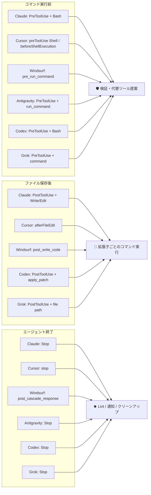

<p align="center">
  
</p>

<h1 align="center">claw-hooks</h1>

<p align="center">
  シンプルなTOML設定でClaude Code・Cursor・Windsurf・Antigravity CLI・Codex CLI・Grok CLIに対応 - コマンドブロック、自動フォーマット、Stop時自動化
</p>

<p align="center">
  <a href="https://github.com/owayo/claw-hooks/actions/workflows/ci.yml">
    
  </a>
  <a href="https://github.com/owayo/claw-hooks/releases/latest">
    
  </a>
  <a href="LICENSE">
    
  </a>
</p>

<p align="center">
  <a href="README.md">English</a> |
  <a href="README.ja.md">日本語</a>
</p>

---

## 機能

- 🦀 **Rust製** - 低オーバーヘッド、軽量シングルバイナリ、超高速（起動<10ms）
- ⚡ **Killコマンドブロック** - `kill`, `pkill`, `killall`, `taskkill`, PowerShell の `Stop-Process` をブロックし、[safe-kill](https://github.com/owayo/safe-kill)を提案
- 🗑️ **RMコマンドブロック** - `rm`, `rmdir`, `del`, `erase`, `rd`, PowerShell の `Remove-Item` をブロックし、[safe-rm](https://github.com/owayo/safe-rm)を提案
- 🪟 **PowerShell ツール対応** - Claude Code の `PowerShell` ツールにも同じフィルターを適用。Git Bash の無い Windows では PowerShell が唯一のシェルツールになる。matcher は `Bash|PowerShell` を指定すること
- 💾 **DDコマンドブロック** - ディスク上書き事故を防ぐため、オプションで`dd`をブロック
- 🌳 **AST解析** - [tree-sitter-bash](https://github.com/tree-sitter/tree-sitter-bash) でラッパー（`sudo`、`timeout`、`command`、`exec`、`pkexec`、`gosu`、`su`、`arch`、`systemd-run`、`script`）、サブシェル、パイプ、`eval`、`find -exec`、`bash -c`/`-lc`、コマンド置換、ブレースグループ、制御構文（`if`/`for`/`while`/`case`）、basename/拡張子/大文字小文字の正規化、シェル quote removal 形式を扱う。文字列フォールバックパーサー（非 `ast-parser` ビルド）も同等のカバレッジを維持
- 🔧 **カスタムコマンドフィルター** - 正規表現サポート付きのカスタムフィルターを定義
- 📁 **拡張子フック** - ファイル保存・編集完了後にのみ外部ツール（フォーマッター、リンター）を実行し、lint 出力を Claude Code / Codex CLI に `additionalContext` で送信。Antigravity CLI は `PostToolUse` エントリに `--event PostToolUse` を付けると `toolCall.args.TargetFile` を対象にツールが実行されるが、出力は `{}` 固定のためエージェントに伝わるのはファイル書き換えのみ。Grok CLI は編集ファイルパスが届くのでツール自体は通常どおり実行されるが、事後フックの stdout は無視されるため、エージェントに伝わるのはフォーマッターによるファイル書き換えのみ
- ⏹️ **Stopフック** - エージェントループ終了時にコマンドを実行（通知、git commit（[git-sc](https://github.com/owayo/git-smart-commit)等）、クリーンアップ等）
- 🧹 **Stop時プロジェクト全体Lint** - プロジェクト構成ファイル（`Cargo.toml`、`tsconfig.json` 等）を自動検出して lint/typecheck を実行。失敗はエージェントに返却（Windsurf と Grok CLI はベストエフォート）
- ⏱️ **フックタイムアウト** - フックごとに設定可能（デフォルト 60 秒）。Unix ではプロセスグループ全体を SIGKILL するため、`sh -c '...'` 経由の孫プロセスも残らず停止
- 📏 **出力長制限** - エージェントのコンテキスト溢れを防ぐマルチバイト安全な切り詰め（デフォルト 1000 文字）
- 🗜️ **出力圧縮** - 装飾文字の連続（`.`、`=`、`-`、`─`、`━`、`^`、`·`、`→`、`_`）、`\r` で上書きされる進捗バー、cargo の繰り返し `Compiling`/`Blocking` ログ、共通絶対パスのプレフィックス、rustc/ruff/biome のマルチライン span 下線や枠線、Biome の空白可視化マーカーや重複行番号ペアを圧縮。成功時の `All checks passed!` や `1 file already formatted` など、何も変更していない formatter/linter の定型通知は省略し、ファイル変更・失敗の出力は保持。no-op 判定は**正規化後**の文字列で行うため、成功メッセージと毎回同じ設定警告を同時に出すツール（`ruff check --select D…` は毎回 stderr にルールセット非互換警告を出す）でも no-op と判定され、編集のたびに `All checks passed!` だけが返る事象を防ぐ。biome の `Checked N file(s) in <時間>. No fixes applied.` 集計行と、締めの `check ━` / `× Some errors were emitted while running checks.` は診断が併記されているときのみ除去し、出力全体がそれだけの場合は保持。ANSI 除去は `ESC` + 中間バイト形式（terminfo の `sgr0`、例: `\E(B\E[m`）と生の `SO`/`SI` にも対応（未対応だと色付き `cargo fmt --check` の差分行の先頭に文字が残り、上記の圧縮が一切効かなくなる）
- ♻️ **ソース抜粋の再掲除去** - 同一診断の中で逐語一致するソース抜粋行（`3 │ code`、`> 3 │ code`、`12 | code`）は2回目以降を除去。biome は 1 件の診断をサブブロック（`!` メッセージ、`i` 補足、`i Safe fix:`）ごとに分けて同じ抜粋を再掲し、ruff も修正差分の中でコンテキストを再掲するが、これらの再掲には情報量が無い。差分行（`- old` / `+ new`）は修正内容そのものなので保持し、重複判定のスコープは診断ヘッダごとにリセットするため、別の診断は自分のコンテキストを保持する。実出力での計測値: ruff −6%、biome −14%
- 🛡️ **デバッグログ安全性** - 永続化するのはイベント/ツール/セッションとバイト数サマリーのみ。生コマンド、ファイル本文、エージェントメッセージ、整形済み formatter/linter 出力はディスクに残さない（本文確認は `--trace` の stderr 経由のみ）
- 🛑 **入出力サイズ上限** - stdin は 4 MiB 上限で、巨大ペイロードや不正 UTF-8 は OOM kill ではなくフェイルクローズドで停止。フック子プロセスの stdout/stderr もデッドロックを避けて最後まで排出しつつ各 4 MiB までしか保持しないため、大量出力する formatter/linter がエージェント向け切り詰め前にメモリを使い切ることを防止
- 🔒 **フェイルクローズドのゲート** - コマンドブロックはパースエラー、読み取り不能な入力、設定の破損時に拒否を返す。`config.toml` のタイポ 1 つで保護が無効化されることはもう無い。設定エラーでは（従来のように exit `1` + stdout 空で終了せず）エージェント固有の拒否応答を返し、診断は stderr へ、あわせて `claw-hooks check` を案内する（exit 1 + stdout 空は一部のエージェントで「フック失敗＝判定を無視」と解釈されるため）。Stop 系だけは意図的な例外で、そこでの「ブロック」は「停止せず継続」を意味するので、無限ループを避けて停止を許可する
- 📂 **プロジェクト設定マージ** - プロジェクトルートに `.claw-hooks.toml` を配置してグローバル設定をプロジェクトごとに上書き/拡張
- 🔌 **マルチエージェント対応** - Claude Code、Cursor、Windsurf、Antigravity CLI、Codex CLI、Grok CLIに対応

## なぜ claw-hooks？

エージェント標準のフックは、危険コマンドのチェック 1 つ、フォーマッター 1 つに対しても Python/Bash スクリプトをエージェントごとに用意する必要があります。claw-hooks ならこれが TOML 設定だけで済みます。

```toml
# 危険コマンドをブロック
rm_block = true
rm_block_message = "🚫 Use safe-rm instead"

# 保存時に自動フォーマット
[extension_hooks]
".rs"  = ["rustfmt {file}"]
".py"  = ["ruff format --check {file}", "ruff check --preview --select=I,F,DOC {file}"]
".ts"  = ["biome check {file}"]
".tsx" = ["biome check {file}"]
```

…各エージェントのフック設定で claw-hooks を一度呼び出すだけ:

```json
{
  "hooks": {
    "PreToolUse": [{
      "matcher": "Bash|PowerShell",
      "hooks": [{"type": "command", "command": "claw-hooks hook"}]
    }]
  }
}
```

素朴な `grep -E '^rm '` では `sudo rm`、`cd /tmp && rm`、`bash -lc 'rm …'`、パイプ、`xargs`、ブレースグループ、プロセス置換、特権昇格ラッパー（`pkexec` / `gosu` / `su <user> cmd`）、シェル quote-removal 形式（`r\m`、`$'r\x6d'`）を取りこぼします。claw-hooks は tree-sitter-bash（同等カバレッジの文字列フォールバックパーサーつき）でこれらすべてに対処します。単一バイナリ、Python/jq 依存なし、Claude Code / Cursor / Windsurf / Antigravity / Codex / Grok で同じ挙動になります。

<details>
<summary>同等のネイティブ Python フックの例</summary>

```python
#!/usr/bin/env python3
import json, sys

data = json.loads(sys.stdin.read())
if data.get("tool_name") == "Bash":
    cmd = data.get("tool_input", {}).get("command", "")
    if any(s in cmd for s in ("rm ", "rm -", "rmdir")):
        print(json.dumps({
            "hookSpecificOutput": {
                "hookEventName": "PreToolUse",
                "permissionDecision": "deny",
                "permissionDecisionReason": "🚫 Dangerous command blocked",
            }
        }))
        sys.exit(2)
sys.exit(0)
```

これをエージェントごと、危険コマンドごと、フォーマッターごとに複製し、quote/ラッパー処理を毎回再実装することになります。
</details>

### 拡張子フックのルール

- 各コマンドテンプレートには `{file}` プレースホルダーを 1 つだけ含めます。
- 保存後・編集後イベントのみ: Claude `PostToolUse` (`Write`/`Edit`)、Cursor `afterFileEdit`、Windsurf `post_write_code`、Codex `PostToolUse` + `apply_patch`、Grok `PostToolUse`（`toolInput` にファイルパスを含むもの）、Antigravity `PostToolUse`（hook エントリに `--event PostToolUse` を指定した場合。編集対象は `toolCall.args.TargetFile` から取得）。Antigravity の事後フック出力は `{}` 固定のため診断を返せません。lint の本文が必要な場合は Stop hooks を使ってください。
- Codex の `PostToolUse` + `Bash` はパススルー。`apply_patch` は変更ファイルパスを抽出して拡張子フックに渡します（削除のみの patch はスキップ）。
- Grok の `PostToolUse` は `toolInput` に `file_path` / `filePath` があればフックを実行するため、フォーマッターによるファイル書き換えは通常どおり行われます。ただし Grok は事後フックの stdout を無視するので、lint の本文自体はエージェントに返りません。
- パスに `../`、リダイレクトメタ文字（`<`、`>`）、タブ、改行、NUL バイトを含むものは拒否。必須フィールドを欠くペイロードはフェイルクローズドで拒否。
- 成功時の no-op 定型通知はエージェントへ返しません。ファイル書き換え、警告、失敗を示す出力は保持し、コマンドラベルには展開済みファイルパスや引数要約ではなく設定上のプログラム名だけを表示します。

### 比較

| 機能 | ネイティブフック | claw-hooks |
|------|------------------|------------|
| 危険なコマンドをブロック | コマンドごとに25行以上のPython | TOML 1行 |
| カスタムフィルター | フィルターごとに新しいスクリプト | `[[custom_filters]]`に追加 |
| 拡張子フック（フォーマッター） | 複雑なファイル検出スクリプト | `[extension_hooks]`マップ |
| lint出力をエージェントに送信 | 手動でJSON構築 | 自動（Claude Code、Codex CLI）、Antigravity CLI は Stop hooks 経由*、Grok CLI は不可（事後フックの stdout が無視されるため） |
| マルチエージェント対応 | エージェントごとに異なるスクリプト | 単一バイナリ + `--format` |
| Stopフック（lint、通知等） | ユースケースごとにスクリプト作成 | `[[stop_hooks]]`設定 |

\* lint/フォーマッターの出力は、対応するフックランタイムでは `additionalContext` 経由で自動送信され、エージェントが警告を修正できます。

## 動作要件

- **OS**: macOS, Linux, Windows
- **実行時依存**: なし（単一バイナリ）
- **ソースビルド/開発**: Rust 1.85 以上。CI でも Rust 1.85 で lockfile 固定の依存チェックを実行し、宣言した MSRV が有効であることを保証します。

## インストール

### Homebrew (macOS/Linux)

```bash
brew install owayo/claw-hooks/claw-hooks
```

### ソースから

```bash
git clone https://github.com/owayo/claw-hooks.git
cd claw-hooks
cargo build --release
```

バイナリ: `target/release/claw-hooks`

開発時の確認:

```bash
make msrv
cargo test --all-features
cargo test --no-default-features
```

### GitHub Releases から

**macOS (Apple Silicon)**
```bash
curl -L https://github.com/owayo/claw-hooks/releases/latest/download/claw-hooks-aarch64-apple-darwin.tar.gz | tar xz
sudo mv claw-hooks /usr/local/bin/
```

**macOS (Intel)**
```bash
curl -L https://github.com/owayo/claw-hooks/releases/latest/download/claw-hooks-x86_64-apple-darwin.tar.gz | tar xz
sudo mv claw-hooks /usr/local/bin/
```

**Linux (x86_64)**
```bash
curl -L https://github.com/owayo/claw-hooks/releases/latest/download/claw-hooks-x86_64-unknown-linux-gnu.tar.gz | tar xz
sudo mv claw-hooks /usr/local/bin/
```

**Linux (ARM64)**
```bash
curl -L https://github.com/owayo/claw-hooks/releases/latest/download/claw-hooks-aarch64-unknown-linux-gnu.tar.gz | tar xz
sudo mv claw-hooks /usr/local/bin/
```

**Windows**

[Releases](https://github.com/owayo/claw-hooks/releases/latest) から `claw-hooks-x86_64-pc-windows-msvc.zip` をダウンロードし、展開してPATHに追加してください。

## クイックスタート

```bash
# デフォルト設定を生成
claw-hooks init

# 安全なコマンドでテスト（許可）
echo '{"hook_event_name":"PreToolUse","tool_name":"Bash","tool_input":{"command":"git status"}}' | claw-hooks hook
# 出力: {}

# 危険なコマンドでテスト（ブロック）
echo '{"hook_event_name":"PreToolUse","tool_name":"Bash","tool_input":{"command":"rm -rf /"}}' | claw-hooks hook
# 出力: {"hookSpecificOutput":{"hookEventName":"PreToolUse","permissionDecision":"deny","permissionDecisionReason":"🚫 Use safe-rm instead..."}}
```

> **claw-hooks は拒否専用（deny-only）です。** 許可時に返すのは空オブジェクト（`{}`）+ exit `0` で、これは「承認」ではなく「異議なし」を意味します。公式仕様では `permissionDecision: "allow"` は**権限プロンプトをスキップする**指示であり、claw-hooks がブロックしなかったコマンドをすべて自動承認してしまうため、claw-hooks は `allow` を返しません。ブロックしなかったものには、これまでどおり既存の権限プロンプト・権限ルールが適用されます。

## 使用方法

### コマンド

| コマンド | 説明 |
|---------|------|
| `hook` (別名: `run`) | stdinからフックイベントを処理 |
| `init` | デフォルト設定を生成 |
| `check` | 設定を検証 |
| `version` | バージョンを表示 |

### オプション

| オプション | 短縮形 | 説明 |
|-----------|--------|------|
| `--format` | `-f` | 入力形式: `claude` (デフォルト), `cursor`, `windsurf`, `agy` (Antigravity CLI), `codex`, `grok` (Grok CLI) |
| `--event` | `-e` | フックイベント名（例: `PostToolUse`）。ペイロードにイベント名フィールドが無く `PreToolUse` / `PostToolUse` の形状が同一な Antigravity CLI 用。他エージェントでは不要 |
| `--config` | `-c` | 設定ファイルのパス |
| `--trace` | `-t` | トレースモード: 生の入力・パース結果・出力を stderr に出力（ディスクには保存しない） |
| `--help` | `-h` | ヘルプを表示 |

### 例

```bash
# Claude Codeフックを処理（デフォルト）
claw-hooks hook

# Cursorフックを処理
claw-hooks hook --format cursor

# Windsurfフックを処理
claw-hooks hook --format windsurf

# Antigravity CLIフックを処理（ペイロードにイベント名が無いため --event を指定する）
claw-hooks hook --format agy --event PreToolUse
claw-hooks hook --format agy --event PostToolUse

# Codex CLIフックを処理
claw-hooks hook --format codex

# Grok CLIフックを処理
claw-hooks hook --format grok

# カスタム設定を使用
claw-hooks hook --config /path/to/config.toml
```

## エージェント統合

### Claude Code

`~/.claude/settings.json`（ユーザー）または`.claude/settings.json`（プロジェクト）に追加:

```json
{
  "hooks": {
    "PreToolUse": [
      {
        "matcher": "Bash|PowerShell",
        "hooks": [{ "type": "command", "command": "claw-hooks hook" }]
      }
    ],
    "PostToolUse": [
      {
        "matcher": "Write|Edit|MultiEdit",
        "hooks": [{ "type": "command", "command": "claw-hooks hook" }]
      }
    ],
    "Stop": [
      {
        "matcher": "",
        "hooks": [{ "type": "command", "command": "claw-hooks hook" }]
      }
    ]
  }
}
```

### Cursor

`~/.cursor/hooks.json`（ユーザー）または`<project>/.cursor/hooks.json`（プロジェクト）に追加:

```json
{
  "version": 1,
  "hooks": {
    "preToolUse": [
      { "command": "claw-hooks hook --format cursor", "failClosed": true }
    ],
    "beforeShellExecution": [
      { "command": "claw-hooks hook --format cursor", "failClosed": true }
    ],
    "afterFileEdit": [
      { "command": "claw-hooks hook --format cursor" }
    ],
    "stop": [
      { "command": "claw-hooks hook --format cursor" }
    ]
  }
}
```

> **コマンドブロック用フックには `failClosed: true` を推奨します。** Cursor は既定でフェイルオープンです。正常なブロック（exit `0` + stdout の `{"permission":"deny", …}`）は `failClosed` なしでも機能しますが、claw-hooks 自体がクラッシュ・タイムアウトした場合、`failClosed: true` を設定していないと Cursor はコマンドを通してしまいます。`afterFileEdit`/`stop` では付けません（フォーマッター/lint のクラッシュでエージェントを止めるべきではないため）。

### Windsurf (Cascade)

`~/.codeium/windsurf/hooks.json`（ユーザー）または`.windsurf/hooks.json`（プロジェクト）に追加:

```json
{
  "hooks": {
    "pre_run_command": [
      { "command": "claw-hooks hook --format windsurf", "show_output": true }
    ],
    "post_write_code": [
      { "command": "claw-hooks hook --format windsurf", "show_output": true }
    ],
    "post_cascade_response": [
      { "command": "claw-hooks hook --format windsurf", "show_output": true }
    ]
  }
}
```

### Antigravity CLI

`~/.gemini/config/hooks.json`（ユーザー）または `<project>/.agents/hooks.json`（プロジェクトワークスペース）に追加:

```json
{
  "claw-hooks": {
    "PreToolUse": [
      {
        "matcher": "run_command",
        "hooks": [{ "type": "command", "command": "claw-hooks hook --format agy --event PreToolUse" }]
      }
    ],
    "PostToolUse": [
      {
        "matcher": "write_to_file|replace_file_content|multi_replace_file_content",
        "hooks": [{ "type": "command", "command": "claw-hooks hook --format agy --event PostToolUse" }]
      }
    ],
    "Stop": [
      { "type": "command", "command": "claw-hooks hook --format agy --event Stop" }
    ]
  }
}
```

注意点:
- **Antigravity では `--event` を指定してください。** Antigravity のペイロードにはイベント名フィールドが無く、`PreToolUse` と `PostToolUse` は形状で区別できません（どちらも `toolCall` と `stepIdx` を持ち、差は Optional な `error` のみ）。`hooks.json` はイベントごとに別エントリで登録するため、`--event` でどちらかを伝えます。未指定の場合は形状から推定し、区別できないケースは `PreToolUse` に倒します（コマンドブロックは維持されますが、保存後フックは動作しません）。
- `--event PostToolUse` を指定すると Antigravity でも拡張子フックが動作します。編集対象は `toolCall.args.TargetFile` から復元します。ただし公式仕様で `PostToolUse` の出力は `{}` 固定のため、formatter/linter は**実行されますが診断結果をエージェントへ返せません**。診断を伝えたい場合は従来どおり Stop hooks でプロジェクト全体の lint/typecheck を回し、失敗を `{"decision":"continue","reason":"..."}` で再投入してください。
- Antigravity には `stop_hook_active`（Claude/Codex）や `loop_count`（Cursor）に相当する入力がありません（`executionNum` は実行試行の連番で、通常の初回停止でも `1` です）。そのため恒久的に失敗する stop hook によるループを claw-hooks 側では遮断できません。report=true の stop hook には自己完結する終了条件を持たせてください。
- `PreInvocation` / `PostInvocation` は claw-hooks のスコープ外（モデル呼び出し前後のオーケストレーション）なので、自動的にパススルーされます。これらのイベントは hook 登録不要です。
- Antigravity hooks 公式仕様: <https://antigravity.google/docs/customizations/hooks>

### Codex CLI

`~/.codex/hooks.json`（ユーザー）に追加:

```json
{
  "hooks": {
    "PreToolUse": [
      {
        "matcher": "Bash",
        "hooks": [
          {
            "type": "command",
            "command": "claw-hooks hook --format codex"
          }
        ]
      }
    ],
    "PermissionRequest": [
      {
        "matcher": "Bash",
        "hooks": [
          {
            "type": "command",
            "command": "claw-hooks hook --format codex"
          }
        ]
      }
    ],
    "PostToolUse": [
      {
        "matcher": "Bash|apply_patch|Edit|Write",
        "hooks": [
          {
            "type": "command",
            "command": "claw-hooks hook --format codex"
          }
        ]
      }
    ],
    "Stop": [
      {
        "hooks": [
          {
            "type": "command",
            "command": "claw-hooks hook --format codex"
          }
        ]
      }
    ]
  }
}
```

Codex hooks はデフォルトで有効です。明示的に機能フラグを設定する場合は、現行の `[features] hooks` キーを使用してください。旧 `codex_hooks` エイリアスは非推奨です。

### Grok CLI

`~/.grok/hooks/`（個人）または `<project>/.grok/hooks/`（プロジェクト）配下に JSON ファイルを追加:

```json
{
  "hooks": {
    "PreToolUse": [
      {
        "matcher": "Bash",
        "hooks": [{ "type": "command", "command": "claw-hooks hook --format grok", "timeout": 10 }]
      }
    ],
    "PostToolUse": [
      {
        "hooks": [{ "type": "command", "command": "claw-hooks hook --format grok", "timeout": 10 }]
      }
    ],
    "Stop": [
      {
        "hooks": [{ "type": "command", "command": "claw-hooks hook --format grok", "timeout": 10 }]
      }
    ]
  }
}
```

注意点:
- `matcher` はツール名に対する正規表現で、省略すると全ツールにマッチします。Grok は `Bash` / `Edit` のような Claude 形式のツール名を自前のツール名へ自動マッピングしますが、マッピング後の名前は公開されていないため、`matcher` を省略する方が安全です。claw-hooks はペイロードの形から処理対象を判断し、対象外はすべてパススルーします（[フォーマット検出ロジック](#フォーマット検出ロジック) を参照）。
- `timeout` の単位は**秒**で、デフォルトは `5` です。フォーマッターやプロジェクト全体 lint には短いため、上記のように延ばしてください。
- プロジェクトのフックはリポジトリを信頼するまで実行されません。`/hooks-trust` を一度実行するか、`--trust` 付きで Grok を起動してください。
- Grok は Claude Code（`.claude/settings.json`）と Cursor（`.cursor/hooks.json`）のフック設定も読み込みます。すでにそちらへ claw-hooks を登録している場合は、1 イベントにつき二重実行にならないよう登録を 1 か所にまとめてください。
- Grok がブロックできるのは `PreToolUse` だけです。それ以外はすべて stdout が無視される事後フックなので、拡張子フックによるファイル整形も Stop hooks の lint も実行はされますが、その出力をエージェントへ返すことはできません（Windsurf の `post_cascade_response` と同じ制約です）。
- Grok は明示的な拒否以外すべてフェイルオープンです。タイムアウト・クラッシュ・不正出力はフック失敗として記録され、ツール呼び出しはそのまま実行されます。そのため claw-hooks はブロック時に deny JSON **と** exit code `2` の両方を返し、フェイルクローズド経路でも（`1` ではなく）exit `2` を使うことで、どちらの解釈でもブロックが成立するようにしています。

## 設定

デフォルトの場所: `~/.config/claw-hooks/config.toml`（全プラットフォーム共通）

```toml
# コマンドブロック
rm_block = true                    # rm/rmdir/del/eraseをブロック（デフォルト: true）
kill_block = true                  # kill/pkill/killall/taskkillをブロック（デフォルト: true）
dd_block = true                    # ddコマンドをブロック（デフォルト: true）

# カスタムメッセージ（推奨: safe-rm/safe-killツールと併用）
# safe-rm: https://github.com/owayo/safe-rm
# safe-kill: https://github.com/owayo/safe-kill
rm_block_message = "🚫 Use safe-rm instead: safe-rm <file> (validates Git status and path containment). Only clean/ignored files in project allowed."
kill_block_message = "🚫 Use safe-kill instead: safe-kill <PID> or safe-kill -n <name> (like pkill). Use -s <signal> for signal."
dd_block_message = "🚫 dd command blocked for safety."

# デバッグログ
debug = false
# log_path = "~/.config/claw-hooks/logs"  # デフォルト: config.tomlと同じディレクトリ
# デバッグログにはフックイベントの概要のみを記録し、生のコマンド、ファイル本文、エージェントメッセージは保存しません

# フックコマンドタイムアウト（秒）（デフォルト: 60、最大: 86400）
# report=true のStopフックと拡張子フックコマンドに適用されます。
# このタイムアウトを超えたコマンドはkill（SIGKILL）され、失敗として報告されます。
# report=false のStopフックはデタッチ起動され、完了を待ちません。
# hook_timeout = 60

# 出力最大長（文字数）（デフォルト: 1000、0 = 無制限）
# AIエージェントのコンテキストウィンドウ溢れを防止
# output_max_length = 1000

# カスタムコマンドフィルター（正規表現対応）
[[custom_filters]]
command = "yarn"
message = "`yarn`の代わりに`pnpm`を使用してください"

# argsモード: コマンド（正規表現） + 引数マッチング
[[custom_filters]]
command = "npm"
args = ["install", "i", "add"]         # ブロック対象: npm install, npm i, npm add
message = "`npm`の代わりに`pnpm`を使用してください"

[[custom_filters]]
command = "pip3?"                       # 正規表現: pip または pip3 にマッチ
args = ["install", "uninstall"]
message = "`uv pip`を使用してください"

# 正規表現のみモード（argsを指定しない場合）
[[custom_filters]]
command = "python[23]? -m pip"         # より複雑なパターン
message = "`uv pip`を使用してください"

[[custom_filters]]
command = "docker"
args = ["rm", "rmi", "system prune"]   # ブロック対象: docker rm, docker rmi
message = "ユーザーに直接実行を依頼してください"

# 拡張子フック（ファイル書き込み/編集時にトリガー）
# マップ形式: ".ext" = ["cmd1 {file}", "cmd2 {file}"]
# 出力（stdout/stderr）は、対応するフックランタイムでは additionalContext としてAIエージェントに送信
# 各コマンドテンプレートは {file} をちょうど1回含める必要があります
# 親ディレクトリ遡りパス（../）は安全のため拒否されます
# シェルのリダイレクトメタ文字（<, >）を含むパスは安全のため拒否されます
# タブ/改行/NUL は引数分割や不正なパスを防ぐため拒否されます
# Windows では `cmd /c` のメタ文字（%, !, ^, "）も変数展開インジェクション防止のため拒否されます
[extension_hooks]
".css" = ["biome format --write {file}", "biome lint --write {file}"]
".py" = ["ruff format --check {file}", "ruff check --preview --select=I,F,DOC {file}"]
".rs" = ["rustfmt {file}"]
".ts" = ["biome check {file}"]
".tsx" = ["biome check {file}"]

# Stopフック（エージェントループ終了時にトリガー）
# 配列内のすべてのコマンドは並列実行されます。
# conditionなしのフックはデフォルトで report=false となりデタッチ起動されます。
# stdout/stderr は破棄されるため、必要ならコマンド側でリダイレクトしてください。
# [[stop_hooks]]
# commands = ["afplay /System/Library/Sounds/Glass.aiff"]  # macOS通知音

# [[stop_hooks]]
# commands = ["notify-send 'エージェント完了'"]  # Linux通知

# 条件付きStopフック（Stop時にプロジェクト全体のlintを実行）
# プロジェクト構成ファイルの存在とツールの利用可能性を検出し、lint/typecheckを実行。
# 失敗時は、Stop時フィードバックに対応したエージェントでは結果をAIへ返し、
# エージェントが問題を修正します（Windsurf と Grok CLI はベストエフォート）。
# conditionフィールド（AND条件）: file_exists, file_not_exists, command_exists, command_not_exists
[[stop_hooks]]
commands = ["cargo clippy --all-targets --all-features -- -D warnings", "cargo fmt --check"]
condition = { file_exists = "Cargo.toml" }

[[stop_hooks]]
commands = ["pnpm exec tsc --noEmit"]
condition = { file_exists = "tsconfig.json" }

[[stop_hooks]]
commands = ["ruff format .", "ruff check --preview --fix --select=I,F,DOC --unsafe-fixes"]
condition = { file_exists = "pyproject.toml", command_exists = "ruff" }

[[stop_hooks]]
commands = ["biome check --write ."]
condition = { file_exists = "package.json" }
```

### プロジェクトごとの設定

claw-hooksはデフォルトでグローバル設定ファイル（`~/.config/claw-hooks/config.toml`）を使用します。プロジェクトごとに動作をカスタマイズする方法は3つあります:

**1. `.claw-hooks.toml` — 自動検出されるプロジェクト設定（推奨）**

プロジェクトルートに `.claw-hooks.toml` を配置するだけです。claw-hooksはカレントディレクトリ直下の `.claw-hooks.toml` を自動検出し、グローバル設定とマージします。`--config` フラグは不要です。

```toml
# my-project/.claw-hooks.toml

# 上書き: このプロジェクトでは dd ブロックを無効化
dd_block = false

# 上書き: プロジェクト固有の拡張子フック（グローバルを完全置換）
[extension_hooks]
".rs" = ["rustfmt {file}"]
".ts" = ["biome check {file}"]

# マージ: 追加のStopフック（グローバルのStopフックに追加）
[[stop_hooks]]
commands = ["pnpm exec tsc --noEmit"]
condition = { file_exists = "tsconfig.json" }
```

**マージルール:**

| フィールド | ルール | 動作 |
|-----------|--------|------|
| `extension_hooks` | **上書き** | プロジェクトの定義がグローバルを完全置換 |
| `custom_filters` | **上書き** | プロジェクトの定義がグローバルを完全置換 |
| `stop_hooks` | **マージ** | グローバルとプロジェクトの両方が実行される |
| `rm_block`, `kill_block`, `dd_block` | **上書き** | プロジェクトの値が優先 |
| `*_block_message`, `hook_timeout`, `output_max_length` | **上書き** | プロジェクトの値が優先 |
| `debug`, `log_path`, `nano_buddy` | **グローバル専用** | プロジェクト設定では使用不可 |

省略されたフィールドはグローバルの値を維持します。空の配列（例: `custom_filters = []`）を設定すると、グローバルの値を明示的にクリアします。

`claw-hooks check` で検証できます — プロジェクト設定が見つかったかどうかと、その有効性を報告します。

**2. `--config` — 設定ファイルの完全置換**

`--config` を使用して完全な設定ファイルを指定し、グローバル設定を完全に置き換えます:

```toml
# my-project/.claude/claw-hooks.toml
rm_block = true
kill_block = true
dd_block = false  # このプロジェクトでは dd を許可

[extension_hooks]
".rs" = ["rustfmt {file}"]
```

```json
// my-project/.claude/settings.json
{
  "hooks": {
    "PreToolUse": [{
      "matcher": "Bash|PowerShell",
      "hooks": [{ "type": "command", "command": "claw-hooks hook --config .claude/claw-hooks.toml" }]
    }],
    "PostToolUse": [{
      "matcher": "Write|Edit|MultiEdit",
      "hooks": [{ "type": "command", "command": "claw-hooks hook --config .claude/claw-hooks.toml" }]
    }],
    "Stop": [{
      "matcher": "",
      "hooks": [{ "type": "command", "command": "claw-hooks hook --config .claude/claw-hooks.toml" }]
    }]
  }
}
```

**3. 条件付きStopフック — プロジェクト自動検出**

`file_exists` 条件付きのStopフックは、作業ディレクトリに基づいてプロジェクトタイプを自動判定します。単一のグローバル設定で複数のプロジェクトタイプに対応できます:

```toml
# ~/.config/claw-hooks/config.toml

# Rustプロジェクトのみで実行（Cargo.toml が存在する場合）
[[stop_hooks]]
commands = ["cargo clippy -- -D warnings"]
condition = { file_exists = "Cargo.toml" }

# TypeScriptプロジェクトのみで実行（tsconfig.json が存在する場合）
[[stop_hooks]]
commands = ["pnpm exec tsc --noEmit"]
condition = { file_exists = "tsconfig.json" }
```

3つのアプローチはすべて組み合わせ可能です。グローバル設定で共通ルールを定義し、`.claw-hooks.toml` でプロジェクト固有の上書きを行い、条件付きStopフックでプロジェクトタイプの自動検出を活用できます。

### 条件付きStopフック（プロジェクト全体Lint）

`condition`フィールドを持つStopフックは、プロジェクトの構成ファイルに応じてlint/typecheckコマンドを実行します。`commands`配列内のすべてのコマンドは**並列実行**されます。失敗したコマンドの出力はすべて収集され、AIエージェントにブロック理由としてまとめて返されます。
**タイムアウトの扱い:** `hook_timeout` は最大 `86400` 秒まで指定できます。報告対象のStopフック（`report = true`）では、`hook_timeout` を超えたコマンドを claw-hooks がプロセスツリーごと強制終了（SIGKILL）し、タイムアウトをブロック理由として返します。直接の子プロセスが終了しても、バックグラウンド孫プロセスが stdout/stderr パイプを保持している場合もタイムアウト扱いにするため、`sh -c 'sleep 60 &'` のようなコマンドでフックタイムアウトを回避できません。通常のコマンド失敗（終了コード `124` を自ら返す場合を含む）も引き続きブロック対象です。`report = false` のStopフックは stdin/stdout/stderr を null にしてデタッチ起動されるため、claw-hooks は完了待ちも `hook_timeout` の強制も行いません。必要ならコマンド自体を timeout ツールで包んでください。

ただし Windsurf と Grok CLI は例外です。Windsurf の `post_cascade_response` は非同期の事後フックであり、Grok も `PreToolUse` 以外はすべて stdout が無視される事後フックです。どちらも Stopフック自体は実行されますが、失敗はベストエフォート扱いとなり、AI エージェントへのブロックとしては返されません。

**Stopフックのフィールド:**

| フィールド | 型 | デフォルト | 説明 |
|-----------|------|-----------|------|
| `commands` | `string[]` | (必須) | 実行するコマンド（同じstage内で並列実行） |
| `condition` | `object` | (なし) | 実行条件（AND条件: `file_exists`, `file_not_exists`, `command_exists`, `command_not_exists`） |
| `stage` | `1-5` | `5` | 実行順序。小さいstageが先に実行される。同じstage内のフックは並列実行。 |
| `report` | `bool` | (自動) | 結果をAIエージェントに返すかどうか。デフォルト: `condition`ありなら`true`、なしなら`false`。 |
| `session_scope` | `"primary"` \| `"delegated"` \| `"all"` | `"primary"` | このフックを実行するセッション種別。`primary` = メインセッションのみ、`delegated` = 委譲エージェントセッション（Claude Code の teammate 等）のみ、`all` = 両方。 |

**conditionフィールド**（AND条件 — 指定されたすべての条件が真である必要があります）:

| フィールド | 説明 |
|-----------|------|
| `file_exists` | 作業ディレクトリにこのファイルが存在する場合のみ実行 |
| `file_not_exists` | 作業ディレクトリにこのファイルが **存在しない** 場合のみ実行（例: 「このロックファイルが無い時のフォールバック」）|
| `command_exists` | このコマンドがPATH上に存在する場合のみ実行（Windows の `PATHEXT` を考慮。Unix では実行ビットが必要。`./tool` や `/usr/bin/tool` のような明示パスも判定可能） |
| `command_not_exists` | このコマンドがPATH上に **存在しない** 場合のみ実行 |

```toml
# ステージベースの実行: 分析 → lint → コミット
[[stop_hooks]]
commands = ["astro-sight impact --dir . --git"]
stage = 1        # 最初に実行
report = true    # 結果をAIに返す

[[stop_hooks]]
commands = ["cargo clippy --all-targets --all-features -- -D warnings", "cargo fmt --check"]
condition = { file_exists = "Cargo.toml" }
stage = 3
# report 未指定 → condition あり → true（デフォルト）

[[stop_hooks]]
commands = ["pnpm exec tsc --noEmit"]
condition = { file_exists = "tsconfig.json" }
stage = 3

[[stop_hooks]]
commands = ["git-sc --all --yes --quiet"]
# stage 未指定 → 5（最後）
# report 未指定 → condition なし → false（fire-and-forget）
```

**ステージの実行順序:** ステージは1から5の順に逐次実行されます。同じステージ内のすべてのフックは並列実行されます。あるステージの全フックが完了してから次のステージに進みます。

**レポート動作:** `report = true`（または`condition`によるデフォルト`true`）の場合、コマンド失敗はAIエージェントにブロック理由として返されます。`report = false`（または`condition`なしによるデフォルト`false`）の場合、コマンドは fire-and-forget 方式で起動され、Hook応答をブロックしません。デタッチコマンドは stdin/stdout/stderr が null になるため、spawn 失敗はログに残りますが、コマンド出力と終了ステータスは収集されません。Windsurf と Grok CLI の Stop フックは常にベストエフォートです（Windsurf は基盤側が非同期、Grok は stdout が無視されるため）。

**セッションスコープ（エージェントセッションの抑止）:** Claude Code のチーム機能は委譲エージェント（teammate）を別プロセスとして起動し、それぞれが自分の `Stop` イベントを発火します — 1 タスクで数十回になることもあります。claw-hooks はこの 2 つを自動で判別します: 委譲エージェントの Stop ペイロードには空白でない `agent_id` と `agent_type` の両方が含まれます。`--agent` で起動したメインセッションにも `agent_type` は入り得ますが、サブエージェント固有の `agent_id` は無いためメイン扱いを維持します。デフォルト（`session_scope = "primary"`）では Stop フックは**メインセッションの停止時のみ**実行されるため、大量の teammate が通知スパム・重複 lint・並列 `git` 自動コミットのレースを引き起こすことはありません。従来どおり常に実行したいフックには `session_scope = "all"` を、エージェントセッション専用のフック（teammate ごとのクリーンアップ等）には `"delegated"` を指定します。判別フィールドが欠落・空白・非文字列の場合と、セッション種別のシグナルを持たないエージェント（Cursor / Windsurf / Codex CLI / Antigravity / Grok CLI）はメインセッションとして扱われます。

```toml
# メインセッションの停止時のみ実行（デフォルト — フィールド指定不要）
[[stop_hooks]]
commands = ["cargo clippy --all-targets --all-features -- -D warnings"]
condition = { file_exists = "Cargo.toml" }

# メインセッションと委譲エージェントセッションの両方で実行
[[stop_hooks]]
commands = ["collect-metrics"]
report = false
session_scope = "all"
```

```toml
# その他の例:

# Python: pyproject.toml があり ruff がインストール済みの場合に ruff format/check を実行
[[stop_hooks]]
commands = ["ruff format .", "ruff check --preview --fix --select=I,F,DOC --unsafe-fixes"]
condition = { file_exists = "pyproject.toml", command_exists = "ruff" }

# JavaScript/TypeScript: package.json がある場合に biome check を実行
[[stop_hooks]]
commands = ["biome check --write ."]
condition = { file_exists = "package.json" }
```

### Stopフックの環境変数

claw-hooksはStopフックの子プロセスに以下の環境変数を渡します:

| 変数名 | 説明 |
|--------|------|
| `CLAW_HOOKS_STOP_ACTIVE` | 常に `1` に設定。子プロセスが別のclaw-hooks Stopイベントをトリガーした際の再帰実行を防止します。 |
| `CLAW_HOOKS_AGENT_MESSAGE` | AIエージェントが停止前に残した最後のメッセージ（利用可能な場合）。エージェントが何を作業していたかの情報を含みます。 |

**`CLAW_HOOKS_AGENT_MESSAGE`** の取得元:
- **Claude Code**: Stopイベントの `last_assistant_message` フィールド
- **Windsurf**: `post_cascade_response` イベントの `response` フィールド
- **Cursor**: 利用不可

これはエージェントのコンテキストを活用できるツールに有用です。例えば、[git-sc](https://github.com/owayo/git-smart-commit)はこの情報を使ってより正確なコミットメッセージを生成します:

```toml
[[stop_hooks]]
commands = ["git-sc --all --yes --quiet"]
```

git-scがStopフックとして実行されると、`CLAW_HOOKS_AGENT_MESSAGE` を読み取り、エージェントのコンテキストをAIプロンプトに含めます。これにより、単なるdiffの説明ではなく、変更の意図を反映したコミットメッセージが生成されます。

### カスタムフィルターの動作

カスタムフィルターは2つのモードをサポートしています:

**正規表現モード**（デフォルト）: `command`のみ指定した場合、正規表現パターンとして扱われます。

```toml
[[custom_filters]]
command = "python[23]? -m pip"    # 複雑な正規表現パターン
message = "uv pipを使用してください"
```

**argsモード**: `args`を指定した場合、`command`は正規表現パターンとしてコマンド名に対してマッチされ、argsのいずれかにマッチするとフィルターが発動します。

```toml
[[custom_filters]]
command = "npm"                    # 正規表現パターン（コマンド名）
args = ["install", "i", "add"]     # 第1引数がこれらのいずれかにマッチ
message = "pnpmを使用してください"

[[custom_filters]]
command = "pip3?"                  # pip と pip3 両方にマッチ
args = ["install", "uninstall"]    # 第1引数がこれらのいずれかにマッチ
message = "uv pipを使用してください"
```

両モードとも `;`、`&&`、`||`、`|` でチェーンされたコマンドも検出します:

```bash
# ブロック: セミコロンの後の yarn を検出
echo "install"; yarn install
# → {"hookSpecificOutput":{"hookEventName":"PreToolUse","permissionDecision":"deny","permissionDecisionReason":"`yarn`の代わりに`pnpm`を使用してください"}}

# 許可: "yarn" はクォート内（コマンドではない）、pnpm は OK
echo "not yarn install"; pnpm install
# → {}
```

クォート内のコマンドは無視されます（引数であり、コマンドではないため）。

## フォーマット検出ロジック

各AIエージェントは異なるJSON構造を送信します。claw-hooksは`--format`を使用してパース方法を決定します。

### Claude Code (`--format claude`)

Claude Code公式フック仕様を使用:

```jsonc
// PreToolUse/PostToolUseイベント
{
  "hook_event_name": "PreToolUse",
  "tool_name": "Bash",
  "tool_input": { "command": "..." },
  "session_id": "...",
  "cwd": "/path/to/project"
}

// Stopイベント（tool_name/tool_inputなし）
{
  "hook_event_name": "Stop",
  "stop_hook_active": true,
  "session_id": "..."
}
```

処理対象のフックイベント: `PreToolUse`、`PostToolUse`、`Stop`、`SubagentStart`、`SubagentStop`。claw-hooks のスコープ外である既知のライフサイクルイベント（`Notification`、`PermissionRequest`、`UserPromptSubmit`、`SessionStart`、`SessionEnd` 等）は判定を返さずパススルーします。

Claude の `Stop` では `stop_hook_active` が必須です。欠落または型不正なら壊れたペイロードとして扱い、stop hook を実行せずセッションの停止を許可します（`{}` + exit `0`）。読み取れないガードを `false` とみなすと stop hook が実行され、報告対象フックの失敗によって `Stop` が無限に再発火し得るためです。

### Cursor (`--format cursor`)

`hook_event_name` フィールドでイベントを判定します:

| `hook_event_name` | 必須フィールド | 内部マッピング |
|-------------------|----------------|----------------|
| `preToolUse`（`Shell` / `Bash` のみ） | `tool_name`, `tool_input.command` | PreToolUse + Bash |
| `beforeShellExecution` | `command` | PreToolUse + Bash |
| `afterFileEdit` / `afterTabFileEdit` | `file_path` / `filePath` | PostToolUse + Write |
| `stop` | `status` | Stop |

Shell 以外の `preToolUse` を含む未対応の Cursor イベントは、`{"permission":"allow"}` ではなく空オブジェクト（`{}`）として透過されます。Cursor は複数ソースのフック応答をマージし、優先度の高い `allow` が他フックの `deny` を上書きし得るため、claw-hooks は中身を検査していないイベント（`beforeReadFile`、`beforeMCPExecution`、`beforeTabFileRead`、`sessionStart`、`postToolUse` 等）に対して許可を表明しません。許可したコマンドで `{}` を返すのも同じ理由です。

ブロックは stdout の `{"permission":"deny", …}` + exit code `0` で返します。Cursor は Claude Code と同様、exit `0` のときだけ stdout の JSON を解釈するため、exit `2` で終了すると「safe-rm を使ってください」という代替案を運ぶ `user_message` が破棄されてしまいます。

`stop` では Cursor の `loop_count` フィールド（stop hook が自動フォローアップを発火した回数、0 始まり）をループ防止に使用します。1 以上の場合は全 stop hook をスキップします — Claude Code の `stop_hook_active` と同じ役割で、lint 失敗のフィードバックは Cursor の `loop_limit` までループせず 1 回だけエージェントに返ります。

不正な `stop` ペイロードは、フェイルクローズドにせず停止を許可します（`{}` + exit `0`）。`followup_message` は次のユーザーメッセージとして自動送信されるため、パースできなかったペイロードに対してこれを返すと同じ失敗が延々と再発火します。詳細は [フェイルクローズド動作](#フェイルクローズド動作) を参照してください。

### Windsurf (`--format windsurf`)

`agent_action_name`フィールドを使用:

| agent_action_name | 内部マッピング |
|-------------------|----------------|
| `pre_run_command` | PreToolUse + Bash |
| `post_write_code` | PostToolUse + Write |
| `post_cascade_response` | Stop |

未対応の Windsurf アクションは `allow` として透過されます。

### Antigravity CLI (`--format agy`)

camelCase スキーマ。代表的な PreToolUse ペイロード:

```jsonc
{
  "toolCall": {
    "name": "run_command",
    "args": { "CommandLine": "rm -rf /tmp/test", "Cwd": "/workspace" }
  },
  "stepIdx": 3,
  "conversationId": "…",
  "workspacePaths": ["/workspace/project"],
  "transcriptPath": "~/.gemini/antigravity-cli/brain/…/transcript.jsonl",
  "artifactDirectoryPath": "~/.gemini/antigravity-cli/brain/…"
}
```

Antigravity の公式ペイロードにはイベント名フィールドが無く、さらに `PreToolUse` と `PostToolUse` は**形状が同一**です（どちらも `toolCall` と `stepIdx` を持ち、差は Optional な `error` のみ）。どちらのイベントかは `--event <name>` で指定してください。`hooks.json` はイベントごとに別エントリで登録するため、呼び出し側は必ず知っています。判別順は `--event` → 空白でない `hook_event_name` / `event`（旧版互換）→ 形状推定（`toolCall` は PreToolUse、Stop 固有フィールドは Stop、invocation 固有フィールドは Pre/PostInvocation）です。推定では PreToolUse / PostToolUse を区別できないため **PreToolUse に倒し**、コマンドブロックを維持します（逆に倒すと未実行のコマンドを素通しします）。`error` は判別条件に使いません — 公式仕様で Optional（「成功時は空」）とされており、これを鍵にすると**成功した**ツール呼び出しを誤判別するためです。

必須フィールドの検証は「claw-hooks が判定に使うもの」に限定します。公式仕様で **Required** マークが付くのは Stop の `fullyIdle`（と出力の `decision`）だけなので、`stepIdx` / `executionNum` / `terminationReason` はいずれも任意扱いです。これらを必須にすると、`run_command` すべてに deny（Antigravity では「即時ハードブロック」）が返り、Stop では**全 stop hook が黙ってスキップ**されます（Antigravity の Stop パースエラーは再投入ループ回避のため `{}` + exit 0 に倒れ、エラーが一切表面化しないため）。`toolCall.args` を必須とするのは `run_command` のときだけです（公式仕様は引数を持たないツールを列挙し、`matcher: ""` / `"*"` も認めているため）。必須フィールドの欠落・空白・型不正は、判別したイベント固有の deny/continue 応答でフェイルクローズドになります。

| 判別に使うイベント形状 | toolCall.name | 内部マッピング |
|---|---|---|
| `toolCall` + `stepIdx`（PreToolUse） | `run_command` | BeforeCommand（`toolCall.args.CommandLine` → Bash） |
| `toolCall` + `stepIdx`（PreToolUse） | その他（`write_to_file`、`replace_file_content`、…） | パススルー allow |
| `toolCall` の無い `stepIdx`、または invocation 固有フィールド | n/a | PostToolUse / invocation のパススルー allow（claw-hooks のスコープ外） |
| `executionNum` / `terminationReason` / `fullyIdle` | n/a | Stop |

> **拡張子フック**: Antigravity の `PostToolUse` は `toolCall`（`name` と `args`）を含むため、`write_to_file` / `replace_file_content` / `multi_replace_file_content` の `args.TargetFile` から編集対象を復元できます。hook エントリに `--event PostToolUse` を付けてください（ペイロードは `PreToolUse` と形状が同一のため、未指定だと `PreToolUse` と推定され保存後フックが動きません）。公式仕様の出力は `{}` 固定なので formatter/linter は実行されますが診断は返せません。lint の本文が必要な場合は Stop hooks で回して `"decision":"continue"` で再投入してください。`run_command` の `PostToolUse` はパススルーします（コマンドは実行済みで、事後のブロックは不可能かつ無意味なため）。出力 JSON は [入出力リファレンス](#入出力リファレンス) を参照。明示名を持つ未対応イベントは allow でパススルーし、イベントを判別できない名前なしペイロードは安全な応答形式を選べないためフェイルクローズドになります。

### Codex CLI (`--format codex`)

`hook_event_name` + `tool_name` + `tool_input` の標準スキーマ。`apply_patch` の `tool_input.command` から `*** Add/Update/Move to File:` ヘッダを抽出して拡張子フックを駆動します（削除のみの patch はスキップ）。

検証対象は claw-hooks が実際に読むフィールドだけです: イベント名、`tool_name` / `tool_input`（および `Bash` の `tool_input.command`、`apply_patch` の patch 本文）、`Stop` の `stop_hook_active`。公式ドキュメントの `session_id` / `cwd` / `model` / `transcript_path` / `turn_id` / `permission_mode` は「通常使うことになる共通フィールド」の紹介であって厳密なスキーマではなく（公式の `SessionEnd` 実例ペイロードには `model` がありません）、これらを必須にすると 1 フィールドの欠落で全フック呼び出しがフェイルクローズドに倒れてしまいます。スコープ外のパススルーイベントは一切検証しません。

非ファイル系ツール（例: `Bash`）の `PostToolUse` も厳密検証せずパススルーします。Codex の `PostToolUse` では `decision:"block"` が**実際のツール出力をフックのメッセージで置き換える**動作になるため、ここでフェイルクローズドにするとモデルは本来のコマンド出力を一切見られなくなり、しかも保存後フックに必要なのはファイルパスだけなので得るものがありません。claw-hooks が実際に読むフィールドについては、欠落・型不正なら従来どおりイベント固有の deny/block 応答でフェイルクローズドになります。

| hook_event_name | 内部マッピング |
|-----------------|------------------|
| `SessionStart` / `UserPromptSubmit` / `PreCompact` / `PostCompact` | パススルー allow |
| `PreToolUse` | BeforeCommand |
| `PermissionRequest` | 承認プロンプト前のコマンドガード（危険な Bash は deny、安全なら `{}`） |
| `PostToolUse` | AfterFileEdit（`Bash` パススルー、`apply_patch` → MultiEdit） |
| `Stop` | Stop |

Codex は許可・ブロック・フェイルクローズドすべてを exit code `0` で返します（非ゼロはフックインフラ失敗扱い）。イベントごとの出力 JSON は [入出力リファレンス](#入出力リファレンス) を参照。

### Grok CLI (`--format grok`)

camelCase スキーマで、`hookEventName` フィールドを明示的に持ちます:

```jsonc
{
  "hookEventName": "PreToolUse",
  "sessionId": "…",
  "cwd": "/path/to/project",
  "workspaceRoot": "/path/to/project",
  "toolName": "Bash",
  "toolInput": { "command": "rm -rf /tmp/test" }
}
```

| hookEventName | `toolInput` の形 | 内部マッピング |
|---|---|---|
| `PreToolUse` | `command` | BeforeCommand（Grok がフックにブロックを許す唯一のイベント） |
| `PreToolUse` | ファイルパス、またはどちらも無し | パススルー allow |
| `PostToolUse` | `file_path` / `filePath` | AfterFileEdit（拡張子フック） |
| `PostToolUse` | `command`、またはどちらも無し | パススルー allow |
| `Stop` | n/a | Stop |
| `SessionStart` / `SessionEnd` / `UserPromptSubmit` / `PostToolUseFailure` / `PermissionDenied` / `StopFailure` / `Notification` / `PreCompact` / `PostCompact` | n/a | パススルー allow |

claw-hooks は **`toolName` ではなく `toolInput` の形**で処理を振り分けます。Grok は `Bash` / `Edit` のような Claude のツール名を自前のツール名へマッピングすると明記していますが、マッピング後の名前は公開仕様に列挙されていないため、名前で判定すると想定外の名前のシェル実行ツールがコマンドフィルターを素通りしてしまいます。そこで `command` を持つペイロードはコマンドフィルターへ、`file_path` / `filePath` を持つペイロードは拡張子フックへ回し、それ以外はパススルーします。ツールイベントでは `toolName` と `toolInput` は必須で、どちらかを欠くペイロードはフェイルクローズドになります。Grok は Claude Code / Cursor のフック設定も読み込むため、snake_case のキー（`hook_event_name`、`session_id`、`tool_name`、`tool_input`）も受理します。

Grok の契約はフェイルオープンです: exit `0` は許可、exit `2` は拒否、それ以外の結末（タイムアウト・クラッシュ・不正な stdout）は失敗として記録されるだけでツール呼び出しは続行されます。そのため claw-hooks はブロック時に deny JSON **と** exit code `2` の両方を返してどちらの解釈でも判定が成立するようにし、フェイルクローズド経路でも exit `1` は使いません。許可時は `allow` 判定ではなく `{}` を返します（公式に文書化された `decision` の値は `deny` のみのため）。

### イベントマッピング


```mermaid
graph LR
    subgraph コマンド実行前
        CC1[Claude: PreToolUse + Bash]
        CU1[Cursor: preToolUse Shell / beforeShellExecution]
        WS1[Windsurf: pre_run_command]
        AG1[Antigravity: PreToolUse + run_command]
        CX1[Codex: PreToolUse + Bash]
        GR1[Grok: PreToolUse + command]
    end
    CH1[🛡️ 検証・代替ツール提案]
    CC1 --> CH1
    CU1 --> CH1
    WS1 --> CH1
    AG1 --> CH1
    CX1 --> CH1
    GR1 --> CH1

    subgraph ファイル保存後
        CC2[Claude: PostToolUse + Write/Edit]
        CU2[Cursor: afterFileEdit]
        WS2[Windsurf: post_write_code]
        CX2[Codex: PostToolUse + apply_patch]
        GR2[Grok: PostToolUse + file path]
    end
    CH2[🔧 拡張子ごとのコマンド実行]
    CC2 --> CH2
    CU2 --> CH2
    WS2 --> CH2
    CX2 --> CH2
    GR2 --> CH2

    subgraph エージェント終了
        CC3[Claude: Stop]
        CU3[Cursor: stop]
        WS3[Windsurf: post_cascade_response]
        AG3[Antigravity: Stop]
        CX3[Codex: Stop]
        GR3[Grok: Stop]
    end
    CH3[⏹️ Lint / 通知 / クリーンアップ]
    CC3 --> CH3
    CU3 --> CH3
    WS3 --> CH3
    AG3 --> CH3
    CX3 --> CH3
    GR3 --> CH3
```

Codex の `PostToolUse` + `Bash` はコマンド出力フィードバックのため、「ファイル保存後」フローには含めません。ファイル書き込みイベントとして扱うのは `apply_patch` のみです。Antigravity CLI は `--event PostToolUse` を指定した hook エントリでのみ「ファイル保存後」グループに入ります（`toolCall.args.TargetFile` から編集対象を復元）。ただし出力は `{}` 固定で診断を返せないため、lint の本文が必要な場合は Stop hooks でプロジェクト全体の lint/typecheck を回してください。Grok CLI は 3 つのグループすべてに登場しますが、ブロックできるのは `PreToolUse` だけです。残り 2 つは Grok が出力を無視する事後フックのため、処理自体は実行されてもフィードバックは返りません。

## 入出力リファレンス

Stdin はエージェント固有のフック JSON（イベント別のペイロードは [フォーマット検出ロジック](#フォーマット検出ロジック) を参照）。Stdout / stderr は `(format, event)` ごとに以下の JSON を返します。

| エージェント | イベント | 許可 | ブロック / フェイルクローズド |
|---|---|---|---|
| Claude Code | PreToolUse | `{}`（判定を返さず、通常の権限フローに委ねる） | `…permissionDecision:"deny", permissionDecisionReason:"…"`（exit 0）。パースエラー時は **stderr** にプレーンテキスト、exit 2 |
| Claude Code | PostToolUse | `{}` または `…additionalContext:"…"`（lint フィードバック） | `{"decision":"block","reason":"…"}` |
| Claude Code | Stop | `{}` | `{"decision":"block","reason":"…"}` |
| Cursor | preToolUse / beforeShellExecution | `{}` | `{"permission":"deny","user_message":"…","agent_message":"…"}`（exit 0 — Cursor は exit 0 のときだけ stdout の JSON を読む） |
| Cursor | stop | `{}` | `{"followup_message":"…"}` |
| Windsurf | pre_run_command | `{}` | exit code 2 + **stderr** プレーンテキスト（JSON ではない） |
| Windsurf | post_cascade_response | `{}` | `{}`（非同期事後フックのためブロック不可） |
| Antigravity | PreToolUse | `{"decision":"allow"}` | `{"decision":"deny","reason":"…"}` |
| Antigravity | PostToolUse / PreInvocation / PostInvocation | `{}` | `{}`（仕様上ブロックパス無し） |
| Antigravity | Stop | `{}` | `{"decision":"continue","reason":"…"}`（エージェントループへ再投入、`reason` が system message として注入される） |
| Codex CLI | 任意 | `{}` または `…additionalContext:"…"` | PreToolUse: `…permissionDecision:"deny",…`。PermissionRequest: `…decision:{behavior:"deny",message:"…"}`。PostToolUse / Stop: `{"decision":"block","reason":"…"}` |
| Grok CLI | PreToolUse | `{}` | `{"decision":"deny","reason":"…"}` **と** exit 2 |
| Grok CLI | PostToolUse / Stop / その他のイベント | `{}` | `{}`（事後フックの stdout は無視されるためブロック不可） |

`additionalContext` は Claude の `PostToolUse` と Codex の `PostToolUse` に lint フィードバックを送るチャネルです。Antigravity には `additionalContext` チャネルが無いため、Stop の `"decision":"continue"` で lint フィードバックを送ります。Grok CLI の事後フックには送る手段自体が無く、ツールは実行されても出力はトランスクリプトに残りません。

claw-hooks は Claude Code / Cursor / Grok CLI に対して `allow` 判定を返しません。`{}` + exit `0` は「claw-hooks としては異議なし」を意味し、実際の可否はエージェント本来の権限プロンプト・権限ルールが決めます。例外は Antigravity の `PreToolUse` だけで、スキーマに中立な値が無いため明示的な `"allow"` を返します。

### 終了コード

| エージェント | 許可 | ブロック | フェイルクローズドのパースエラー |
|---|---|---|---|
| Claude Code | `0`（stdout JSON で判定） | `0`（stdout JSON で判定） | `2` + **stderr** プレーンテキスト |
| Cursor | `0` | `0`（stdout の deny JSON。exit `2` だとメッセージが破棄される） | `2` |
| Windsurf | `0` | `2`（BeforeCommand は stderr にプレーンテキストを書き込み、Stop は `0` のまま） | `2` |
| Antigravity CLI | `0`（stdout JSON で判定） | `0`（stdout JSON で判定） | `0` + イベント固有の deny JSON |
| Codex CLI | `0`（stdout JSON で判定） | `0`（stdout JSON で判定） | `0` + イベント固有の deny/block JSON（非ゼロはフックインフラ失敗扱いで判定が無視される） |
| Grok CLI | `0` | `2` + stdout の deny JSON（PreToolUse のみ。他のイベントは `0`） | `2`（`1` は使わない — Grok は `2` 以外をすべてフェイルオープン扱いにするため） |

全エージェント共通で、Stop 系イベント（`Stop`、Cursor の `stop`、Windsurf の `post_cascade_response`）のパースエラーだけは上記の拒否ではなく `{}` + exit `0` を返します（次節を参照）。

### フェイルクローズド動作

**実行前ゲートはフェイルクローズドです。** ペイロードをパースできない、stdin が空または上限超過、claw-hooks が実際に読むフィールドが欠けている、といった場合、コマンドブロック系イベント（`PreToolUse`、`beforeShellExecution`、`pre_run_command`、`PermissionRequest`）はエージェント固有の拒否応答を返します。フックが壊れても、それが黙認（許可）に化けることはありません。

**設定の破損時も、保護を無効化せず拒否します。** TOML 設定の読み込み・検証に失敗した場合も同じ拒否応答を返し、診断は stderr に出して `claw-hooks check` の実行を案内します。従来のように exit `1` + stdout 空で終了することはありません（Codex CLI / Antigravity CLI はこれを「フック失敗＝判定を無視」と解釈するため、`config.toml` のタイポ 1 つでコマンドブロックが丸ごと無効化されていました）。ロギングはセキュリティ制御ではなく診断機能なので、ログの初期化に失敗しても警告を出すだけでログ無しのまま処理を続行します。

**Stop 系イベントは逆に許可します。** Stop イベントにおける「ブロック」は拒否ではなく *停止せずに新しいプロンプトを渡す* 指示です（Claude Code / Codex CLI は `decision:"block"`、Antigravity CLI は `decision:"continue"`、Cursor の `followup_message` は次のユーザーメッセージとして自動送信される）。壊れたペイロードや設定エラーに対してこれを返すと、失敗 → 継続 → `Stop` 再発火 → 同じ失敗、という自己維持ループになります。ループ防止層（`stop_hook_active` / `loop_count` / `CLAW_HOOKS_STOP_ACTIVE`）はいずれもパース成功後にしか働かないため、この循環を断てません。Stop は危険操作の実行前ゲートではないので、停止を許可（`{}` + exit `0`）しても新しい副作用は発生せず、むしろ自動継続する方が新たなツール実行を誘発します。そのためここではループ回避を優先します。

## パフォーマンス

| 項目 | 値 |
|------|-----|
| 起動時間 | 10ms未満 |

## 開発

### 前提条件

- Rust 1.85+
- Cargo

### ビルド

```bash
cargo build           # デバッグ
cargo build --release # リリース
```

### テスト

```bash
cargo test
cargo test -- --nocapture  # 詳細出力
```

### リント

```bash
cargo clippy --all-targets --all-features -- -D warnings
cargo fmt --check
```

## ライセンス

[MIT](LICENSE)

## コントリビュート

コントリビュートは歓迎します！お気軽にPull Requestを送ってください。
