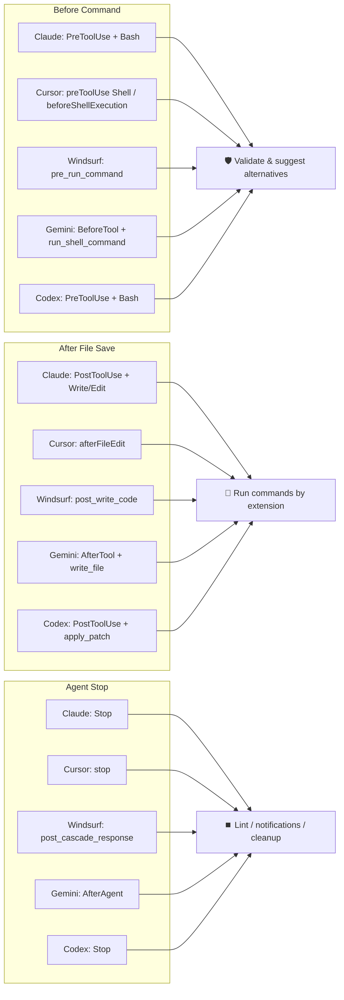

<p align="center">
  
</p>

<h1 align="center">claw-hooks</h1>

<p align="center">
  Simple TOML hooks for Claude Code, Cursor, Windsurf, Gemini CLI, Codex CLI - Command blocking, auto-formatting, stop-time automation
</p>

<p align="center">
  <a href="https://github.com/owayo/claw-hooks/actions/workflows/ci.yml">
    
  </a>
  <a href="https://github.com/owayo/claw-hooks/releases/latest">
    
  </a>
  <a href="LICENSE">
    
  </a>
</p>

<p align="center">
  <a href="README.md">English</a> |
  <a href="README.ja.md">日本語</a>
</p>

---

## Features

- 🦀 **Built with Rust** - Low overhead, lightweight single binary, blazing fast (<10ms startup)
- ⚡ **Kill Command Blocking** - Blocks `kill`, `pkill`, `killall`, `taskkill` and suggests [safe-kill](https://github.com/owayo/safe-kill)
- 🗑️ **RM Command Blocking** - Blocks `rm`, `rmdir`, `del`, `erase` and suggests [safe-rm](https://github.com/owayo/safe-rm)
- 💾 **DD Command Blocking** - Optionally blocks `dd` to prevent disk overwrite accidents
- 🌳 **AST-based Parsing** - Uses [tree-sitter-bash](https://github.com/tree-sitter/tree-sitter-bash) for accurate command analysis with wrapper/subshell detection and shell quote-removal handling (sudo, `sudo -n`, `sudo --user`, `sudo VAR=value rm`, `timeout --signal`, `command rm`, bash -c, `eval`, `find -exec`, pipes, `r\m`, `r''m`, `$'r\x6d'`)
- 🔧 **Custom Command Filters** - Define custom filters with regex support
- 📁 **Extension Hooks** - Execute external tools (formatters, linters) only after file save/edit completes, with lint output passed to supported AI agents (Claude Code, Gemini CLI, Codex CLI)
- ⏹️ **Stop Hooks** - Run commands when agent loop ends (notifications, git commit with [git-sc](https://github.com/owayo/git-smart-commit), cleanup)
- 🧹 **Project-wide Lint on Stop** - Auto-detect project type (`Cargo.toml`, `tsconfig.json`, etc.) and run lint/typecheck, feeding errors back to the AI agent where the hook runtime supports stop-time feedback (Windsurf runs best-effort)
- ⏱️ **Hook Timeout** - Configurable timeout for hook commands (default: 60s); on Unix the entire process group is killed with SIGKILL so grandchildren of `sh -c '...'` are also stopped
- 📏 **Output Truncation** - Configurable output length limit (default: 1000 characters) to prevent AI agent context window overflow, with multi-byte character-safe truncation
- 🗜️ **Output Compression** - Collapses repeated decorative characters (`.`, `=`, `-`, `─`, `━`, `^`, `·`, `→`), trailing progress ellipses, and noisy repeated-prefix progress lines (e.g., cargo `Compiling foo v1.0` runs) for token-efficient output. It also strips common absolute path prefixes, including paths under directories with spaces. The `^` rule trims long range markers commonly produced by ruff / clippy / rustc lint output, while `·` and `→` handle whitespace markers from tools such as Biome — including the space-separated variants seen in diff visualizations (`→ → → → → → → Google` → `→ Google`) and Biome's duplicate diff context line numbers (`129 129 │ text` → `129 │ text`, with mismatched pairs like `10 9 │` left untouched).
- 📂 **Project Config Merge** - Place `.claw-hooks.toml` in your project root to override/extend global settings per project
- 🔌 **Multi-Agent Support** - Works with Claude Code, Cursor, Windsurf, Gemini CLI, and Codex CLI

## Why claw-hooks?

Native hooks require complex Python/Bash scripts for simple tasks. claw-hooks reduces this to simple TOML configuration.

### Native Hooks (Complex)

**Claude Code** - Blocking `rm` command requires a Python script:

```python
#!/usr/bin/env python3
import json
import sys

def main():
    input_data = json.loads(sys.stdin.read())
    tool_name = input_data.get("tool_name", "")
    tool_input = input_data.get("tool_input", {})

    if tool_name == "Bash":
        command = tool_input.get("command", "")
        dangerous = ["rm ", "rm -", "rmdir"]
        if any(cmd in command for cmd in dangerous):
            result = {
                "hookSpecificOutput": {
                    "hookEventName": "PreToolUse",
                    "permissionDecision": "deny",
                    "permissionDecisionReason": "🚫 Dangerous command blocked"
                }
            }
            print(json.dumps(result))
            sys.exit(2)

    sys.exit(0)

if __name__ == "__main__":
    main()
```

Then configure in `settings.json`:

```json
{
  "hooks": {
    "PreToolUse": [{
      "matcher": "Bash",
      "hooks": [{"type": "command", "command": "python3 /path/to/hook.py"}]
    }]
  }
}
```

**Cursor/Windsurf** - Similar complexity with different JSON structures to parse.

**Alternative: Regex one-liner** - Harder to maintain and limited functionality:

```json
{
  "hooks": {
    "PreToolUse": [{
      "matcher": "Bash",
      "hooks": [{
        "type": "command",
        "command": "jq -r '.tool_input.command // \"\"' | grep -qE '^rm(dir)?\\b' && { echo '🚫 Dangerous command blocked' >&2; exit 2; }; exit 0"
      }]
    }]
  }
}
```

Problems with regex approach:
- ❌ Doesn't catch `sudo rm`, `cd /tmp && rm`, or commands in pipes
- ❌ Hard to add multiple blocked commands
- ❌ No custom messages per command type
- ❌ Requires jq dependency
- ❌ Different regex needed for each agent's JSON structure

**Extension hooks (formatters/linters)** - Even more complex:

```bash
# Regex one-liner attempt - becomes unmaintainable
jq -r '.tool_input.file_path // ""' | xargs -I{} sh -c 'case "{}" in *.rs) rustfmt "{}" ;; *.py) ruff format "{}" && ruff check --fix "{}" ;; *.ts|*.tsx) biome format --write "{}" && biome lint --write "{}" ;; esac'
```

Or with a Python script:

```python
#!/usr/bin/env python3
import json
import sys
import subprocess
import os

def main():
    input_data = json.loads(sys.stdin.read())
    tool_name = input_data.get("tool_name", "")
    tool_input = input_data.get("tool_input", {})

    if tool_name in ["Write", "Edit", "MultiEdit"]:
        file_path = tool_input.get("file_path", "")
        ext = os.path.splitext(file_path)[1]

        commands = {
            ".rs": ["rustfmt {}"],
            ".py": ["ruff format {}", "ruff check --fix {}"],
            ".ts": ["biome format --write {}", "biome lint --write {}"],
            ".tsx": ["biome format --write {}", "biome lint --write {}"],
        }

        if ext in commands:
            for cmd in commands[ext]:
                subprocess.run(cmd.format(file_path), shell=True)

    print(json.dumps({"decision": "approve"}))

if __name__ == "__main__":
    main()
```

### claw-hooks (Simple)

**Block dangerous commands with 2 lines:**

```toml
rm_block = true
rm_block_message = "🚫 Use safe-rm instead"
```

**Extension hooks with simple map:**

```toml
[extension_hooks]
".css" = ["biome format --write {file}", "biome lint --write {file}"]
".py" = ["ruff format --check {file}", "ruff check --preview --select=I,F,DOC {file}"]
".rs" = ["rustfmt {file}"]
".ts" = ["biome check {file}"]
".tsx" = ["biome check {file}"]
```

Rules:
- Each extension hook command template must contain exactly one `{file}` placeholder.
- Extension hooks run only on post-save/post-edit file-write events (`PostToolUse` for Claude `Write` / `Edit`, Cursor `afterFileEdit`, Windsurf `post_write_code`, Gemini `AfterTool` with `write_file`, Codex `PostToolUse` with `apply_patch`).
- Codex `PostToolUse` with `Bash` remains a pass-through command-output event; `apply_patch` payloads are parsed for changed file paths and can trigger extension hooks.
- Paths containing parent-directory traversal segments (e.g., `../`) are rejected.
- Paths containing shell redirection metacharacters (`<`, `>`) are rejected.
- Malformed agent payloads that omit required command/file fields are rejected fail-closed.

**Why it works better:**
- ✅ AST-based parsing with tree-sitter-bash for accurate command detection
- ✅ Quote-aware (detects commands, ignores arguments in quotes)
- ✅ Detects `sudo rm`, `sudo -n rm`, `sudo --user root rm`, `sudo VAR=value rm`, `timeout --signal TERM 10 rm`, `command rm`, `exec rm`, `bash -lc 'rm ...'`, `cmd /c del`, `cd /tmp && rm`, `echo ok & rm` (single `&` background), commands separated by newlines, commands in pipes, `eval`, `xargs -I`, `xargs sh -c`, `find -exec`, and shell quote-removal forms such as `r\m`, `r''m`, and `$'r\x6d'`
- ✅ Handles wrappers and subshells (sudo, timeout, command, exec, bash -c/-lc, cmd /c, xargs, eval, find -exec)
- ✅ Single binary, no Python/jq dependencies

Configure once:

```json
{
  "hooks": {
    "PreToolUse": [{
      "matcher": "Bash",
      "hooks": [{"type": "command", "command": "claw-hooks hook"}]
    }]
  }
}
```

### Comparison

| Feature | Native Hooks | claw-hooks |
|---------|--------------|------------|
| Block dangerous commands | 25+ lines Python per command | 1 line TOML |
| Custom filters | New script per filter | Add to `[[custom_filters]]` |
| Extension hooks (formatters) | Complex file detection script | `[extension_hooks]` map |
| Lint output to agent | Manual JSON construction | Automatic (Claude Code, Gemini CLI, Codex CLI)* |
| Multi-agent support | Different scripts per agent | Single binary with `--format` |
| Stop hooks (lint, notifications, etc.) | Custom scripts per use case | `[[stop_hooks]]` config |

\* Lint/formatter output is automatically passed via `additionalContext` where the agent hook runtime supports it, enabling the agent to fix warnings.

## Requirements

- **OS**: macOS, Linux, Windows
- **Dependencies**: None (single binary)

## Installation

### Homebrew (macOS/Linux)

```bash
brew install owayo/claw-hooks/claw-hooks
```

### From Source

```bash
git clone https://github.com/owayo/claw-hooks.git
cd claw-hooks
cargo build --release
```

Binary: `target/release/claw-hooks`

### From GitHub Releases

**macOS (Apple Silicon)**
```bash
curl -L https://github.com/owayo/claw-hooks/releases/latest/download/claw-hooks-aarch64-apple-darwin.tar.gz | tar xz
sudo mv claw-hooks /usr/local/bin/
```

**macOS (Intel)**
```bash
curl -L https://github.com/owayo/claw-hooks/releases/latest/download/claw-hooks-x86_64-apple-darwin.tar.gz | tar xz
sudo mv claw-hooks /usr/local/bin/
```

**Linux (x86_64)**
```bash
curl -L https://github.com/owayo/claw-hooks/releases/latest/download/claw-hooks-x86_64-unknown-linux-gnu.tar.gz | tar xz
sudo mv claw-hooks /usr/local/bin/
```

**Linux (ARM64)**
```bash
curl -L https://github.com/owayo/claw-hooks/releases/latest/download/claw-hooks-aarch64-unknown-linux-gnu.tar.gz | tar xz
sudo mv claw-hooks /usr/local/bin/
```

**Windows**

Download `claw-hooks-x86_64-pc-windows-msvc.zip` from [Releases](https://github.com/owayo/claw-hooks/releases/latest), extract, and add to PATH.

## Quickstart

```bash
# Generate default configuration
claw-hooks init

# Test with a safe command (allowed)
echo '{"hook_event_name":"PreToolUse","tool_name":"Bash","tool_input":{"command":"git status"}}' | claw-hooks hook
# Output: {"hookSpecificOutput":{"hookEventName":"PreToolUse","permissionDecision":"allow"}}

# Test with a dangerous command (blocked)
echo '{"hook_event_name":"PreToolUse","tool_name":"Bash","tool_input":{"command":"rm -rf /"}}' | claw-hooks hook
# Output: {"hookSpecificOutput":{"hookEventName":"PreToolUse","permissionDecision":"deny","permissionDecisionReason":"🚫 Use safe-rm instead..."}}
```

## Usage

### Commands

| Command | Description |
|---------|-------------|
| `hook` (alias: `run`) | Process hook events from stdin |
| `init` | Generate default configuration |
| `check` | Validate configuration |
| `version` | Show version |

### Options

| Option | Short | Description |
|--------|-------|-------------|
| `--format` | `-f` | Input format: `claude` (default), `cursor`, `windsurf`, `gemini`, `codex` |
| `--config` | `-c` | Path to configuration file |
| `--help` | `-h` | Show help |

### Examples

```bash
# Process Claude Code hooks (default)
claw-hooks hook

# Process Cursor hooks
claw-hooks hook --format cursor

# Process Windsurf hooks
claw-hooks hook --format windsurf

# Process Gemini CLI hooks
claw-hooks hook --format gemini

# Process Codex CLI hooks
claw-hooks hook --format codex

# Use custom config
claw-hooks hook --config /path/to/config.toml
```

## Agent Integration

### Claude Code

Add to `~/.claude/settings.json` (user) or `.claude/settings.json` (project):

```json
{
  "hooks": {
    "PreToolUse": [
      {
        "matcher": "Bash",
        "hooks": [{ "type": "command", "command": "claw-hooks hook" }]
      }
    ],
    "PostToolUse": [
      {
        "matcher": "Write|Edit|MultiEdit",
        "hooks": [{ "type": "command", "command": "claw-hooks hook" }]
      }
    ],
    "Stop": [
      {
        "matcher": "",
        "hooks": [{ "type": "command", "command": "claw-hooks hook" }]
      }
    ]
  }
}
```

### Cursor

Add to `~/.cursor/hooks.json` (user) or `<project>/.cursor/hooks.json` (project):

```json
{
  "version": 1,
  "hooks": {
    "preToolUse": [
      { "command": "claw-hooks hook --format cursor" }
    ],
    "beforeShellExecution": [
      { "command": "claw-hooks hook --format cursor" }
    ],
    "afterFileEdit": [
      { "command": "claw-hooks hook --format cursor" }
    ],
    "stop": [
      { "command": "claw-hooks hook --format cursor" }
    ]
  }
}
```

### Windsurf (Cascade)

Add to `~/.codeium/windsurf/hooks.json` (user) or `.windsurf/hooks.json` (project):

```json
{
  "hooks": {
    "pre_run_command": [
      { "command": "claw-hooks hook --format windsurf", "show_output": true }
    ],
    "post_write_code": [
      { "command": "claw-hooks hook --format windsurf", "show_output": true }
    ],
    "post_cascade_response": [
      { "command": "claw-hooks hook --format windsurf", "show_output": true }
    ]
  }
}
```

### Gemini CLI

Add to `~/.gemini/settings.json` (user) or `.gemini/settings.json` (project):

```json
{
  "hooks": {
    "BeforeTool": [
      {
        "matcher": "run_shell_command",
        "hooks": [{ "type": "command", "command": "claw-hooks hook --format gemini" }]
      }
    ],
    "AfterTool": [
      {
        "matcher": "write_file|replace",
        "hooks": [{ "type": "command", "command": "claw-hooks hook --format gemini" }]
      }
    ],
    "AfterAgent": [
      {
        "matcher": "",
        "hooks": [{ "type": "command", "command": "claw-hooks hook --format gemini" }]
      }
    ]
  }
}
```

### Codex CLI

Add to `~/.codex/hooks.json` (user):

```json
{
  "hooks": {
    "PreToolUse": [
      {
        "matcher": "Bash",
        "hooks": [
          {
            "type": "command",
            "command": "claw-hooks hook --format codex"
          }
        ]
      }
    ],
    "PermissionRequest": [
      {
        "matcher": "Bash",
        "hooks": [
          {
            "type": "command",
            "command": "claw-hooks hook --format codex"
          }
        ]
      }
    ],
    "PostToolUse": [
      {
        "matcher": "Bash|apply_patch|Edit|Write",
        "hooks": [
          {
            "type": "command",
            "command": "claw-hooks hook --format codex"
          }
        ]
      }
    ],
    "Stop": [
      {
        "hooks": [
          {
            "type": "command",
            "command": "claw-hooks hook --format codex"
          }
        ]
      }
    ]
  }
}
```

## Configuration

Default location: `~/.config/claw-hooks/config.toml` (all platforms)

```toml
# Command blocking
rm_block = true                    # Block rm/rmdir/del/erase (default: true)
kill_block = true                  # Block kill/pkill/killall/taskkill (default: true)
dd_block = true                    # Block dd command (default: true)

# Custom messages (recommended: use with safe-rm/safe-kill tools)
# safe-rm: https://github.com/owayo/safe-rm
# safe-kill: https://github.com/owayo/safe-kill
rm_block_message = "🚫 Use safe-rm instead: safe-rm <file> (validates Git status and path containment). Only clean/ignored files in project allowed."
kill_block_message = "🚫 Use safe-kill instead: safe-kill <PID> or safe-kill -n <name> (like pkill). Use -s <signal> for signal."
dd_block_message = "🚫 dd command blocked for safety."

# Debug logging
debug = false
# log_path = "~/.config/claw-hooks/logs"  # default: same directory as config.toml
# Debug logs record hook event summaries only. Raw tool input/content is not written.

# Hook command timeout in seconds (default: 60, max: 86400)
# Applies to reported stop hooks and extension hook commands.
# Commands exceeding this timeout will be killed (SIGKILL) and reported as failures.
# report=false stop hooks are started detached and are not waited on.
# hook_timeout = 60

# Output max length in characters (default: 1000, 0 = unlimited)
# Prevents AI agent context window overflow from large lint/typecheck output
# output_max_length = 1000

# Custom command filters (regex supported)
[[custom_filters]]
command = "yarn"
message = "Use `pnpm` instead of `yarn`"

# Args mode: command (regex) + args matching
[[custom_filters]]
command = "npm"
args = ["install", "i", "add"]         # Blocks: npm install, npm i, npm add
message = "Use `pnpm` instead of `npm`"

[[custom_filters]]
command = "pip3?"                       # Regex: matches pip or pip3
args = ["install", "uninstall"]
message = "Use `uv pip` instead"

# Regex-only mode (when args is not specified)
[[custom_filters]]
command = "python[23]? -m pip"         # More complex patterns
message = "Use `uv pip` instead"

[[custom_filters]]
command = "docker"
args = ["rm", "rmi", "system prune"]   # Blocks: docker rm, docker rmi
message = "Ask the user to run this command manually"

# Extension hooks (triggered on file write/edit)
# Map format: ".ext" = ["cmd1 {file}", "cmd2 {file}"]
# Output (stdout/stderr) is passed as additionalContext where the hook runtime supports it
# Each command template must contain exactly one {file}
# Parent-directory traversal paths (../) are rejected for safety
# Shell redirection metacharacters (<, >) in file paths are rejected for safety
# On Windows, cmd metacharacters (%, !, ^, ") are also rejected to prevent variable-expansion injection
[extension_hooks]
".css" = ["biome format --write {file}", "biome lint --write {file}"]
".py" = ["ruff format --check {file}", "ruff check --preview --select=I,F,DOC {file}"]
".rs" = ["rustfmt {file}"]
".ts" = ["biome check {file}"]
".tsx" = ["biome check {file}"]

# Stop hooks (triggered when agent loop ends)
# All commands in the array are executed in parallel.
# Hooks without a condition default to report=false and are started detached;
# stdout/stderr are discarded, so redirect output yourself if needed.
# [[stop_hooks]]
# commands = ["afplay /System/Library/Sounds/Glass.aiff"]  # macOS notification sound

# [[stop_hooks]]
# commands = ["notify-send 'Agent completed'"]  # Linux notification

# Conditional stop hooks (project-wide lint on stop)
# Detects project type by file existence and tool availability.
# On failure, the result is returned to the AI agent so it can fix the issues
# on runtimes that support stop-time feedback (Windsurf remains best-effort).
# condition fields (AND logic): file_exists, command_exists
[[stop_hooks]]
commands = ["cargo clippy --all-targets --all-features -- -D warnings", "cargo fmt --check"]
condition = { file_exists = "Cargo.toml" }

[[stop_hooks]]
commands = ["pnpm exec tsc --noEmit"]
condition = { file_exists = "tsconfig.json" }

[[stop_hooks]]
commands = ["ruff format .", "ruff check --preview --fix --select=I,F,DOC --unsafe-fixes"]
condition = { file_exists = "pyproject.toml", command_exists = "ruff" }

[[stop_hooks]]
commands = ["biome check --write ."]
condition = { file_exists = "package.json" }
```

### Per-Project Configuration

claw-hooks uses a global configuration file (`~/.config/claw-hooks/config.toml`) by default. You can customize behavior per project in three ways:

**1. `.claw-hooks.toml` — Auto-detected project config (recommended)**

Place a `.claw-hooks.toml` in your project root. claw-hooks automatically detects it in the current working directory and merges it with the global config. No `--config` flag needed.

```toml
# my-project/.claw-hooks.toml

# Override: disable dd blocking for this project
dd_block = false

# Override: project-specific extension hooks (replaces global)
[extension_hooks]
".rs" = ["rustfmt {file}"]
".ts" = ["biome check {file}"]

# Merge: additional stop hooks (added to global stop hooks)
[[stop_hooks]]
commands = ["pnpm exec tsc --noEmit"]
condition = { file_exists = "tsconfig.json" }
```

**Merge rules:**

| Field | Rule | Behavior |
|-------|------|----------|
| `extension_hooks` | **Replace** | Project definition completely replaces global |
| `custom_filters` | **Replace** | Project definition completely replaces global |
| `stop_hooks` | **Merge** | Both global and project hooks are executed |
| `rm_block`, `kill_block`, `dd_block` | **Replace** | Project value takes precedence |
| `*_block_message`, `hook_timeout`, `output_max_length` | **Replace** | Project value takes precedence |
| `debug`, `log_path`, `nano_buddy` | **Global only** | Not allowed in project config |

Omitted fields keep the global value. Setting an empty array (e.g., `custom_filters = []`) explicitly clears the global value.

Validate with `claw-hooks check` — it reports if a project config was found and whether it's valid.

**2. `--config` — Full config replacement**

Use `--config` to specify a complete configuration file, replacing the global config entirely:

```toml
# my-project/.claude/claw-hooks.toml
rm_block = true
kill_block = true
dd_block = false  # Allow dd in this project

[extension_hooks]
".rs" = ["rustfmt {file}"]
```

```json
// my-project/.claude/settings.json
{
  "hooks": {
    "PreToolUse": [{
      "matcher": "Bash",
      "hooks": [{ "type": "command", "command": "claw-hooks hook --config .claude/claw-hooks.toml" }]
    }],
    "PostToolUse": [{
      "matcher": "Write|Edit|MultiEdit",
      "hooks": [{ "type": "command", "command": "claw-hooks hook --config .claude/claw-hooks.toml" }]
    }],
    "Stop": [{
      "matcher": "",
      "hooks": [{ "type": "command", "command": "claw-hooks hook --config .claude/claw-hooks.toml" }]
    }]
  }
}
```

**3. Conditional stop hooks — Automatic project detection**

Stop hooks with `file_exists` conditions automatically adapt to the project type based on the working directory. A single global config can handle multiple project types:

```toml
# ~/.config/claw-hooks/config.toml

# Runs only in Rust projects (where Cargo.toml exists)
[[stop_hooks]]
commands = ["cargo clippy -- -D warnings"]
condition = { file_exists = "Cargo.toml" }

# Runs only in TypeScript projects (where tsconfig.json exists)
[[stop_hooks]]
commands = ["pnpm exec tsc --noEmit"]
condition = { file_exists = "tsconfig.json" }
```

All three approaches can be combined: use the global config for shared rules, `.claw-hooks.toml` for project-specific overrides, and conditional stop hooks for automatic project-type detection.

### Conditional Stop Hooks (Project-wide Lint)

Stop hooks with a `condition` field run lint/typecheck commands based on the project type. All commands in the `commands` array are executed **in parallel**. When any command fails (non-zero exit), all failure outputs are collected and returned to the AI agent as a block reason, prompting it to fix the issues.
**Timeout handling:** `hook_timeout` accepts values up to `86400` seconds. For reported stop hooks (`report = true`), when a command exceeds `hook_timeout`, claw-hooks kills the process tree (SIGKILL) and returns the timeout as a block reason. Normal command failures — including those that explicitly exit with code `124` — also block as usual. `report = false` stop hooks are started detached with stdin/stdout/stderr set to null, so claw-hooks does not wait for them or enforce `hook_timeout`; wrap the command itself with a timeout tool if needed.

Windsurf is the main exception here: its `post_cascade_response` hook is an asynchronous post-hook, so stop hooks still run but failures are treated as best-effort and are not surfaced back to the agent as a block.

**Stop hook fields:**

| Field | Type | Default | Description |
|-------|------|---------|-------------|
| `commands` | `string[]` | (required) | Commands to execute (in parallel within the same stage) |
| `condition` | `object` | (none) | Execution condition (AND logic: `file_exists`, `command_exists`) |
| `stage` | `1-5` | `5` | Execution order. Lower stages run first. Hooks in the same stage run in parallel. |
| `report` | `bool` | (auto) | Whether to report results to the AI agent. Default: `true` if `condition` is set, `false` otherwise. |

**Condition fields** (AND logic — all specified conditions must be true):

| Field | Description |
|-------|-------------|
| `file_exists` | Run only when this file exists in the working directory |
| `command_exists` | Run only when this command is available in PATH (Windows `PATHEXT` is respected; on Unix the file must have an executable bit; explicit paths like `./tool` or `/usr/bin/tool` are also supported) |

```toml
# Stage-based execution: analysis → lint → commit
[[stop_hooks]]
commands = ["astro-sight impact --dir . --git"]
stage = 1        # Run first
report = true    # Return results to AI

[[stop_hooks]]
commands = ["cargo clippy --all-targets --all-features -- -D warnings", "cargo fmt --check"]
condition = { file_exists = "Cargo.toml" }
stage = 3
# report not set → condition present → true (default)

[[stop_hooks]]
commands = ["pnpm exec tsc --noEmit"]
condition = { file_exists = "tsconfig.json" }
stage = 3

[[stop_hooks]]
commands = ["git-sc --all --yes --quiet"]
# stage not set → 5 (last)
# report not set → no condition → false (fire-and-forget)
```

**Stage execution order:** Stages are executed sequentially from 1 to 5. All hooks in the same stage run in parallel. A stage completes before the next one begins.

**Report behavior:** When `report = true` (or defaulting to true via `condition`), command failures are collected and returned to the AI agent as a block reason. When `report = false` (or defaulting to false without `condition`), commands are started fire-and-forget style and do not block the hook response. Detached commands run with stdin/stdout/stderr set to null; spawn failures are logged, but command output and exit status are not collected. On Windsurf stop hooks, failures are always best-effort because the underlying hook is asynchronous.

```toml
# More examples:

# Python: run ruff format/check when pyproject.toml exists and ruff is installed
[[stop_hooks]]
commands = ["ruff format .", "ruff check --preview --fix --select=I,F,DOC --unsafe-fixes"]
condition = { file_exists = "pyproject.toml", command_exists = "ruff" }

# JavaScript/TypeScript: run biome check when package.json exists
[[stop_hooks]]
commands = ["biome check --write ."]
condition = { file_exists = "package.json" }
```

### Stop Hook Environment Variables

claw-hooks passes the following environment variables to stop hook child processes:

| Variable | Description |
|----------|-------------|
| `CLAW_HOOKS_STOP_ACTIVE` | Always set to `1`. Prevents recursive stop hook execution when a child process triggers another claw-hooks stop event. |
| `CLAW_HOOKS_AGENT_MESSAGE` | The AI agent's last message before stopping (if available). Contains what the agent was working on. |

**`CLAW_HOOKS_AGENT_MESSAGE`** is populated from:
- **Claude Code**: `last_assistant_message` field in the Stop event
- **Windsurf**: `response` field in the `post_cascade_response` event
- **Gemini CLI**: `prompt_response` field in the `AfterAgent` event
- **Cursor**: Not available

This is useful for tools that benefit from knowing the agent's context. For example, [git-sc](https://github.com/owayo/git-smart-commit) uses this to generate more accurate commit messages:

```toml
[[stop_hooks]]
commands = ["git-sc --all --yes --quiet"]
```

When git-sc runs as a stop hook, it reads `CLAW_HOOKS_AGENT_MESSAGE` and includes the agent's context in the AI prompt, resulting in commit messages that reflect the intent of the changes rather than just the raw diff.

### Custom Filter Behavior

Custom filters support two modes:

**Regex mode** (default): When only `command` is specified, it's treated as a regex pattern.

```toml
[[custom_filters]]
command = "python[23]? -m pip"    # Complex regex pattern
message = "Use uv pip instead"
```

**Args mode**: When `args` is specified, `command` is treated as a regex pattern (matched against the command name) and any of the args triggers the filter.

```toml
[[custom_filters]]
command = "npm"                    # Regex pattern for command name
args = ["install", "i", "add"]     # First argument must match one of these
message = "Use pnpm instead"

[[custom_filters]]
command = "pip3?"                  # Matches both pip and pip3
args = ["install", "uninstall"]    # First argument must match one of these
message = "Use uv pip instead"
```

Both modes detect commands even when chained with `;`, `&&`, `||`, or `|`:

```bash
# Blocked: yarn is detected after semicolon
echo "install"; yarn install
# → {"hookSpecificOutput":{"hookEventName":"PreToolUse","permissionDecision":"deny","permissionDecisionReason":"Use `pnpm` instead of `yarn`"}}

# Allowed: "yarn" is inside quotes (not a command), pnpm is OK
echo "not yarn install"; pnpm install
# → {"hookSpecificOutput":{"hookEventName":"PreToolUse","permissionDecision":"allow"}}
```

Commands inside quotes are ignored (they're arguments, not commands).

## Format Detection Logic

Each AI agent sends different JSON structures. claw-hooks uses `--format` to determine parsing.

### Claude Code (`--format claude`)

Uses the official Claude Code hooks specification:

```jsonc
// PreToolUse/PostToolUse events
{
  "hook_event_name": "PreToolUse",
  "tool_name": "Bash",
  "tool_input": { "command": "..." },
  "session_id": "...",
  "cwd": "/path/to/project"
}

// Stop event (no tool_name/tool_input)
{
  "hook_event_name": "Stop",
  "stop_hook_active": true,
  "session_id": "..."
}
```

Supported hook events: `PreToolUse`, `PostToolUse`, `Stop`, `Notification`, `UserPromptSubmit`, `SessionStart`, `SessionEnd`

### Cursor (`--format cursor`)

Uses the `hook_event_name` field for event detection:

| `hook_event_name` | Required Fields | Internal Mapping |
|-------------------|-----------------|------------------|
| `preToolUse` (`Shell` / `Bash` only) | `tool_name`, `tool_input.command` | PreToolUse + Bash |
| `beforeShellExecution` | `command` | PreToolUse + Bash |
| `afterFileEdit` / `afterTabFileEdit` | `file_path` / `filePath` | PostToolUse + Write |
| `stop` | `status` | Stop |

Unsupported Cursor events, including non-shell `preToolUse` tools, are passed through as allow.

### Windsurf (`--format windsurf`)

Uses `agent_action_name` field:

| agent_action_name | Internal Mapping |
|-------------------|------------------|
| `pre_run_command` | PreToolUse + Bash |
| `post_write_code` | PostToolUse + Write |
| `post_cascade_response` | Stop |

Unsupported Windsurf actions are passed through as allow.

### Gemini CLI (`--format gemini`)

Uses `hook_event_name` and `tool_name` fields:

```jsonc
// BeforeTool event (shell command)
{
  "hook_event_name": "BeforeTool",
  "tool_name": "run_shell_command",
  "tool_input": { "command": "..." },
  "session_id": "..."
}

// AfterTool event (file write)
{
  "hook_event_name": "AfterTool",
  "tool_name": "write_file",
  "tool_input": { "file_path": "..." }
}

// AfterAgent event (agent loop ends)
{
  "hook_event_name": "AfterAgent"
}
```

| hook_event_name | tool_name | Internal Mapping |
|-----------------|-----------|------------------|
| `BeforeTool` | `run_shell_command` | PreToolUse + Bash |
| `AfterTool` | `write_file` | PostToolUse + Write |
| `AfterAgent` | - | Stop |

Unsupported Gemini events are passed through as allow so `claw-hooks` can be attached only to the events it actively handles.

Output format uses `allow`/`deny` instead of `approve`/`block`:
- Allow: `{"decision":"allow"}`
- Deny: `{"decision":"deny","reason":"..."}`

### Codex CLI (`--format codex`)

Uses `hook_event_name` field:

```jsonc
// PreToolUse event
{
  "hook_event_name": "PreToolUse",
  "session_id": "...",
  "cwd": "/path/to/project",
  "model": "gpt-5.4",
  "tool_name": "Bash",
  "tool_use_id": "...",
  "tool_input": { "command": "rm -rf /tmp/test" }
}
```

```jsonc
// PermissionRequest event before approval prompts
{
  "hook_event_name": "PermissionRequest",
  "session_id": "...",
  "cwd": "/path/to/project",
  "model": "gpt-5.4",
  "tool_name": "Bash",
  "tool_input": { "command": "rm -rf /tmp/test", "description": "..." }
}
```

```jsonc
// PostToolUse event for Bash command output
{
  "hook_event_name": "PostToolUse",
  "session_id": "...",
  "cwd": "/path/to/project",
  "model": "gpt-5.4",
  "tool_name": "Bash",
  "tool_use_id": "...",
  "tool_input": { "command": "cargo test" },
  "tool_response": "..."
}
```

```jsonc
// PostToolUse event for file edits through apply_patch
{
  "hook_event_name": "PostToolUse",
  "session_id": "...",
  "cwd": "/path/to/project",
  "model": "gpt-5.4",
  "tool_name": "apply_patch",
  "tool_use_id": "...",
  "tool_input": {
    "command": "*** Begin Patch\n*** Update File: src/main.rs\n@@\n-old\n+new\n*** End Patch\n"
  },
  "tool_response": "..."
}
```

```jsonc
// Stop event
{
  "hook_event_name": "Stop",
  "session_id": "...",
  "cwd": "/path/to/project",
  "model": "gpt-5.4",
  "permission_mode": "default",
  "stop_hook_active": false,
  "last_assistant_message": "...",
  "transcript_path": "..."
}
```

| hook_event_name | Internal Mapping |
|-----------------|------------------|
| `SessionStart` | BeforePrompt (pass-through) |
| `UserPromptSubmit` | BeforePrompt (pass-through) |
| `PreToolUse` | BeforeCommand |
| `PermissionRequest` | PermissionRequest (Bash command guard before approval) |
| `PostToolUse` | AfterFileEdit (Bash output pass-through; `apply_patch` can trigger extension hooks) |
| `Stop` | Stop |

Codex `PermissionRequest` is handled as a command guard for `Bash`: dangerous commands are denied with the hook-specific permission response, while safe commands return `{}` and leave the normal approval flow unchanged.

Codex `PostToolUse` supports `Bash` command output and file edits through `apply_patch`. `claw-hooks` treats `Bash` as pass-through and maps `apply_patch` to `MultiEdit` by extracting `*** Add File:`, `*** Update File:`, and `*** Move to:` paths from the patch command. Deleted files are ignored for extension hooks because there is no saved file to format.

Output format:
- Allow: `{}` (empty JSON, exit 0)
- Block: `{"decision":"block","reason":"..."}` (legacy format, officially accepted)
- PermissionRequest Block: `{"hookSpecificOutput":{"hookEventName":"PermissionRequest","decision":{"behavior":"deny","message":"..."}}}`

Hooks should exit with status `0` for both allow and block decisions. A non-zero exit code is treated by Codex CLI as a hook failure, not as a block.

### Event Mapping Summary


```mermaid
graph LR
    subgraph Before Command
        CC1[Claude: PreToolUse + Bash]
        CU1[Cursor: preToolUse Shell / beforeShellExecution]
        WS1[Windsurf: pre_run_command]
        GE1[Gemini: BeforeTool + run_shell_command]
        CX1[Codex: PreToolUse + Bash]
    end
    CH1[🛡️ Validate & suggest alternatives]
    CC1 --> CH1
    CU1 --> CH1
    WS1 --> CH1
    GE1 --> CH1
    CX1 --> CH1

    subgraph After File Save
        CC2[Claude: PostToolUse + Write/Edit]
        CU2[Cursor: afterFileEdit]
        WS2[Windsurf: post_write_code]
        GE2[Gemini: AfterTool + write_file]
        CX2[Codex: PostToolUse + apply_patch]
    end
    CH2[🔧 Run commands by extension]
    CC2 --> CH2
    CU2 --> CH2
    WS2 --> CH2
    GE2 --> CH2
    CX2 --> CH2

    subgraph Agent Stop
        CC3[Claude: Stop]
        CU3[Cursor: stop]
        WS3[Windsurf: post_cascade_response]
        GE3[Gemini: AfterAgent]
        CX3[Codex: Stop]
    end
    CH3[⏹️ Lint / notifications / cleanup]
    CC3 --> CH3
    CU3 --> CH3
    WS3 --> CH3
    GE3 --> CH3
    CX3 --> CH3
```

Codex `PostToolUse` with `Bash` is omitted from the "After File Save" flow because it is command-output feedback. Only `apply_patch` payloads are treated as file-write events.

## Input/Output Reference

### Input (stdin)

```json
{
  "hook_event_name": "PreToolUse",
  "tool_name": "Bash",
  "tool_input": { "command": "rm -rf /tmp/test" },
  "session_id": "abc123"
}
```

### Output (stdout/stderr)

**Claude Code PreToolUse Allow**:
```json
{
  "hookSpecificOutput": {
    "hookEventName": "PreToolUse",
    "permissionDecision": "allow"
  }
}
```

**Claude Code PreToolUse Block**:
```json
{
  "hookSpecificOutput": {
    "hookEventName": "PreToolUse",
    "permissionDecision": "deny",
    "permissionDecisionReason": "Use safe-rm instead..."
  }
}
```

> **Note**: PreToolUse uses `hookSpecificOutput.permissionDecision` only. Top-level `decision`/`reason` fields are deprecated for this event.

**Claude Code PostToolUse Allow with lint output**:
```json
{
  "hookSpecificOutput": {
    "hookEventName": "PostToolUse",
    "additionalContext": "[rustfmt {file}] warning: unused variable..."
  }
}
```

**Claude Code PostToolUse Block**: `{"decision":"block","reason":"..."}`

The `additionalContext` field passes lint warnings/errors to the agent where the hook runtime supports it. `claw-hooks` emits it for Claude Code `PostToolUse`, Gemini CLI `AfterTool`, and Codex CLI `PostToolUse`.

**Claude Code Stop Allow**: `{}`

**Claude Code Stop Block**: `{"decision":"block","reason":"lint errors found..."}`

**Windsurf pre_run_command Block**: Exit code 2 with block message on stderr (Windsurf reads stderr on exit code 2).

**Windsurf Stop (`post_cascade_response`)**: Always returns `{}`. The hook still runs, but failures are treated as best-effort and are not sent back as a block because Windsurf's stop hook is an asynchronous post-hook.

**Codex CLI Allow**: `{}` (empty JSON)

**Codex CLI Block**: `{"decision":"block","reason":"Use safe-rm instead..."}`

**Codex CLI PermissionRequest Block**: `{"hookSpecificOutput":{"hookEventName":"PermissionRequest","decision":{"behavior":"deny","message":"Use safe-rm instead..."}}}`

### Exit Codes

**Claude Code**:
| Code | Meaning |
|------|---------|
| `0` | Success; allow/block decisions are parsed from stdout JSON |
| `2` | Fail-closed hook error; stderr is sent back as feedback |

Claude Code only parses stdout JSON on exit code `0`, so normal PreToolUse/PostToolUse/Stop block decisions are returned with exit code `0`. Parse errors and empty input still use exit code `2` with stderr for fail-closed behavior.

**Cursor / Windsurf**:
| Code | Meaning |
|------|---------|
| `0` | Allow |
| `2` | Block |

**Gemini CLI** (different semantics):
| Code | Meaning |
|------|---------|
| `0` | Success (decision in JSON: `allow` or `deny`) |
| `2` | System error (stderr used as reason) |

Gemini CLI expects exit code `0` for all decisions, including blocks. The `decision` field in the JSON response determines whether the action is allowed or denied.

**Codex CLI** (different semantics):
| Code | Meaning |
|------|---------|
| `0` | Success (decision in JSON: `allow` or `block`) |
| non-zero | Hook failure (decision is ignored) |

Codex CLI expects exit code `0` for all decisions, including blocks. A non-zero exit code is treated as a hook infrastructure failure, and any block decision in stdout JSON is ignored.

## Performance

| Metric | Value |
|--------|-------|
| Startup time | <10ms |

## Development

### Prerequisites

- Rust 1.85+
- Cargo

### Build

```bash
cargo build           # Debug
cargo build --release # Release
```

### Test

```bash
cargo test
cargo test -- --nocapture  # Verbose
```

### Lint

```bash
cargo clippy --all-targets --all-features -- -D warnings
cargo fmt --check
```

## License

[MIT](LICENSE)

## Contributing

Contributions welcome! Please submit a Pull Request.
