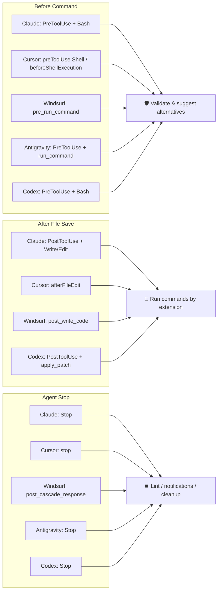

<p align="center">
  
</p>

<h1 align="center">claw-hooks</h1>

<p align="center">
  Simple TOML hooks for Claude Code, Cursor, Windsurf, Antigravity CLI, Codex CLI, Grok CLI - Command blocking, auto-formatting, stop-time automation
</p>

<p align="center">
  <a href="https://github.com/owayo/claw-hooks/actions/workflows/ci.yml">
    
  </a>
  <a href="https://github.com/owayo/claw-hooks/releases/latest">
    
  </a>
  <a href="LICENSE">
    
  </a>
</p>

<p align="center">
  <a href="README.md">English</a> |
  <a href="README.ja.md">日本語</a>
</p>

---

## Features

- 🦀 **Built with Rust** - Low overhead, lightweight single binary, blazing fast (<10ms startup)
- ⚡ **Kill Command Blocking** - Blocks `kill`, `pkill`, `killall`, `taskkill` and suggests [safe-kill](https://github.com/owayo/safe-kill)
- 🗑️ **RM Command Blocking** - Blocks `rm`, `rmdir`, `del`, `erase` and suggests [safe-rm](https://github.com/owayo/safe-rm)
- 💾 **DD Command Blocking** - Optionally blocks `dd` to prevent disk overwrite accidents
- 🌳 **AST-based Parsing** - [tree-sitter-bash](https://github.com/tree-sitter/tree-sitter-bash) handles wrappers (`sudo`, `timeout`, `command`, `exec`, `pkexec`, `gosu`, `su`), subshells, pipes, `eval`, `find -exec`, `bash -c`/`-lc`, command substitution, brace groups, control flow (`if`/`for`/`while`/`case`), basename/extension/case normalization, and shell quote-removal forms. A string fallback parser keeps the same coverage for non-`ast-parser` builds
- 🔧 **Custom Command Filters** - Define custom filters with regex support
- 📁 **Extension Hooks** - Execute external tools (formatters, linters) only after file save/edit completes; lint output flows back to Claude Code / Codex CLI via `additionalContext`. Antigravity CLI does fire `PostToolUse`, but the payload omits the original `toolCall` — there's no way to recover which file was edited — so per-file extension hooks fall back to Stop hooks for project-wide lint. Grok CLI does deliver the edited file path, so the tools run normally, but its post-hook stdout is ignored, so the formatter's own rewrite is the only feedback the agent sees
- ⏹️ **Stop Hooks** - Run commands when agent loop ends (notifications, git commit with [git-sc](https://github.com/owayo/git-smart-commit), cleanup)
- 🧹 **Project-wide Lint on Stop** - Auto-detect project type (`Cargo.toml`, `tsconfig.json`, etc.) and run lint/typecheck; failures are surfaced back to the agent (Windsurf and Grok CLI are best-effort)
- ⏱️ **Hook Timeout** - Configurable per-hook timeout (default 60s). On Unix the whole process group is SIGKILL'd, so grandchildren of `sh -c '...'` cannot leak past the deadline
- 📏 **Output Truncation** - Multi-byte-safe truncation of hook output (default 1000 chars) to protect the agent's context window
- 🗜️ **Output Compression** - Collapses decorative runs (`.`, `=`, `-`, `─`, `━`, `^`, `·`, `→`, `_`), `\r`-overwriting progress bars, repeated cargo `Compiling`/`Blocking` lines, common absolute-path prefixes, rustc/ruff/biome span underlines and frame characters, and Biome's whitespace markers / duplicate diff line-number pairs. Successful no-op formatter/linter notices such as `All checks passed!` and `1 file already formatted` are omitted, while changed-file and failure output is preserved
- ♻️ **Repeated Source Excerpt Removal** - Within a single diagnostic, source-excerpt lines (`3 │ code`, `> 3 │ code`, `12 | code`) that repeat verbatim are dropped after the first occurrence: biome re-prints the same excerpt once per sub-block (the `!` message, the `i` note, the `i Safe fix:` block) and ruff re-prints context inside its fix diff, and those repeats carry no information. Diff lines (`- old` / `+ new`) survive because they *are* the fix, and the dedup scope resets at every diagnostic header, so separate diagnostics keep their own context. Measured on real output: ruff −6%, biome −14%
- 🛡️ **Debug Log Safety** - Logs persist only event/tool/session metadata and byte-size summaries. Raw commands, file contents, agent messages, and rendered formatter/linter output never reach disk — full output bodies are available only via `--trace` (stderr, non-persistent)
- 🛑 **Bounded I/O** - stdin is capped at 4 MiB and oversized or invalid-UTF-8 payloads fail closed instead of OOM-killing the process. Hook subprocess stdout/stderr is also drained without deadlock while retaining at most 4 MiB per stream, so a noisy formatter/linter cannot exhaust memory before agent-facing truncation
- 🔒 **Fail-Closed Gates** - Command blocking denies on parse errors, unreadable input, or a broken config. A typo in `config.toml` can no longer switch protection off: a config error now returns the agent's own deny response (diagnostic on stderr, plus a `claw-hooks check` hint) instead of exiting `1` with empty stdout, which several agents read as "hook failed, ignore its decision". Stop events are the deliberate exception — there a "block" means "keep going", so claw-hooks allows the stop rather than looping forever
- 📂 **Project Config Merge** - Place `.claw-hooks.toml` in your project root to override/extend global settings per project
- 🔌 **Multi-Agent Support** - Works with Claude Code, Cursor, Windsurf, Antigravity CLI, Codex CLI, and Grok CLI

## Why claw-hooks?

Native agent hooks make you ship a Python/Bash script for every dangerous-command check and every formatter. claw-hooks collapses that to TOML.

```toml
# Block dangerous commands
rm_block = true
rm_block_message = "🚫 Use safe-rm instead"

# Auto-format on save
[extension_hooks]
".rs"  = ["rustfmt {file}"]
".py"  = ["ruff format --check {file}", "ruff check --preview --select=I,F,DOC {file}"]
".ts"  = ["biome check {file}"]
".tsx" = ["biome check {file}"]
```

…wired in once via the agent's standard hooks config:

```json
{
  "hooks": {
    "PreToolUse": [{
      "matcher": "Bash",
      "hooks": [{"type": "command", "command": "claw-hooks hook"}]
    }]
  }
}
```

A naive `grep -E '^rm '` filter misses `sudo rm`, `cd /tmp && rm`, `bash -lc 'rm …'`, pipes, `xargs`, brace groups, process substitution, privilege wrappers (`pkexec` / `gosu` / `su <user> cmd`), and shell quote-removal forms (`r\m`, `$'r\x6d'`). claw-hooks resolves every one of those through tree-sitter-bash (with a string fallback parser of the same coverage) — one binary, no Python/jq dependency, identical behavior across Claude Code / Cursor / Windsurf / Antigravity / Codex / Grok.

<details>
<summary>What the equivalent native Python hook looks like</summary>

```python
#!/usr/bin/env python3
import json, sys

data = json.loads(sys.stdin.read())
if data.get("tool_name") == "Bash":
    cmd = data.get("tool_input", {}).get("command", "")
    if any(s in cmd for s in ("rm ", "rm -", "rmdir")):
        print(json.dumps({
            "hookSpecificOutput": {
                "hookEventName": "PreToolUse",
                "permissionDecision": "deny",
                "permissionDecisionReason": "🚫 Dangerous command blocked",
            }
        }))
        sys.exit(2)
sys.exit(0)
```

Then duplicate it per agent, per dangerous command, per formatter — and re-implement quote/wrapper handling for every one.
</details>

### Extension hook rules

- Each `{file}` template must contain exactly one `{file}` placeholder.
- Runs on post-save/post-edit only: Claude `PostToolUse` (`Write`/`Edit`), Cursor `afterFileEdit`, Windsurf `post_write_code`, Codex `PostToolUse` with `apply_patch`, Grok `PostToolUse` with a file path in `toolInput`. Antigravity's `PostToolUse` fires too, but its payload omits the original `toolCall` so the edited file path can't be recovered — use Stop hooks for project-wide lint/typecheck instead.
- Codex `PostToolUse` + `Bash` passes through; `apply_patch` is parsed for changed file paths (delete-only patches are skipped).
- Grok `PostToolUse` runs the hooks whenever `toolInput` carries `file_path` / `filePath`, so formatters still rewrite the file. Grok ignores post-hook stdout, though, so the lint text itself is not returned to the agent.
- Paths with `../`, shell redirection (`<`, `>`), tabs, newlines, or NUL bytes are rejected. Agent payloads missing required fields fail closed.
- Successful no-op formatter/linter notices are not returned to the agent. Output that reports a rewritten file, a warning, or a failure remains visible; command labels expose only the configured program name, not the expanded file path or argument summary.

### Comparison

| Feature | Native Hooks | claw-hooks |
|---------|--------------|------------|
| Block dangerous commands | 25+ lines Python per command | 1 line TOML |
| Custom filters | New script per filter | Add to `[[custom_filters]]` |
| Extension hooks (formatters) | Complex file detection script | `[extension_hooks]` map |
| Lint output to agent | Manual JSON construction | Automatic (Claude Code, Codex CLI); Antigravity CLI via Stop hooks*; not available on Grok CLI (post-hook stdout is ignored) |
| Multi-agent support | Different scripts per agent | Single binary with `--format` |
| Stop hooks (lint, notifications, etc.) | Custom scripts per use case | `[[stop_hooks]]` config |

\* Lint/formatter output is automatically passed via `additionalContext` where the agent hook runtime supports it, enabling the agent to fix warnings.

## Requirements

- **OS**: macOS, Linux, Windows
- **Runtime dependencies**: None (single binary)
- **Source builds / development**: Rust 1.85 or newer. CI also runs locked dependency checks on Rust 1.85 to keep the declared MSRV valid.

## Installation

### Homebrew (macOS/Linux)

```bash
brew install owayo/claw-hooks/claw-hooks
```

### From Source

```bash
git clone https://github.com/owayo/claw-hooks.git
cd claw-hooks
cargo build --release
```

Binary: `target/release/claw-hooks`

For contributor checks:

```bash
make msrv
cargo test --all-features
cargo test --no-default-features
```

### From GitHub Releases

**macOS (Apple Silicon)**
```bash
curl -L https://github.com/owayo/claw-hooks/releases/latest/download/claw-hooks-aarch64-apple-darwin.tar.gz | tar xz
sudo mv claw-hooks /usr/local/bin/
```

**macOS (Intel)**
```bash
curl -L https://github.com/owayo/claw-hooks/releases/latest/download/claw-hooks-x86_64-apple-darwin.tar.gz | tar xz
sudo mv claw-hooks /usr/local/bin/
```

**Linux (x86_64)**
```bash
curl -L https://github.com/owayo/claw-hooks/releases/latest/download/claw-hooks-x86_64-unknown-linux-gnu.tar.gz | tar xz
sudo mv claw-hooks /usr/local/bin/
```

**Linux (ARM64)**
```bash
curl -L https://github.com/owayo/claw-hooks/releases/latest/download/claw-hooks-aarch64-unknown-linux-gnu.tar.gz | tar xz
sudo mv claw-hooks /usr/local/bin/
```

**Windows**

Download `claw-hooks-x86_64-pc-windows-msvc.zip` from [Releases](https://github.com/owayo/claw-hooks/releases/latest), extract, and add to PATH.

## Quickstart

```bash
# Generate default configuration
claw-hooks init

# Test with a safe command (allowed)
echo '{"hook_event_name":"PreToolUse","tool_name":"Bash","tool_input":{"command":"git status"}}' | claw-hooks hook
# Output: {}

# Test with a dangerous command (blocked)
echo '{"hook_event_name":"PreToolUse","tool_name":"Bash","tool_input":{"command":"rm -rf /"}}' | claw-hooks hook
# Output: {"hookSpecificOutput":{"hookEventName":"PreToolUse","permissionDecision":"deny","permissionDecisionReason":"🚫 Use safe-rm instead..."}}
```

> **claw-hooks is deny-only.** An allowed command returns an empty object (`{}`) with exit `0`, which means "no objection" — not "approved". claw-hooks never emits `permissionDecision: "allow"`, because per the official spec that *skips the permission prompt* and would silently auto-approve everything claw-hooks did not block. Your existing permission prompts and rules stay in effect for everything else.

## Usage

### Commands

| Command | Description |
|---------|-------------|
| `hook` (alias: `run`) | Process hook events from stdin |
| `init` | Generate default configuration |
| `check` | Validate configuration |
| `version` | Show version |

### Options

| Option | Short | Description |
|--------|-------|-------------|
| `--format` | `-f` | Input format: `claude` (default), `cursor`, `windsurf`, `agy` (Antigravity CLI), `codex`, `grok` (Grok CLI) |
| `--config` | `-c` | Path to configuration file |
| `--help` | `-h` | Show help |

### Examples

```bash
# Process Claude Code hooks (default)
claw-hooks hook

# Process Cursor hooks
claw-hooks hook --format cursor

# Process Windsurf hooks
claw-hooks hook --format windsurf

# Process Antigravity CLI hooks
claw-hooks hook --format agy

# Process Codex CLI hooks
claw-hooks hook --format codex

# Process Grok CLI hooks
claw-hooks hook --format grok

# Use custom config
claw-hooks hook --config /path/to/config.toml
```

## Agent Integration

### Claude Code

Add to `~/.claude/settings.json` (user) or `.claude/settings.json` (project):

```json
{
  "hooks": {
    "PreToolUse": [
      {
        "matcher": "Bash",
        "hooks": [{ "type": "command", "command": "claw-hooks hook" }]
      }
    ],
    "PostToolUse": [
      {
        "matcher": "Write|Edit|MultiEdit",
        "hooks": [{ "type": "command", "command": "claw-hooks hook" }]
      }
    ],
    "Stop": [
      {
        "matcher": "",
        "hooks": [{ "type": "command", "command": "claw-hooks hook" }]
      }
    ]
  }
}
```

### Cursor

Add to `~/.cursor/hooks.json` (user) or `<project>/.cursor/hooks.json` (project):

```json
{
  "version": 1,
  "hooks": {
    "preToolUse": [
      { "command": "claw-hooks hook --format cursor", "failClosed": true }
    ],
    "beforeShellExecution": [
      { "command": "claw-hooks hook --format cursor", "failClosed": true }
    ],
    "afterFileEdit": [
      { "command": "claw-hooks hook --format cursor" }
    ],
    "stop": [
      { "command": "claw-hooks hook --format cursor" }
    ]
  }
}
```

> **`failClosed: true` on the command-blocking hooks is recommended.** Cursor is fail-open by default: a clean block (exit `0` plus `{"permission":"deny", …}` on stdout) works without it, but if claw-hooks itself crashes or times out, Cursor lets the command through unless `failClosed: true` is set. Leave it off for `afterFileEdit`/`stop` (a formatter/lint crash should not block the agent).

### Windsurf (Cascade)

Add to `~/.codeium/windsurf/hooks.json` (user) or `.windsurf/hooks.json` (project):

```json
{
  "hooks": {
    "pre_run_command": [
      { "command": "claw-hooks hook --format windsurf", "show_output": true }
    ],
    "post_write_code": [
      { "command": "claw-hooks hook --format windsurf", "show_output": true }
    ],
    "post_cascade_response": [
      { "command": "claw-hooks hook --format windsurf", "show_output": true }
    ]
  }
}
```

### Antigravity CLI

Add to `~/.gemini/config/hooks.json` (user) or `<project>/.agents/hooks.json` (project workspace):

```json
{
  "claw-hooks": {
    "PreToolUse": [
      {
        "matcher": "run_command",
        "hooks": [{ "type": "command", "command": "claw-hooks hook --format agy" }]
      }
    ],
    "Stop": [
      { "type": "command", "command": "claw-hooks hook --format agy" }
    ]
  }
}
```

Notes:
- Antigravity's `PostToolUse` event does not include the original `toolCall`, so file-level extension hooks are unavailable. Use Stop hooks to run project-wide lint/typecheck instead — failures are injected back to the agent via `{"decision":"continue","reason":"..."}`.
- `PreInvocation` / `PostInvocation` are out of claw-hooks' scope and pass through automatically; no hook entry is needed for those events.
- Official Antigravity hooks docs: <https://antigravity.google/docs/customizations/hooks>

### Codex CLI

Add to `~/.codex/hooks.json` (user):

```json
{
  "hooks": {
    "PreToolUse": [
      {
        "matcher": "Bash",
        "hooks": [
          {
            "type": "command",
            "command": "claw-hooks hook --format codex"
          }
        ]
      }
    ],
    "PermissionRequest": [
      {
        "matcher": "Bash",
        "hooks": [
          {
            "type": "command",
            "command": "claw-hooks hook --format codex"
          }
        ]
      }
    ],
    "PostToolUse": [
      {
        "matcher": "Bash|apply_patch|Edit|Write",
        "hooks": [
          {
            "type": "command",
            "command": "claw-hooks hook --format codex"
          }
        ]
      }
    ],
    "Stop": [
      {
        "hooks": [
          {
            "type": "command",
            "command": "claw-hooks hook --format codex"
          }
        ]
      }
    ]
  }
}
```

Codex hooks are enabled by default. If you explicitly configure feature flags, use the current `[features] hooks` key; the older `codex_hooks` alias is deprecated.

### Grok CLI

Add a JSON file under `~/.grok/hooks/` (personal) or `<project>/.grok/hooks/` (project):

```json
{
  "hooks": {
    "PreToolUse": [
      {
        "matcher": "Bash",
        "hooks": [{ "type": "command", "command": "claw-hooks hook --format grok", "timeout": 10 }]
      }
    ],
    "PostToolUse": [
      {
        "hooks": [{ "type": "command", "command": "claw-hooks hook --format grok", "timeout": 10 }]
      }
    ],
    "Stop": [
      {
        "hooks": [{ "type": "command", "command": "claw-hooks hook --format grok", "timeout": 10 }]
      }
    ]
  }
}
```

Notes:
- `matcher` is a regular expression tested against the tool name; omit it to match every tool. Grok maps Claude-style names such as `Bash` and `Edit` onto its own tool names, but the mapped names are not published, so omitting `matcher` is the safer choice — claw-hooks decides what to do from the payload itself and passes everything irrelevant through (see [Format Detection Logic](#format-detection-logic)).
- `timeout` is in **seconds** and defaults to `5`, which is short for formatters and project-wide lint. Raise it as shown above.
- Project hooks only run after the repository is trusted: run `/hooks-trust` once, or start Grok with `--trust`.
- Grok also loads Claude Code (`.claude/settings.json`) and Cursor (`.cursor/hooks.json`) hook files. If claw-hooks is already registered in one of those, keep a single registration so it does not run twice per event.
- `PreToolUse` is Grok's only blocking event. Every other event is a post-hook whose stdout is ignored, so extension hooks still reformat files and Stop hooks still run lint, but their output cannot be reported back to the agent — the same limitation as Windsurf's `post_cascade_response`.
- Grok is fail-open for anything that is not an explicit deny: a timeout, a crash, or malformed output is recorded as a hook failure and the tool call proceeds. claw-hooks therefore emits the deny JSON **and** exit code `2` when it blocks, and uses exit `2` (never `1`) on its fail-closed paths, so the block holds under either reading of the contract.

## Configuration

Default location: `~/.config/claw-hooks/config.toml` (all platforms)

```toml
# Command blocking
rm_block = true                    # Block rm/rmdir/del/erase (default: true)
kill_block = true                  # Block kill/pkill/killall/taskkill (default: true)
dd_block = true                    # Block dd command (default: true)

# Custom messages (recommended: use with safe-rm/safe-kill tools)
# safe-rm: https://github.com/owayo/safe-rm
# safe-kill: https://github.com/owayo/safe-kill
rm_block_message = "🚫 Use safe-rm instead: safe-rm <file> (validates Git status and path containment). Only clean/ignored files in project allowed."
kill_block_message = "🚫 Use safe-kill instead: safe-kill <PID> or safe-kill -n <name> (like pkill). Use -s <signal> for signal."
dd_block_message = "🚫 dd command blocked for safety."

# Debug logging
debug = false
# log_path = "~/.config/claw-hooks/logs"  # default: same directory as config.toml
# Debug logs record hook event summaries only. Raw commands, file contents, and agent messages are not written.

# Hook command timeout in seconds (default: 60, max: 86400)
# Applies to reported stop hooks and extension hook commands.
# Commands exceeding this timeout will be killed (SIGKILL) and reported as failures.
# report=false stop hooks are started detached and are not waited on.
# hook_timeout = 60

# Output max length in characters (default: 1000, 0 = unlimited)
# Prevents AI agent context window overflow from large lint/typecheck output
# output_max_length = 1000

# Custom command filters (regex supported)
[[custom_filters]]
command = "yarn"
message = "Use `pnpm` instead of `yarn`"

# Args mode: command (regex) + args matching
[[custom_filters]]
command = "npm"
args = ["install", "i", "add"]         # Blocks: npm install, npm i, npm add
message = "Use `pnpm` instead of `npm`"

[[custom_filters]]
command = "pip3?"                       # Regex: matches pip or pip3
args = ["install", "uninstall"]
message = "Use `uv pip` instead"

# Regex-only mode (when args is not specified)
[[custom_filters]]
command = "python[23]? -m pip"         # More complex patterns
message = "Use `uv pip` instead"

[[custom_filters]]
command = "docker"
args = ["rm", "rmi", "system prune"]   # Blocks: docker rm, docker rmi
message = "Ask the user to run this command manually"

# Extension hooks (triggered on file write/edit)
# Map format: ".ext" = ["cmd1 {file}", "cmd2 {file}"]
# Output (stdout/stderr) is passed as additionalContext where the hook runtime supports it
# Each command template must contain exactly one {file}
# Parent-directory traversal paths (../) are rejected for safety
# Shell redirection metacharacters (<, >) in file paths are rejected for safety
# Tabs/newlines/NUL are rejected to prevent argument splitting and malformed paths
# On Windows, cmd metacharacters (%, !, ^, ") are also rejected to prevent variable-expansion injection
[extension_hooks]
".css" = ["biome format --write {file}", "biome lint --write {file}"]
".py" = ["ruff format --check {file}", "ruff check --preview --select=I,F,DOC {file}"]
".rs" = ["rustfmt {file}"]
".ts" = ["biome check {file}"]
".tsx" = ["biome check {file}"]

# Stop hooks (triggered when agent loop ends)
# All commands in the array are executed in parallel.
# Hooks without a condition default to report=false and are started detached;
# stdout/stderr are discarded, so redirect output yourself if needed.
# [[stop_hooks]]
# commands = ["afplay /System/Library/Sounds/Glass.aiff"]  # macOS notification sound

# [[stop_hooks]]
# commands = ["notify-send 'Agent completed'"]  # Linux notification

# Conditional stop hooks (project-wide lint on stop)
# Detects project type by file existence and tool availability.
# On failure, the result is returned to the AI agent so it can fix the issues
# on runtimes that support stop-time feedback (Windsurf and Grok CLI remain best-effort).
# condition fields (AND logic): file_exists, file_not_exists, command_exists, command_not_exists
[[stop_hooks]]
commands = ["cargo clippy --all-targets --all-features -- -D warnings", "cargo fmt --check"]
condition = { file_exists = "Cargo.toml" }

[[stop_hooks]]
commands = ["pnpm exec tsc --noEmit"]
condition = { file_exists = "tsconfig.json" }

[[stop_hooks]]
commands = ["ruff format .", "ruff check --preview --fix --select=I,F,DOC --unsafe-fixes"]
condition = { file_exists = "pyproject.toml", command_exists = "ruff" }

[[stop_hooks]]
commands = ["biome check --write ."]
condition = { file_exists = "package.json" }
```

### Per-Project Configuration

claw-hooks uses a global configuration file (`~/.config/claw-hooks/config.toml`) by default. You can customize behavior per project in three ways:

**1. `.claw-hooks.toml` — Auto-detected project config (recommended)**

Place a `.claw-hooks.toml` in your project root. claw-hooks automatically detects it in the current working directory and merges it with the global config. No `--config` flag needed.

```toml
# my-project/.claw-hooks.toml

# Override: disable dd blocking for this project
dd_block = false

# Override: project-specific extension hooks (replaces global)
[extension_hooks]
".rs" = ["rustfmt {file}"]
".ts" = ["biome check {file}"]

# Merge: additional stop hooks (added to global stop hooks)
[[stop_hooks]]
commands = ["pnpm exec tsc --noEmit"]
condition = { file_exists = "tsconfig.json" }
```

**Merge rules:**

| Field | Rule | Behavior |
|-------|------|----------|
| `extension_hooks` | **Replace** | Project definition completely replaces global |
| `custom_filters` | **Replace** | Project definition completely replaces global |
| `stop_hooks` | **Merge** | Both global and project hooks are executed |
| `rm_block`, `kill_block`, `dd_block` | **Replace** | Project value takes precedence |
| `*_block_message`, `hook_timeout`, `output_max_length` | **Replace** | Project value takes precedence |
| `debug`, `log_path`, `nano_buddy` | **Global only** | Not allowed in project config |

Omitted fields keep the global value. Setting an empty array (e.g., `custom_filters = []`) explicitly clears the global value.

Validate with `claw-hooks check` — it reports if a project config was found and whether it's valid.

**2. `--config` — Full config replacement**

Use `--config` to specify a complete configuration file, replacing the global config entirely:

```toml
# my-project/.claude/claw-hooks.toml
rm_block = true
kill_block = true
dd_block = false  # Allow dd in this project

[extension_hooks]
".rs" = ["rustfmt {file}"]
```

```json
// my-project/.claude/settings.json
{
  "hooks": {
    "PreToolUse": [{
      "matcher": "Bash",
      "hooks": [{ "type": "command", "command": "claw-hooks hook --config .claude/claw-hooks.toml" }]
    }],
    "PostToolUse": [{
      "matcher": "Write|Edit|MultiEdit",
      "hooks": [{ "type": "command", "command": "claw-hooks hook --config .claude/claw-hooks.toml" }]
    }],
    "Stop": [{
      "matcher": "",
      "hooks": [{ "type": "command", "command": "claw-hooks hook --config .claude/claw-hooks.toml" }]
    }]
  }
}
```

**3. Conditional stop hooks — Automatic project detection**

Stop hooks with `file_exists` conditions automatically adapt to the project type based on the working directory. A single global config can handle multiple project types:

```toml
# ~/.config/claw-hooks/config.toml

# Runs only in Rust projects (where Cargo.toml exists)
[[stop_hooks]]
commands = ["cargo clippy -- -D warnings"]
condition = { file_exists = "Cargo.toml" }

# Runs only in TypeScript projects (where tsconfig.json exists)
[[stop_hooks]]
commands = ["pnpm exec tsc --noEmit"]
condition = { file_exists = "tsconfig.json" }
```

All three approaches can be combined: use the global config for shared rules, `.claw-hooks.toml` for project-specific overrides, and conditional stop hooks for automatic project-type detection.

### Conditional Stop Hooks (Project-wide Lint)

Stop hooks with a `condition` field run lint/typecheck commands based on the project type. All commands in the `commands` array are executed **in parallel**. When any command fails (non-zero exit), all failure outputs are collected and returned to the AI agent as a block reason, prompting it to fix the issues.
**Timeout handling:** `hook_timeout` accepts values up to `86400` seconds. For reported stop hooks (`report = true`), when a command exceeds `hook_timeout`, claw-hooks kills the process tree (SIGKILL) and returns the timeout as a block reason. A direct child that exits while a background grandchild still keeps stdout/stderr pipes open is also treated as timed out, so commands like `sh -c 'sleep 60 &'` cannot bypass the hook timeout. Normal command failures — including those that explicitly exit with code `124` — also block as usual. `report = false` stop hooks are started detached with stdin/stdout/stderr set to null, so claw-hooks does not wait for them or enforce `hook_timeout`; wrap the command itself with a timeout tool if needed.

Windsurf and Grok CLI are the exceptions here: Windsurf's `post_cascade_response` is an asynchronous post-hook, and every Grok event except `PreToolUse` is a post-hook whose stdout the agent ignores. On both, stop hooks still run but failures are treated as best-effort and are not surfaced back to the agent as a block.

**Stop hook fields:**

| Field | Type | Default | Description |
|-------|------|---------|-------------|
| `commands` | `string[]` | (required) | Commands to execute (in parallel within the same stage) |
| `condition` | `object` | (none) | Execution condition (AND logic: `file_exists`, `file_not_exists`, `command_exists`, `command_not_exists`) |
| `stage` | `1-5` | `5` | Execution order. Lower stages run first. Hooks in the same stage run in parallel. |
| `report` | `bool` | (auto) | Whether to report results to the AI agent. Default: `true` if `condition` is set, `false` otherwise. |
| `session_scope` | `"primary"` \| `"delegated"` \| `"all"` | `"primary"` | Which session kind runs this hook. `primary` = main session only, `delegated` = delegated agent sessions (e.g. Claude Code teammates) only, `all` = both. |

**Condition fields** (AND logic — all specified conditions must be true):

| Field | Description |
|-------|-------------|
| `file_exists` | Run only when this file exists in the working directory |
| `file_not_exists` | Run only when this file does NOT exist in the working directory (useful for fallbacks such as "no lockfile of type X here") |
| `command_exists` | Run only when this command is available in PATH (Windows `PATHEXT` is respected; on Unix the file must have an executable bit; explicit paths like `./tool` or `/usr/bin/tool` are also supported) |
| `command_not_exists` | Run only when this command is NOT available in PATH |

```toml
# Stage-based execution: analysis → lint → commit
[[stop_hooks]]
commands = ["astro-sight impact --dir . --git"]
stage = 1        # Run first
report = true    # Return results to AI

[[stop_hooks]]
commands = ["cargo clippy --all-targets --all-features -- -D warnings", "cargo fmt --check"]
condition = { file_exists = "Cargo.toml" }
stage = 3
# report not set → condition present → true (default)

[[stop_hooks]]
commands = ["pnpm exec tsc --noEmit"]
condition = { file_exists = "tsconfig.json" }
stage = 3

[[stop_hooks]]
commands = ["git-sc --all --yes --quiet"]
# stage not set → 5 (last)
# report not set → no condition → false (fire-and-forget)
```

**Stage execution order:** Stages are executed sequentially from 1 to 5. All hooks in the same stage run in parallel. A stage completes before the next one begins.

**Report behavior:** When `report = true` (or defaulting to true via `condition`), command failures are collected and returned to the AI agent as a block reason. When `report = false` (or defaulting to false without `condition`), commands are started fire-and-forget style and do not block the hook response. Detached commands run with stdin/stdout/stderr set to null; spawn failures are logged, but command output and exit status are not collected. On Windsurf and Grok CLI stop hooks, failures are always best-effort — the underlying hook is asynchronous (Windsurf) or its stdout is ignored (Grok).

**Session scope (agent-session suppression):** Claude Code's team features spawn delegated agents (teammates) as separate processes, and each of them fires its own `Stop` event — potentially dozens per task. claw-hooks tells the two apart automatically: a delegated agent's Stop payload carries both non-blank `agent_id` and `agent_type` fields. A main session launched with `--agent` can also carry `agent_type`, but it does not carry the subagent-specific `agent_id`, so it remains primary. By default (`session_scope = "primary"`), stop hooks run **only when the main session stops**, so a fleet of teammates does not trigger notification spam, redundant lints, or racing parallel `git` auto-commits. Set `session_scope = "all"` on a hook to restore the old run-everywhere behavior, or `"delegated"` for hooks that should run only for agent sessions (e.g. per-teammate cleanup). Missing, blank, or non-string discriminator fields fall back to primary; agents without a session-kind signal (Cursor, Windsurf, Codex CLI, Antigravity) are also treated as the main session.

```toml
# Runs only when the main session stops (default — no field needed)
[[stop_hooks]]
commands = ["cargo clippy --all-targets --all-features -- -D warnings"]
condition = { file_exists = "Cargo.toml" }

# Runs for both the main session and delegated agent sessions
[[stop_hooks]]
commands = ["collect-metrics"]
report = false
session_scope = "all"
```

```toml
# More examples:

# Python: run ruff format/check when pyproject.toml exists and ruff is installed
[[stop_hooks]]
commands = ["ruff format .", "ruff check --preview --fix --select=I,F,DOC --unsafe-fixes"]
condition = { file_exists = "pyproject.toml", command_exists = "ruff" }

# JavaScript/TypeScript: run biome check when package.json exists
[[stop_hooks]]
commands = ["biome check --write ."]
condition = { file_exists = "package.json" }
```

### Stop Hook Environment Variables

claw-hooks passes the following environment variables to stop hook child processes:

| Variable | Description |
|----------|-------------|
| `CLAW_HOOKS_STOP_ACTIVE` | Always set to `1`. Prevents recursive stop hook execution when a child process triggers another claw-hooks stop event. |
| `CLAW_HOOKS_AGENT_MESSAGE` | The AI agent's last message before stopping (if available). Contains what the agent was working on. |

**`CLAW_HOOKS_AGENT_MESSAGE`** is populated from:
- **Claude Code**: `last_assistant_message` field in the Stop event
- **Windsurf**: `response` field in the `post_cascade_response` event
- **Cursor**: Not available

This is useful for tools that benefit from knowing the agent's context. For example, [git-sc](https://github.com/owayo/git-smart-commit) uses this to generate more accurate commit messages:

```toml
[[stop_hooks]]
commands = ["git-sc --all --yes --quiet"]
```

When git-sc runs as a stop hook, it reads `CLAW_HOOKS_AGENT_MESSAGE` and includes the agent's context in the AI prompt, resulting in commit messages that reflect the intent of the changes rather than just the raw diff.

### Custom Filter Behavior

Custom filters support two modes:

**Regex mode** (default): When only `command` is specified, it's treated as a regex pattern.

```toml
[[custom_filters]]
command = "python[23]? -m pip"    # Complex regex pattern
message = "Use uv pip instead"
```

**Args mode**: When `args` is specified, `command` is treated as a regex pattern (matched against the command name) and any of the args triggers the filter.

```toml
[[custom_filters]]
command = "npm"                    # Regex pattern for command name
args = ["install", "i", "add"]     # First argument must match one of these
message = "Use pnpm instead"

[[custom_filters]]
command = "pip3?"                  # Matches both pip and pip3
args = ["install", "uninstall"]    # First argument must match one of these
message = "Use uv pip instead"
```

Both modes detect commands even when chained with `;`, `&&`, `||`, or `|`:

```bash
# Blocked: yarn is detected after semicolon
echo "install"; yarn install
# → {"hookSpecificOutput":{"hookEventName":"PreToolUse","permissionDecision":"deny","permissionDecisionReason":"Use `pnpm` instead of `yarn`"}}

# Allowed: "yarn" is inside quotes (not a command), pnpm is OK
echo "not yarn install"; pnpm install
# → {"hookSpecificOutput":{"hookEventName":"PreToolUse","permissionDecision":"allow"}}
```

Commands inside quotes are ignored (they're arguments, not commands).

## Format Detection Logic

Each AI agent sends different JSON structures. claw-hooks uses `--format` to determine parsing.

### Claude Code (`--format claude`)

Uses the official Claude Code hooks specification:

```jsonc
// PreToolUse/PostToolUse events
{
  "hook_event_name": "PreToolUse",
  "tool_name": "Bash",
  "tool_input": { "command": "..." },
  "session_id": "...",
  "cwd": "/path/to/project"
}

// Stop event (no tool_name/tool_input)
{
  "hook_event_name": "Stop",
  "stop_hook_active": true,
  "session_id": "..."
}
```

Supported hook events: `PreToolUse`, `PostToolUse`, `Stop`, `Notification`, `UserPromptSubmit`, `SessionStart`, `SessionEnd`

### Cursor (`--format cursor`)

Uses the `hook_event_name` field for event detection:

| `hook_event_name` | Required Fields | Internal Mapping |
|-------------------|-----------------|------------------|
| `preToolUse` (`Shell` / `Bash` only) | `tool_name`, `tool_input.command` | PreToolUse + Bash |
| `beforeShellExecution` | `command` | PreToolUse + Bash |
| `afterFileEdit` / `afterTabFileEdit` | `file_path` / `filePath` | PostToolUse + Write |
| `stop` | `status` | Stop |

Unsupported Cursor events, including non-shell `preToolUse` tools, are passed through as allow.

For `stop`, Cursor's `loop_count` field (how many automatic follow-ups the stop hook has already triggered, starting at 0) is used for loop prevention: when it is 1 or higher, all stop hooks are skipped — the same role `stop_hook_active` plays for Claude Code, so a failing lint feeds back to the agent once instead of looping up to Cursor's `loop_limit`.

Malformed `stop` payloads fail closed with the event's native `followup_message` shape; claw-hooks does not emit the command-hook-only `permission` field for this path.

### Windsurf (`--format windsurf`)

Uses `agent_action_name` field:

| agent_action_name | Internal Mapping |
|-------------------|------------------|
| `pre_run_command` | PreToolUse + Bash |
| `post_write_code` | PostToolUse + Write |
| `post_cascade_response` | Stop |

Unsupported Windsurf actions are passed through as allow.

### Antigravity CLI (`--format agy`)

camelCase schema. A representative PreToolUse payload:

```jsonc
{
  "toolCall": {
    "name": "run_command",
    "args": { "CommandLine": "rm -rf /tmp/test", "Cwd": "/workspace" }
  },
  "stepIdx": 3,
  "conversationId": "…",
  "workspacePaths": ["/workspace/project"],
  "transcriptPath": "~/.gemini/antigravity-cli/brain/…/transcript.jsonl",
  "artifactDirectoryPath": "~/.gemini/antigravity-cli/brain/…"
}
```

Official Antigravity payloads do not include an event-name field. claw-hooks infers the event from its official event-specific fields: `toolCall` identifies PreToolUse, the Stop fields identify Stop, `stepIdx` plus `error` without `toolCall` identifies PostToolUse, and invocation fields identify Pre/PostInvocation. Legacy non-blank `hook_event_name` / `event` fields remain accepted for compatibility. `PreToolUse` requires `stepIdx`; `Stop` requires `executionNum` / `terminationReason` / `fullyIdle` instead of `toolCall`. Missing, blank, or incorrectly typed required fields fail closed using the inferred event's native deny/continue response.

| Inferred event shape | toolCall.name | Internal Mapping |
|---|---|---|
| `toolCall` + `stepIdx` (PreToolUse) | `run_command` | BeforeCommand (`toolCall.args.CommandLine` → Bash) |
| `toolCall` + `stepIdx` (PreToolUse) | other (`write_to_file`, `replace_file_content`, …) | pass-through allow |
| `stepIdx` + `error`, or invocation fields | n/a | PostToolUse / invocation pass-through allow (out of claw-hooks scope) |
| `executionNum` / `terminationReason` / `fullyIdle` | n/a | Stop |

> **Extension hooks**: Antigravity's `PostToolUse` does fire, but its payload only has `stepIdx` and `error` (no `toolCall`), and the official output is fixed at `{}` — so per-file post-edit hooks can't be reconstructed. `--format agy` therefore treats `PostToolUse` as a pass-through; run project-wide lint/typecheck as Stop hooks and surface failures via `"decision":"continue"`. The output JSON shapes are listed in [Input/Output Reference](#inputoutput-reference). Explicitly named unsupported events pass through as allow; an unidentifiable nameless payload fails closed because no event-specific response shape can be selected safely.

### Codex CLI (`--format codex`)

Standard `hook_event_name` + `tool_name` + `tool_input` schema. `apply_patch`'s `tool_input.command` is parsed for the `*** Add/Update/Move to File:` headers to drive extension hooks (delete-only patches are skipped).

Every Codex event is validated against the official required metadata before it is mapped: `session_id`, `cwd`, and `model` must be non-empty strings, while `transcript_path` must be present as a string or `null`. Event-specific fields such as `turn_id`, `permission_mode`, tool identifiers/payloads, and Stop state are also type-checked. Missing or invalid fields fail closed with the event's native deny/block response; known out-of-scope events pass through only after this validation succeeds.

| hook_event_name | Internal Mapping |
|-----------------|------------------|
| `SessionStart` / `UserPromptSubmit` / `PreCompact` / `PostCompact` | pass-through allow |
| `PreToolUse` | BeforeCommand |
| `PermissionRequest` | command guard before approval prompts (deny for dangerous Bash, `{}` for safe) |
| `PostToolUse` | AfterFileEdit (`Bash` pass-through; `apply_patch` → MultiEdit) |
| `Stop` | Stop |

Codex returns all decisions — allow, block, and fail-closed — with exit code `0`; non-zero is treated as hook infrastructure failure. See [Input/Output Reference](#inputoutput-reference) for the per-event output JSON.

### Event Mapping Summary


```mermaid
graph LR
    subgraph Before Command
        CC1[Claude: PreToolUse + Bash]
        CU1[Cursor: preToolUse Shell / beforeShellExecution]
        WS1[Windsurf: pre_run_command]
        AG1[Antigravity: PreToolUse + run_command]
        CX1[Codex: PreToolUse + Bash]
    end
    CH1[🛡️ Validate & suggest alternatives]
    CC1 --> CH1
    CU1 --> CH1
    WS1 --> CH1
    AG1 --> CH1
    CX1 --> CH1

    subgraph After File Save
        CC2[Claude: PostToolUse + Write/Edit]
        CU2[Cursor: afterFileEdit]
        WS2[Windsurf: post_write_code]
        CX2[Codex: PostToolUse + apply_patch]
    end
    CH2[🔧 Run commands by extension]
    CC2 --> CH2
    CU2 --> CH2
    WS2 --> CH2
    CX2 --> CH2

    subgraph Agent Stop
        CC3[Claude: Stop]
        CU3[Cursor: stop]
        WS3[Windsurf: post_cascade_response]
        AG3[Antigravity: Stop]
        CX3[Codex: Stop]
    end
    CH3[⏹️ Lint / notifications / cleanup]
    CC3 --> CH3
    CU3 --> CH3
    WS3 --> CH3
    AG3 --> CH3
    CX3 --> CH3
```

Codex `PostToolUse` with `Bash` is omitted from the "After File Save" flow because it is command-output feedback. Only `apply_patch` payloads are treated as file-write events. Antigravity CLI is intentionally absent from the "After File Save" group because its `PostToolUse` payload does not include the original `toolCall` — use Stop hooks for project-wide lint/typecheck instead.

## Input/Output Reference

Stdin: the agent's native hook JSON (see [Format Detection Logic](#format-detection-logic) for per-agent payloads). Stdout/stderr: one of the JSON bodies below, picked by `(format, event)`.

| Agent | Event | Allow | Block / fail-closed |
|---|---|---|---|
| Claude Code | PreToolUse | `{"hookSpecificOutput":{"hookEventName":"PreToolUse","permissionDecision":"allow"}}` | `…permissionDecision:"deny", permissionDecisionReason:"…"` (exit 0). Parse errors: plain text on **stderr**, exit 2 |
| Claude Code | PostToolUse | `{}` or `…additionalContext:"…"` (lint feedback) | `{"decision":"block","reason":"…"}` |
| Claude Code | Stop | `{}` | `{"decision":"block","reason":"…"}` |
| Cursor | preToolUse / beforeShellExecution | `{"permission":"allow"}` | `{"permission":"deny","user_message":"…","agent_message":"…"}`, exit 2 |
| Cursor | stop | `{}` | `{"followup_message":"…"}` |
| Windsurf | pre_run_command | `{}` | exit code 2 + **stderr** plain text (not JSON) |
| Windsurf | post_cascade_response | `{}` | `{}` (best-effort post-hook; cannot block) |
| Antigravity | PreToolUse | `{"decision":"allow"}` | `{"decision":"deny","reason":"…"}` |
| Antigravity | PostToolUse / PreInvocation / PostInvocation | `{}` | `{}` (spec defines no block path) |
| Antigravity | Stop | `{}` | `{"decision":"continue","reason":"…"}` (re-enters the agent loop, `reason` injected as a system message) |
| Codex CLI | any | `{}` or `…additionalContext:"…"` | PreToolUse: `…permissionDecision:"deny",…`. PermissionRequest: `…decision:{behavior:"deny",message:"…"}`. PostToolUse / Stop: `{"decision":"block","reason":"…"}` |

`additionalContext` carries lint feedback to Claude `PostToolUse` and Codex `PostToolUse`. Antigravity has no `additionalContext` channel — emit lint feedback via Stop `"decision":"continue"` instead.

### Exit Codes

| Agent | Allow | Block | Fail-closed parse error |
|---|---|---|---|
| Claude Code | `0` (decision in stdout JSON) | `0` (decision in stdout JSON) | `2` + **stderr** plain text |
| Cursor / Windsurf | `0` | `2` (Windsurf BeforeCommand writes stderr; Cursor Stop stays `0` with `followup_message`) | `2` |
| Antigravity CLI | `0` (decision in stdout JSON) | `0` (decision in stdout JSON) | `0` + event-specific JSON (`deny` for PreToolUse, `continue` for Stop) |
| Codex CLI | `0` (decision in stdout JSON) | `0` (decision in stdout JSON) | `0` + event-specific deny/block JSON (non-zero is treated as hook infra failure and discarded) |

## Performance

| Metric | Value |
|--------|-------|
| Startup time | <10ms |

## Development

### Prerequisites

- Rust 1.85+
- Cargo

### Build

```bash
cargo build           # Debug
cargo build --release # Release
```

### Test

```bash
cargo test
cargo test -- --nocapture  # Verbose
```

### Lint

```bash
cargo clippy --all-targets --all-features -- -D warnings
cargo fmt --check
```

## License

[MIT](LICENSE)

## Contributing

Contributions welcome! Please submit a Pull Request.
