<p align="center">
  
</p>

<h1 align="center">claw-hooks</h1>

<p align="center">
  Simple TOML hooks for Claude Code, Cursor, Windsurf - Command blocking, auto-formatting, notifications
</p>

<p align="center">
  <a href="https://github.com/owayo/claw-hooks/actions/workflows/ci.yml">
    
  </a>
  <a href="https://github.com/owayo/claw-hooks/releases/latest">
    
  </a>
  <a href="LICENSE">
    
  </a>
</p>

<p align="center">
  <a href="README.md">English</a> |
  <a href="README.ja.md">日本語</a>
</p>

---

## Features

- ⚡ **Kill Command Blocking** - Blocks `kill`, `pkill`, `killall`, `taskkill` and suggests [safe-kill](https://github.com/owayo/safe-kill)
- 🗑️ **RM Command Blocking** - Blocks `rm`, `rmdir`, `del`, `erase` and suggests [safe-rm](https://github.com/owayo/safe-rm)
- 💾 **DD Command Blocking** - Optionally blocks `dd` to prevent disk overwrite accidents
- 🌳 **AST-based Parsing** - Uses [tree-sitter-bash](https://github.com/tree-sitter/tree-sitter-bash) for accurate command analysis with wrapper/subshell detection (sudo, bash -c, pipes)
- 🔧 **Custom Command Filters** - Define custom filters with regex support
- 📁 **Extension Hooks** - Execute external tools (formatters, linters) on file modifications
- 🔔 **Stop Hooks** - Run commands when agent loop ends (notifications, sounds, cleanup)
- 🔌 **Multi-Agent Support** - Works with Claude Code, Cursor, and Windsurf

## Why claw-hooks?

Native hooks require complex Python/Bash scripts for simple tasks. claw-hooks reduces this to simple TOML configuration.

### Native Hooks (Complex)

**Claude Code** - Blocking `rm` command requires a Python script:

```python
#!/usr/bin/env python3
import json
import sys

def main():
    input_data = json.loads(sys.stdin.read())
    tool_name = input_data.get("tool_name", "")
    tool_input = input_data.get("tool_input", {})

    if tool_name == "Bash":
        command = tool_input.get("command", "")
        dangerous = ["rm ", "rm -", "rmdir"]
        if any(cmd in command for cmd in dangerous):
            result = {
                "decision": "block",
                "message": "🚫 Dangerous command blocked"
            }
            print(json.dumps(result))
            sys.exit(2)

    print(json.dumps({"decision": "approve"}))
    sys.exit(0)

if __name__ == "__main__":
    main()
```

Then configure in `settings.json`:

```json
{
  "hooks": {
    "PreToolUse": [{
      "matcher": "Bash",
      "hooks": [{"type": "command", "command": "python3 /path/to/hook.py"}]
    }]
  }
}
```

**Cursor/Windsurf** - Similar complexity with different JSON structures to parse.

**Alternative: Regex one-liner** - Harder to maintain and limited functionality:

```json
{
  "hooks": {
    "PreToolUse": [{
      "matcher": "Bash",
      "hooks": [{
        "type": "command",
        "command": "jq -r '.tool_input.command // \"\"' | grep -qE '^rm(dir)?\\b' && { echo '🚫 Dangerous command blocked' >&2; exit 2; }; exit 0"
      }]
    }]
  }
}
```

Problems with regex approach:
- ❌ Doesn't catch `sudo rm`, `cd /tmp && rm`, or commands in pipes
- ❌ Hard to add multiple blocked commands
- ❌ No custom messages per command type
- ❌ Requires jq dependency
- ❌ Different regex needed for each agent's JSON structure

**Extension hooks (formatters/linters)** - Even more complex:

```bash
# Regex one-liner attempt - becomes unmaintainable
jq -r '.tool_input.file_path // ""' | xargs -I{} sh -c 'case "{}" in *.rs) rustfmt "{}" ;; *.py) ruff format "{}" && ruff check --fix "{}" ;; *.ts|*.tsx) biome format --write "{}" && biome lint --write "{}" ;; esac'
```

Or with a Python script:

```python
#!/usr/bin/env python3
import json
import sys
import subprocess
import os

def main():
    input_data = json.loads(sys.stdin.read())
    tool_name = input_data.get("tool_name", "")
    tool_input = input_data.get("tool_input", {})

    if tool_name in ["Write", "Edit", "MultiEdit"]:
        file_path = tool_input.get("file_path", "")
        ext = os.path.splitext(file_path)[1]

        commands = {
            ".rs": ["rustfmt {}"],
            ".py": ["ruff format {}", "ruff check --fix {}"],
            ".ts": ["biome format --write {}", "biome lint --write {}"],
            ".tsx": ["biome format --write {}", "biome lint --write {}"],
        }

        if ext in commands:
            for cmd in commands[ext]:
                subprocess.run(cmd.format(file_path), shell=True)

    print(json.dumps({"decision": "approve"}))

if __name__ == "__main__":
    main()
```

### claw-hooks (Simple)

**Block dangerous commands with 2 lines:**

```toml
rm_block = true
rm_block_message = "🚫 Use safe-rm instead"
```

**Extension hooks with simple map:**

```toml
[extension_hooks]
".rs" = ["rustfmt {file}"]
".py" = ["ruff format {file}", "ruff check --fix {file}"]
".ts" = ["biome format --write {file}", "biome lint --write {file}"]
".tsx" = ["biome format --write {file}", "biome lint --write {file}"]
```

**Why it works better:**
- ✅ AST-based parsing with tree-sitter-bash for accurate command detection
- ✅ Quote-aware (detects commands, ignores arguments in quotes)
- ✅ Detects `sudo rm`, `cd /tmp && rm`, commands in pipes
- ✅ Handles wrappers and subshells (sudo, bash -c, xargs)
- ✅ Single binary, no Python/jq dependencies

Configure once:

```json
{
  "hooks": {
    "PreToolUse": [{
      "matcher": "Bash",
      "hooks": [{"type": "command", "command": "claw-hooks hook"}]
    }]
  }
}
```

### Comparison

| Feature | Native Hooks | claw-hooks |
|---------|--------------|------------|
| Block dangerous commands | 25+ lines Python per command | 1 line TOML |
| Custom filters | New script per filter | Add to `[[custom_filters]]` |
| Extension hooks (formatters) | Complex file detection script | `[extension_hooks]` map |
| Multi-agent support | Different scripts per agent | Single binary with `--format` |
| Stop notifications | Custom notification script | `[[stop_hooks]]` config |

## Requirements

- **OS**: macOS, Linux, Windows
- **Dependencies**: None (single binary)

## Installation

### From Source

```bash
git clone https://github.com/owayo/claw-hooks.git
cd claw-hooks
cargo build --release
```

Binary: `target/release/claw-hooks`

### Pre-built Binaries

Download from [Releases](https://github.com/owayo/claw-hooks/releases).

## Quickstart

```bash
# Generate default configuration
claw-hooks init

# Test with a safe command (allowed)
echo '{"hook_event_name":"PreToolUse","tool_name":"Bash","tool_input":{"command":"git status"}}' | claw-hooks hook
# Output: {"decision":"approve"}

# Test with a dangerous command (blocked)
echo '{"hook_event_name":"PreToolUse","tool_name":"Bash","tool_input":{"command":"rm -rf /"}}' | claw-hooks hook
# Output: {"decision":"block","message":"🚫 Use safe-rm instead..."}
```

## Usage

### Commands

| Command | Description |
|---------|-------------|
| `hook` (alias: `run`) | Process hook events from stdin |
| `init` | Generate default configuration |
| `check` | Validate configuration |
| `version` | Show version |

### Options

| Option | Short | Description |
|--------|-------|-------------|
| `--format` | `-f` | Input format: `claude` (default), `cursor`, `windsurf` |
| `--config` | `-c` | Path to configuration file |
| `--help` | `-h` | Show help |

### Examples

```bash
# Process Claude Code hooks (default)
claw-hooks hook

# Process Cursor hooks
claw-hooks hook --format cursor

# Process Windsurf hooks
claw-hooks hook --format windsurf

# Use custom config
claw-hooks hook --config /path/to/config.toml
```

## Agent Integration

### Claude Code

Add to `~/.claude/settings.json` (user) or `.claude/settings.json` (project):

```json
{
  "hooks": {
    "PreToolUse": [
      {
        "matcher": "Bash",
        "hooks": [{ "type": "command", "command": "claw-hooks hook" }]
      }
    ],
    "PostToolUse": [
      {
        "matcher": "Write|Edit|MultiEdit",
        "hooks": [{ "type": "command", "command": "claw-hooks hook" }]
      }
    ],
    "Stop": [
      {
        "matcher": "",
        "hooks": [{ "type": "command", "command": "claw-hooks hook" }]
      }
    ]
  }
}
```

### Cursor

Add to `~/.cursor/hooks.json` (user) or `<project>/.cursor/hooks.json` (project):

```json
{
  "version": 1,
  "hooks": {
    "beforeShellExecution": [
      { "command": "claw-hooks hook --format cursor" }
    ],
    "afterFileEdit": [
      { "command": "claw-hooks hook --format cursor" }
    ],
    "stop": [
      { "command": "claw-hooks hook --format cursor" }
    ]
  }
}
```

### Windsurf (Cascade)

Add to `~/.codeium/windsurf/hooks.json` (user) or `.windsurf/hooks.json` (project):

```json
{
  "hooks": {
    "pre_run_command": [
      { "command": "claw-hooks hook --format windsurf", "show_output": true }
    ],
    "post_write_code": [
      { "command": "claw-hooks hook --format windsurf", "show_output": false }
    ],
    "post_cascade_response": [
      { "command": "claw-hooks hook --format windsurf", "show_output": false }
    ]
  }
}
```

## Configuration

Default location: `~/.config/claw-hooks/config.toml` (all platforms)

```toml
# Command blocking
rm_block = true                    # Block rm/rmdir/del/erase (default: true)
kill_block = true                  # Block kill/pkill/killall/taskkill (default: true)
dd_block = true                    # Block dd command (default: true)

# Custom messages (recommended: use with safe-rm/safe-kill tools)
# safe-rm: https://github.com/owayo/safe-rm
# safe-kill: https://github.com/owayo/safe-kill
rm_block_message = "🚫 Use safe-rm instead: safe-rm <file> (validates Git status and path containment). Only clean/ignored files in project allowed."
kill_block_message = "🚫 Use safe-kill instead: safe-kill <PID> or safe-kill -n <name> (like pkill). Use -s <signal> for signal."
dd_block_message = "🚫 dd command blocked for safety."

# Debug logging
debug = false
# log_path = "~/.config/claw-hooks/logs"  # default: same directory as config.toml

# Custom command filters (regex supported)
[[custom_filters]]
command = "python"
message = "Use `uv` instead of `python`"

[[custom_filters]]
command = "yarn"
message = "Use `pnpm` instead of `yarn`"

# Regex examples
[[custom_filters]]
command = "^pip3?$"                    # Match pip or pip3
message = "Use `uv pip` instead"

[[custom_filters]]
command = "npm (install|i|add)"        # Match npm install/i/add
message = "Use `pnpm` instead of `npm`"

# Extension hooks (triggered on file write/edit)
# Map format: ".ext" = ["cmd1 {file}", "cmd2 {file}"]
[extension_hooks]
".rs" = ["rustfmt {file}"]
".go" = ["gofmt -w {file}", "golangci-lint run {file}"]
".py" = ["ruff format {file}", "ruff check --fix {file}"]
".ts" = ["biome format --write {file}", "biome lint --write {file}"]
".tsx" = ["biome format --write {file}", "biome lint --write {file}"]
".css" = ["biome format --write {file}", "biome lint --write {file}"]

# Stop hooks (triggered when agent loop ends)
[[stop_hooks]]
command = "afplay /System/Library/Sounds/Glass.aiff"  # macOS notification sound

# [[stop_hooks]]
# command = "notify-send 'Agent completed'"  # Linux notification
```

### Custom Filter Behavior

Custom filters detect commands even when chained with `;`, `&&`, `||`, or `|`:

```bash
# Blocked: yarn is detected after semicolon
echo "install"; yarn install
# → {"decision":"block","message":"Use `pnpm` instead of `yarn`"}

# Allowed: "yarn" is inside quotes (not a command), pnpm is OK
echo "not yarn install"; pnpm install
# → {"decision":"approve"}
```

Commands inside quotes are ignored (they're arguments, not commands).

## Format Detection Logic

Each AI agent sends different JSON structures. claw-hooks uses `--format` to determine parsing.

### Claude Code (`--format claude`)

Uses the official Claude Code hooks specification:

```jsonc
// PreToolUse/PostToolUse events
{
  "hook_event_name": "PreToolUse",
  "tool_name": "Bash",
  "tool_input": { "command": "..." },
  "session_id": "...",
  "cwd": "/path/to/project"
}

// Stop event (no tool_name/tool_input)
{
  "hook_event_name": "Stop",
  "stop_hook_active": true,
  "session_id": "..."
}
```

Supported hook events: `PreToolUse`, `PostToolUse`, `Stop`, `Notification`, `UserPromptSubmit`, `SessionStart`, `SessionEnd`

### Cursor (`--format cursor`)

No event type in JSON. Detected by field presence:

| JSON Fields | Detected Hook | Internal Mapping |
|-------------|---------------|------------------|
| `command` | `beforeShellExecution` | PreToolUse + Bash |
| `file_path` / `filePath` | `afterFileEdit` | PostToolUse + Write |
| `status` | `stop` | Stop |

### Windsurf (`--format windsurf`)

Uses `agent_action_name` field:

| agent_action_name | Internal Mapping |
|-------------------|------------------|
| `pre_run_command` | PreToolUse + Bash |
| `post_write_code` | PostToolUse + Write |
| `post_cascade_response` | Stop |

### Event Mapping Summary

```mermaid
graph LR
    subgraph Before Command
        CC1[Claude: PreToolUse + Bash]
        CU1[Cursor: beforeShellExecution]
        WS1[Windsurf: pre_run_command]
    end
    CH1[🛡️ Validate & suggest alternatives]
    CC1 --> CH1
    CU1 --> CH1
    WS1 --> CH1

    subgraph After File Save
        CC2[Claude: PostToolUse + Write/Edit]
        CU2[Cursor: afterFileEdit]
        WS2[Windsurf: post_write_code]
    end
    CH2[🔧 Run formatters & linters]
    CC2 --> CH2
    CU2 --> CH2
    WS2 --> CH2

    subgraph Agent Stop
        CC3[Claude: Stop]
        CU3[Cursor: stop]
        WS3[Windsurf: post_cascade_response]
    end
    CH3[🔔 Send notifications]
    CC3 --> CH3
    CU3 --> CH3
    WS3 --> CH3
```



## Input/Output Reference

### Input (stdin)

```json
{
  "hook_event_name": "PreToolUse",
  "tool_name": "Bash",
  "tool_input": { "command": "rm -rf /tmp/test" },
  "session_id": "abc123"
}
```

### Output (stdout)

**Approve**: `{"decision":"approve"}`

**Block**: `{"decision":"block","message":"Use safe-rm instead..."}`

### Exit Codes

| Code | Meaning |
|------|---------|
| `0` | Allow |
| `2` | Block |

## Performance

| Metric | Value |
|--------|-------|
| Binary size | ~2.5MB (stripped, LTO) |
| Startup time | <10ms |
| Memory | <5MB |

## Development

### Prerequisites

- Rust 1.75+
- Cargo

### Build

```bash
cargo build           # Debug
cargo build --release # Release
```

### Test

```bash
cargo test
cargo test -- --nocapture  # Verbose
```

### Lint

```bash
cargo clippy
cargo fmt --check
```

## License

[MIT](LICENSE)

## Contributing

Contributions welcome! Please submit a Pull Request.
