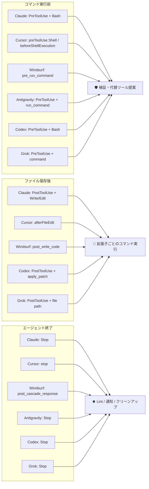

# CLI リファレンス

claw-hooks は stdin からフックイベントを 1 件読み、呼び出し元のエージェント固有の形式で応答します。このページでは、サブコマンドとオプション、`--format` ごとのペイロードの読み方、イベントごとの出力、終了コード、フェイルクローズドの規則を説明します。各エージェントへの登録方法は [エージェント統合](integrations.ja.md) にあります。

## コマンド

| コマンド | 説明 |
|---------|------|
| `hook` (別名: `run`) | stdinからフックイベントを処理 |
| `init` | デフォルト設定を生成 |
| `check` | 設定を検証 |
| `version` | バージョンを表示 |

## オプション

| オプション | 短縮形 | 説明 |
|-----------|--------|------|
| `--format` | `-f` | 入力形式: `claude` (デフォルト), `cursor`, `windsurf`, `agy` (Antigravity CLI), `codex`, `grok` (Grok CLI) |
| `--event` | `-e` | フックイベント名（例: `PostToolUse`）。ペイロードにイベント名フィールドが無く `PreToolUse` / `PostToolUse` の形状が同一な Antigravity CLI 用。他エージェントでは不要 |
| `--config` | `-c` | 設定ファイルのパス |
| `--trace` | `-t` | トレースモード: 生の入力・パース結果・出力を stderr に出力（ディスクには保存しない） |
| `--path` | `-p` | `init` 専用: 設定ファイルの作成先（既定は `~/.config/claw-hooks/config.toml`） |
| `--debug` | — | この実行だけデバッグログを有効にする（設定の `debug = true` と同じ） |
| `--quiet` | `-q` | `init` と `check` の状況メッセージを出さない |
| `--help` | `-h` | ヘルプを表示 |
| `--version` | `-V` | バージョンを表示 |

## 例

```bash
# Claude Codeフックを処理（デフォルト）
claw-hooks hook

# Cursorフックを処理
claw-hooks hook --format cursor

# Windsurfフックを処理
claw-hooks hook --format windsurf

# Antigravity CLIフックを処理（ペイロードにイベント名が無いため --event を指定する）
claw-hooks hook --format agy --event PreToolUse
claw-hooks hook --format agy --event PostToolUse

# Codex CLIフックを処理
claw-hooks hook --format codex

# Grok CLIフックを処理
claw-hooks hook --format grok

# カスタム設定を使用
claw-hooks hook --config /path/to/config.toml
```

## フォーマット検出ロジック

各AIエージェントは異なるJSON構造を送信します。claw-hooksは`--format`を使用してパース方法を決定します。

### Claude Code (`--format claude`)

Claude Code公式フック仕様を使用:

```jsonc
// PreToolUse/PostToolUseイベント
{
  "hook_event_name": "PreToolUse",
  "tool_name": "Bash",
  "tool_input": { "command": "..." },
  "session_id": "...",
  "cwd": "/path/to/project"
}

// Stopイベント（tool_name/tool_inputなし）
{
  "hook_event_name": "Stop",
  "stop_hook_active": true,
  "session_id": "..."
}
```

処理対象のフックイベント: `PreToolUse`、`PostToolUse`、`Stop`、`SubagentStart`、`SubagentStop`。claw-hooks のスコープ外である既知のライフサイクルイベント（`Notification`、`PermissionRequest`、`UserPromptSubmit`、`SessionStart`、`SessionEnd` 等）は判定を返さずパススルーします。

Claude の `Stop` では `stop_hook_active` が必須です。欠落または型不正なら壊れたペイロードとして扱い、stop hook を実行せずセッションの停止を許可します（`{}` + exit `0`）。読み取れないガードを `false` とみなすと stop hook が実行され、報告対象フックの失敗によって `Stop` が無限に再発火し得るためです。

### Cursor (`--format cursor`)

`hook_event_name` フィールドでイベントを判定します:

| `hook_event_name` | 必須フィールド | 内部マッピング |
|-------------------|----------------|----------------|
| `preToolUse`（全ツール） | なし（`tool_input.command` があればコマンド経路、無ければパススルー） | PreToolUse + Bash |
| `beforeShellExecution` | `command` | PreToolUse + Bash |
| `afterFileEdit` / `afterTabFileEdit` | `file_path` / `filePath` | PostToolUse + Write |
| `stop` | なし（`loop_count` は存在すれば読む） | Stop |

Shell 以外の `preToolUse` を含む未対応の Cursor イベントは、`{"permission":"allow"}` ではなく空オブジェクト（`{}`）として透過されます。Cursor は複数ソースのフック応答をマージし、優先度の高い `allow` が他フックの `deny` を上書きし得るため、claw-hooks は中身を検査していないイベント（`beforeReadFile`、`beforeMCPExecution`、`beforeTabFileRead`、`sessionStart`、`postToolUse` 等）に対して許可を表明しません。許可したコマンドで `{}` を返すのも同じ理由です。

ブロックは stdout の `{"permission":"deny", …}` + exit code `0` で返します。Cursor は exit `0` のときだけ stdout の JSON を解釈するため、exit `2` で終了すると「safe-rm を使ってください」という代替案を運ぶ `user_message` が破棄されてしまいます。Claude Code は異なり、現行仕様では全終了コードで有効な stdout JSON を読みますが、exit `2` のブロック効果は上書きできません。

`stop` では Cursor の `loop_count` フィールド（stop hook が自動フォローアップを発火した回数、0 始まり）をループ防止に使用します。1 以上の場合は全 stop hook をスキップします — Claude Code の `stop_hook_active` と同じ役割で、lint 失敗のフィードバックは Cursor の `loop_limit` までループせず 1 回だけエージェントに返ります。

不正な `stop` ペイロードは、フェイルクローズドにせず停止を許可します（`{}` + exit `0`）。`followup_message` は次のユーザーメッセージとして自動送信されるため、パースできなかったペイロードに対してこれを返すと同じ失敗が延々と再発火します。詳細は [フェイルクローズド動作](#フェイルクローズド動作) を参照してください。

### Windsurf (`--format windsurf`)

`agent_action_name`フィールドを使用:

| agent_action_name | 内部マッピング |
|-------------------|----------------|
| `pre_run_command` | PreToolUse + Bash |
| `post_write_code` | PostToolUse + Write |
| `post_cascade_response` | Stop |

未対応の Windsurf アクションは `allow` として透過されます。

### Antigravity CLI (`--format agy`)

camelCase スキーマ。代表的な PreToolUse ペイロード:

```jsonc
{
  "toolCall": {
    "name": "run_command",
    "args": { "CommandLine": "rm -rf /tmp/test", "Cwd": "/workspace" }
  },
  "stepIdx": 3,
  "conversationId": "…",
  "workspacePaths": ["/workspace/project"],
  "transcriptPath": "~/.gemini/antigravity-cli/brain/…/transcript.jsonl",
  "artifactDirectoryPath": "~/.gemini/antigravity-cli/brain/…"
}
```

Antigravity の公式ペイロードにはイベント名フィールドが無く、さらに `PreToolUse` と `PostToolUse` は**形状が同一**です（どちらも `toolCall` と `stepIdx` を持ち、差は Optional な `error` のみ）。どちらのイベントかは `--event <name>` で指定してください。`hooks.json` はイベントごとに別エントリで登録するため、呼び出し側は必ず知っています。判別順は `--event` → 空白でない `hook_event_name` / `event`（旧版互換）→ 形状推定（`toolCall` は PreToolUse、Stop 固有フィールドは Stop、invocation 固有フィールドは Pre/PostInvocation）です。推定では PreToolUse / PostToolUse を区別できないため **PreToolUse に倒し**、コマンドブロックを維持します（逆に倒すと未実行のコマンドを素通しします）。`error` は判別条件に使いません — 公式仕様で Optional（「成功時は空」）とされており、これを鍵にすると**成功した**ツール呼び出しを誤判別するためです。

必須フィールドの検証は「claw-hooks が判定に使うもの」に限定します。公式仕様で **Required** マークが付くのは Stop の `fullyIdle`（と出力の `decision`）だけなので、`stepIdx` / `executionNum` / `terminationReason` はいずれも任意扱いです。これらを必須にすると、`run_command` すべてに deny（Antigravity では「即時ハードブロック」）が返り、Stop では**全 stop hook が黙ってスキップ**されます。Stop のパースエラーは `{"decision":"stop"}` + exit 0 に倒し、必須の出力スキーマを満たしながら再投入ループを起こす `continue` を避けます。`toolCall.args` を必須とするのは `run_command` のときだけです（公式仕様は引数を持たないツールを列挙し、`matcher: ""` / `"*"` も認めているため）。必須フィールドの欠落・空白・型不正は、判別したイベント固有の応答でフェイルクローズドになります。

| 判別に使うイベント形状 | toolCall.name | 内部マッピング |
|---|---|---|
| `toolCall` + `stepIdx`（PreToolUse） | `run_command` | BeforeCommand（`toolCall.args.CommandLine` → Bash） |
| `toolCall` + `stepIdx`（PreToolUse） | その他（`write_to_file`、`replace_file_content`、…） | パススルー allow |
| `toolCall` の無い `stepIdx`、または invocation 固有フィールド | n/a | PostToolUse / invocation のパススルー allow（claw-hooks のスコープ外） |
| `executionNum` / `terminationReason` / `fullyIdle` | n/a | Stop |

> **拡張子フック**: Antigravity の `PostToolUse` は `toolCall`（`name` と `args`）を含むため、`write_to_file` / `replace_file_content` / `multi_replace_file_content` の `args.TargetFile` から編集対象を復元できます。hook エントリに `--event PostToolUse` を付けてください（ペイロードは `PreToolUse` と形状が同一のため、未指定だと `PreToolUse` と推定され保存後フックが動きません）。公式仕様の出力は `{}` 固定なので formatter/linter は実行されますが診断は返せません。lint の本文が必要な場合は Stop hooks で回して `"decision":"continue"` で再投入してください。`run_command` の `PostToolUse` はパススルーします（コマンドは実行済みで、事後のブロックは不可能かつ無意味なため）。出力 JSON は [入出力リファレンス](#入出力リファレンス) を参照。明示名を持つ未対応イベントは allow でパススルーし、イベントを判別できない名前なしペイロードは安全な応答形式を選べないためフェイルクローズドになります。

### Codex CLI (`--format codex`)

`hook_event_name` + `tool_name` + `tool_input` の標準スキーマ。`apply_patch` の `tool_input.command` から `*** Add/Update/Move to File:` ヘッダを抽出して拡張子フックを駆動します（削除のみの patch はスキップ）。

検証対象は claw-hooks が実際に読むフィールドだけです: イベント名、`tool_name` / `tool_input`（および `Bash` の `tool_input.command`、`apply_patch` の patch 本文）、`Stop` の `stop_hook_active`。公式ドキュメントの `session_id` / `cwd` / `model` / `transcript_path` / `turn_id` / `permission_mode` は「通常使うことになる共通フィールド」の紹介であって厳密なスキーマではなく（公式の `SessionEnd` 実例ペイロードには `model` がありません）、これらを必須にすると 1 フィールドの欠落で全フック呼び出しがフェイルクローズドに倒れてしまいます。スコープ外のパススルーイベントは一切検証しません。

非ファイル系ツール（例: `Bash`）の `PostToolUse` も厳密検証せずパススルーします。Codex の `PostToolUse` では `decision:"block"` が**実際のツール出力をフックのメッセージで置き換える**動作になるため、ここでフェイルクローズドにするとモデルは本来のコマンド出力を一切見られなくなり、しかも保存後フックに必要なのはファイルパスだけなので得るものがありません。claw-hooks が実際に読むフィールドについては、欠落・型不正ならイベント固有の deny/block 応答でフェイルクローズドになります。

`Interrupt` と、`mcp__*` など claw-hooks が検査しない MCP / 関数ツールはスコープ外です。他のフックや Codex 本来の権限判断を上書きしないよう、明示的な allow ではなく中立応答 `{}` でパススルーします。

| hook_event_name | 内部マッピング |
|-----------------|------------------|
| `SessionStart` / `SessionEnd` / `UserPromptSubmit` / `PreCompact` / `PostCompact` / `Interrupt` | パススルー allow |
| `PreToolUse` | BeforeCommand |
| `PermissionRequest` | 承認プロンプト前のコマンドガード（危険な Bash は deny、安全なら `{}`） |
| `PostToolUse` | AfterFileEdit（`Bash` パススルー、`apply_patch` → MultiEdit） |
| `Stop` | Stop |

Codex は許可・ブロック・フェイルクローズドすべてを exit code `0` で返します（非ゼロはフックインフラ失敗扱い）。イベントごとの出力 JSON は [入出力リファレンス](#入出力リファレンス) を参照。

### Grok CLI (`--format grok`)

camelCase スキーマで、`hookEventName` フィールドを明示的に持ちます:

```jsonc
{
  "hookEventName": "PreToolUse",
  "sessionId": "…",
  "cwd": "/path/to/project",
  "workspaceRoot": "/path/to/project",
  "toolName": "Bash",
  "toolInput": { "command": "rm -rf /tmp/test" }
}
```

| hookEventName | `toolInput` の形 | 内部マッピング |
|---|---|---|
| `PreToolUse` | `command` | BeforeCommand（Grok がフックにブロックを許す唯一のイベント） |
| `PreToolUse` | ファイルパス、またはどちらも無し | パススルー allow |
| `PostToolUse` | `file_path` / `filePath` | AfterFileEdit（拡張子フック） |
| `PostToolUse` | `command`、またはどちらも無し | パススルー allow |
| `Stop` | n/a | Stop |
| `SessionStart` / `SessionEnd` / `UserPromptSubmit` / `PostToolUseFailure` / `PermissionDenied` / `StopFailure` / `Notification` / `PreCompact` / `PostCompact` | n/a | パススルー allow |

claw-hooks は **`toolName` ではなく `toolInput` の形**で処理を振り分けます。Grok は `Bash` / `Edit` のような Claude のツール名を自前のツール名へマッピングすると明記していますが、マッピング後の名前は公開仕様に列挙されていないため、名前で判定すると想定外の名前のシェル実行ツールがコマンドフィルターを素通りしてしまいます。そこで `command` を持つペイロードはコマンドフィルターへ、`file_path` / `filePath` を持つペイロードは拡張子フックへ回し、それ以外はパススルーします。`toolName` と `toolInput` はどちらも**任意**です。理由は同じで、判定に使わないフィールドを必須化すると無関係なツール呼び出しまで拒否してしまうためです（引数を持たないツールは `toolInput` をキーごと送りません）。Grok では `PreToolUse` が唯一のハードブロック経路なので、ここでの誤 deny は影響が大きくなります。Grok は Claude Code / Cursor のフック設定も読み込むため、snake_case のキー（`hook_event_name`、`session_id`、`tool_name`、`tool_input`）も受理します。

Grok の契約はフェイルオープンです: exit `0` は許可、exit `2` は拒否、それ以外の結末（タイムアウト・クラッシュ・不正な stdout）は失敗として記録されるだけでツール呼び出しは続行されます。そのため claw-hooks はブロック時に deny JSON **と** exit code `2` の両方を返してどちらの解釈でも判定が成立するようにし、フェイルクローズド経路でも exit `1` は使いません。許可時は `allow` 判定ではなく `{}` を返します（公式に文書化された `decision` の値は `deny` のみのため）。

### イベントマッピング



Codex の `PostToolUse` + `Bash` はコマンド出力フィードバックのため、「ファイル保存後」フローには含めません。ファイル書き込みイベントとして扱うのは `apply_patch` のみです。Antigravity CLI は `--event PostToolUse` を指定した hook エントリでのみ「ファイル保存後」グループに入ります（`toolCall.args.TargetFile` から編集対象を復元）。ただし出力は `{}` 固定で診断を返せないため、lint の本文が必要な場合は Stop hooks でプロジェクト全体の lint/typecheck を回してください。Grok CLI は 3 つのグループすべてに登場しますが、ブロックできるのは `PreToolUse` だけです。残り 2 つは Grok が出力を無視する事後フックのため、処理自体は実行されてもフィードバックは返りません。

## 入出力リファレンス

Stdin はエージェント固有のフック JSON（イベント別のペイロードは [フォーマット検出ロジック](#フォーマット検出ロジック) を参照）。Stdout / stderr は `(format, event)` ごとに以下の JSON を返します。

| エージェント | イベント | 許可 | ブロック / フェイルクローズド |
|---|---|---|---|
| Claude Code | PreToolUse | `{}`（判定を返さず、通常の権限フローに委ねる） | `…permissionDecision:"deny", permissionDecisionReason:"…"`（exit 0）。パースエラー時は **stderr** にプレーンテキスト、exit 2 |
| Claude Code | PostToolUse | `{}` または `…additionalContext:"…"`（lint フィードバック） | `{"decision":"block","reason":"…"}` |
| Claude Code | Stop | `{}` | `{"decision":"block","reason":"…"}` |
| Cursor | preToolUse / beforeShellExecution | `{}` | `{"permission":"deny","user_message":"…","agent_message":"…"}`（exit 0 — Cursor は exit 0 のときだけ stdout の JSON を読む） |
| Cursor | stop | `{}` | `{"followup_message":"…"}` |
| Windsurf | pre_run_command | `{}` | exit code 2 + **stderr** プレーンテキスト（JSON ではない） |
| Windsurf | post_write_code | `{}`（指摘なし） | exit code 2 + **stderr** プレーンテキスト（lint の指摘。事後フックはブロックできないため、編集はそのまま残る） |
| Windsurf | post_cascade_response | `{}` | `{}`（非同期事後フックのためブロック不可） |
| Antigravity | PreToolUse | `{"decision":"allow"}` | `{"decision":"deny","reason":"…"}` |
| Antigravity | PostToolUse / PreInvocation / PostInvocation | `{}` | `{}`（仕様上ブロックパス無し） |
| Antigravity | Stop | `{"decision":"stop"}` | `{"decision":"continue","reason":"…"}`（エージェントループへ再投入、`reason` が system message として注入される） |
| Codex CLI | 任意 | `{}` または `…additionalContext:"…"` | PreToolUse: `…permissionDecision:"deny",…`。PermissionRequest: `…decision:{behavior:"deny",message:"…"}`。PostToolUse / Stop: `{"decision":"block","reason":"…"}` |
| Grok CLI | PreToolUse | `{}` | `{"decision":"deny","reason":"…"}` **と** exit 2 |
| Grok CLI | PostToolUse / Stop / その他のイベント | `{}` | `{}`（事後フックの stdout は無視されるためブロック不可） |

`additionalContext` は Claude の `PostToolUse` と Codex の `PostToolUse` に lint フィードバックを送るチャネルです。Antigravity には `additionalContext` チャネルが無いため、Stop の `"decision":"continue"` で lint フィードバックを送ります。Grok CLI の事後フックには送る手段自体が無く、ツールは実行されても出力はトランスクリプトに残りません。

claw-hooks は Claude Code / Cursor / Grok CLI に対して `allow` 判定を返しません。`{}` + exit `0` は「claw-hooks としては異議なし」を意味し、実際の可否はエージェント本来の権限プロンプト・権限ルールが決めます。Antigravity のイベントスキーマは明示的な判定が必須で、安全な `PreToolUse` は `"allow"`、停止を許可する Stop は再投入しない値 `"stop"` を返します。

### 終了コード

| エージェント | 許可 | ブロック | フェイルクローズドのパースエラー |
|---|---|---|---|
| Claude Code | `0`（stdout JSON で判定） | `0`（stdout JSON で判定） | `2` + **stderr** プレーンテキスト |
| Cursor | `0` | `0`（stdout の deny JSON。exit `2` だとメッセージが破棄される） | `2` |
| Windsurf | `0` | `2`（BeforeCommand は stderr にプレーンテキストを書き込み、AfterFileEdit も同じ経路で lint 診断をブロックせずに伝え、Stop は `0` のまま） | `2`（`pre_run_command` のみ。事後フックは `{}` + `0`） |
| Antigravity CLI | `0`（stdout JSON で判定） | `0`（stdout JSON で判定） | `0` + イベント固有の deny JSON |
| Codex CLI | `0`（stdout JSON で判定） | `0`（stdout JSON で判定） | `0` + イベント固有の deny/block JSON（非ゼロはフックインフラ失敗扱いで判定が無視される） |
| Grok CLI | `0` | `2` + stdout の deny JSON（PreToolUse のみ。他のイベントは `0`） | `2`（`1` は使わない — Grok は `2` 以外をすべてフェイルオープン扱いにするため） |

「フェイルクローズドのパースエラー」列が当てはまるのは実行前ゲートだけです。それ以外のイベント（Stop 系、保存後フック、claw-hooks がパススルーするライフサイクル系）は、上記の拒否ではなく中立の `{}` + exit `0` を返します（次節を参照）。

### フェイルクローズド動作

**実行前ゲートはフェイルクローズドです。** ペイロードをパースできない、stdin が空または上限超過、claw-hooks が実際に読むフィールドが欠けている、といった場合、コマンドブロック系イベント（`PreToolUse`、`beforeShellExecution`、`pre_run_command`、`PermissionRequest`）はエージェント固有の拒否応答を返します。フックが壊れても、それが黙認（許可）に化けることはありません。

**設定の破損時も、保護を無効化せず拒否します。** TOML 設定の読み込み・検証に失敗した場合も同じ拒否応答を返し、診断は stderr に出して `claw-hooks check` の実行を案内します。exit `1` + stdout 空では終了しません（Codex CLI / Antigravity CLI はこれを「フック失敗＝判定を無視」と解釈するため、そうすると `config.toml` のタイポ 1 つでコマンドブロックが丸ごと無効になります）。ロギングはセキュリティ制御ではなく診断機能なので、ログの初期化に失敗しても警告を出すだけでログ無しのまま処理を続行します。

**Stop 系イベントは逆に許可します。** Stop イベントにおける「ブロック」は拒否ではなく *停止せずに新しいプロンプトを渡す* 指示です（Claude Code / Codex CLI は `decision:"block"`、Antigravity CLI は `decision:"continue"`、Cursor の `followup_message` は次のユーザーメッセージとして自動送信される）。壊れたペイロードや設定エラーに対してこれを返すと、失敗 → 継続 → `Stop` 再発火 → 同じ失敗、という自己維持ループになります。ループ防止層（`stop_hook_active` / `loop_count` / `CLAW_HOOKS_STOP_ACTIVE`）はいずれもパース成功後にしか働かないため、この循環を断てません。Stop は危険操作の実行前ゲートではないので、イベント固有の停止許可 + exit `0`（Antigravity は `{"decision":"stop"}`、他エージェントは `{}`）を返します。これは新しい副作用を発生させず、自動継続による追加のツール実行を避けます。

**claw-hooks が中身を見ないイベントも許可します。** 検査していないイベントを拒否しても安全性は 1 ミリも上がらず、害だけが残ります。`UserPromptSubmit` の拒否は**ユーザーのプロンプト自体を消去**し、Codex の `PostToolUse` の拒否は**実際のツール出力をフックのメッセージで置き換え**ます。Cursor の `beforeReadFile` はファイル全文を入力に含むため、大きなファイルでは容易に stdin の 4 MiB 上限を超え、ファイル読み取りに何の意見も持たない claw-hooks がその読み取りを止めてしまいます。Windsurf の事後フックと Grok の `PreToolUse` 以外のイベントはそもそもブロック不可なので、拒否は無用なエラーを注入するだけです。これらはすべて `{}` + exit `0` を返します。

**イベントを特定できないペイロードはブロックを維持します。** 上記の判断はイベント名を基準にしています。ペイロードの破損が激しくイベント名すら復元できない場合は拒否応答に倒すため、切り詰められた / 上限を超えた `PreToolUse` はブロックされます。
