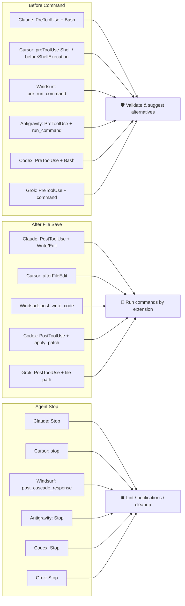

# CLI Reference

claw-hooks reads one hook event from stdin and answers in the calling agent's native format. This page covers the subcommands and options, how each `--format` reads its agent's payload, the output for every event, the exit codes, and the fail-closed rules. Registering claw-hooks in each agent is covered in [Agent Integration](integrations.md).

## Commands

| Command | Description |
|---------|-------------|
| `hook` (alias: `run`) | Process hook events from stdin |
| `init` | Generate default configuration |
| `check` | Validate configuration |
| `version` | Show version |

## Options

| Option | Short | Description |
|--------|-------|-------------|
| `--format` | `-f` | Input format: `claude` (default), `cursor`, `windsurf`, `agy` (Antigravity CLI), `codex`, `grok` (Grok CLI) |
| `--event` | `-e` | Hook event name (e.g. `PostToolUse`). For Antigravity CLI, whose payloads carry no event-name field and whose `PreToolUse` / `PostToolUse` are shape-identical. Omit for other agents |
| `--config` | `-c` | Path to configuration file |
| `--trace` | `-t` | Trace mode: write the raw input, parsed input, and output to stderr (not persisted to disk) |
| `--path` | `-p` | `init` only: where to write the new config file (default `~/.config/claw-hooks/config.toml`) |
| `--debug` | — | Enable debug logging for this run (same as `debug = true` in the config) |
| `--quiet` | `-q` | Suppress the status messages of `init` and `check` |
| `--help` | `-h` | Show help |
| `--version` | `-V` | Show version |

## Examples

```bash
# Process Claude Code hooks (default)
claw-hooks hook

# Process Cursor hooks
claw-hooks hook --format cursor

# Process Windsurf hooks
claw-hooks hook --format windsurf

# Process Antigravity CLI hooks (pass --event: its payloads have no event-name field)
claw-hooks hook --format agy --event PreToolUse
claw-hooks hook --format agy --event PostToolUse

# Process Codex CLI hooks
claw-hooks hook --format codex

# Process Grok CLI hooks
claw-hooks hook --format grok

# Use custom config
claw-hooks hook --config /path/to/config.toml
```

## Format Detection Logic

Each AI agent sends different JSON structures. claw-hooks uses `--format` to determine parsing.

### Claude Code (`--format claude`)

Uses the official Claude Code hooks specification:

```jsonc
// PreToolUse/PostToolUse events
{
  "hook_event_name": "PreToolUse",
  "tool_name": "Bash",
  "tool_input": { "command": "..." },
  "session_id": "...",
  "cwd": "/path/to/project"
}

// Stop event (no tool_name/tool_input)
{
  "hook_event_name": "Stop",
  "stop_hook_active": true,
  "session_id": "..."
}
```

Handled hook events: `PreToolUse`, `PostToolUse`, `Stop`, `SubagentStart`, and `SubagentStop`. Known lifecycle events outside claw-hooks' scope — including `Notification`, `PermissionRequest`, `UserPromptSubmit`, `SessionStart`, and `SessionEnd` — pass through without a decision.

`stop_hook_active` is required on Claude `Stop`. If it is absent or mistyped, claw-hooks treats the payload as malformed, does not run stop hooks, and allows the session to terminate (`{}` + exit `0`). Defaulting an unreadable guard to `false` would run the hooks and could make a failing reported hook re-trigger `Stop` forever.

### Cursor (`--format cursor`)

Uses the `hook_event_name` field for event detection:

| `hook_event_name` | Required Fields | Internal Mapping |
|-------------------|-----------------|------------------|
| `preToolUse` (any tool) | — (`tool_input.command` selects the command path; without it the event passes through) | PreToolUse + Bash |
| `beforeShellExecution` | `command` | PreToolUse + Bash |
| `afterFileEdit` / `afterTabFileEdit` | `file_path` / `filePath` | PostToolUse + Write |
| `stop` | — (`loop_count` is read when present) | Stop |

Unsupported Cursor events, including non-shell `preToolUse` tools, pass through as an empty object (`{}`) rather than `{"permission":"allow"}`. Cursor merges hook responses from several sources and a higher-priority `allow` can override another hook's `deny`, so claw-hooks never votes to approve an event it did not inspect (`beforeReadFile`, `beforeMCPExecution`, `beforeTabFileRead`, `sessionStart`, `postToolUse`, …). Allowed commands return `{}` for the same reason.

Blocks are returned as `{"permission":"deny", …}` on stdout with exit code `0`. Cursor only consumes the stdout JSON when the hook exits `0`, so exiting `2` would discard the `user_message` that carries the "use safe-rm instead" guidance. Claude Code differs here: its current hook contract reads valid stdout JSON on every exit code, while exit `2` remains unconditionally blocking.

For `stop`, Cursor's `loop_count` field (how many automatic follow-ups the stop hook has already triggered, starting at 0) is used for loop prevention: when it is 1 or higher, all stop hooks are skipped — the same role `stop_hook_active` plays for Claude Code, so a failing lint feeds back to the agent once instead of looping up to Cursor's `loop_limit`.

Malformed `stop` payloads let the stop through (`{}` + exit `0`) instead of failing closed: a `followup_message` is auto-submitted as the next user message, so returning one for a payload claw-hooks could not parse would re-trigger the same failure forever. See [Fail-Closed Behavior](#fail-closed-behavior).

### Windsurf (`--format windsurf`)

Uses `agent_action_name` field:

| agent_action_name | Internal Mapping |
|-------------------|------------------|
| `pre_run_command` | PreToolUse + Bash |
| `post_write_code` | PostToolUse + Write |
| `post_cascade_response` | Stop |

Unsupported Windsurf actions are passed through as allow.

### Antigravity CLI (`--format agy`)

camelCase schema. A representative PreToolUse payload:

```jsonc
{
  "toolCall": {
    "name": "run_command",
    "args": { "CommandLine": "rm -rf /tmp/test", "Cwd": "/workspace" }
  },
  "stepIdx": 3,
  "conversationId": "…",
  "workspacePaths": ["/workspace/project"],
  "transcriptPath": "~/.gemini/antigravity-cli/brain/…/transcript.jsonl",
  "artifactDirectoryPath": "~/.gemini/antigravity-cli/brain/…"
}
```

Official Antigravity payloads do not include an event-name field, and `PreToolUse` and `PostToolUse` are **shape-identical** — both carry `toolCall` and `stepIdx`, differing only in an optional `error`. Pass `--event <name>` so claw-hooks knows which one it received; `hooks.json` registers each event separately, so the calling entry always knows. Resolution order is `--event`, then a legacy non-blank `hook_event_name` / `event` field, then shape inference (`toolCall` → PreToolUse, Stop fields → Stop, invocation fields → Pre/PostInvocation). Inference resolves the PreToolUse/PostToolUse ambiguity to **PreToolUse**, keeping command blocking intact — the opposite choice would let a not-yet-executed command through. `error` is deliberately not used as a discriminator: the spec marks it Optional ("Empty if successful"), so keying on it would misclassify every *successful* tool call.

Required-field validation is limited to what claw-hooks actually uses for a decision. The spec marks only Stop's `fullyIdle` (and the output `decision`) as **Required**, so `stepIdx`, `executionNum` and `terminationReason` are all optional here. Requiring them would answer every `run_command` with a deny — which Antigravity documents as an immediate hard block — and, on Stop, would silently skip every stop hook. A Stop parse error therefore resolves to `{"decision":"stop"}` + exit 0: this satisfies the required output schema without returning `continue`, which would create a re-entry loop. `toolCall.args` is required only for `run_command`, because the spec documents zero-argument tools and allows `matcher: ""` / `"*"`. Missing, blank, or incorrectly typed required fields fail closed using the inferred event's native response.

| Inferred event shape | toolCall.name | Internal Mapping |
|---|---|---|
| `toolCall` + `stepIdx` (PreToolUse) | `run_command` | BeforeCommand (`toolCall.args.CommandLine` → Bash) |
| `toolCall` + `stepIdx` (PreToolUse) | other (`write_to_file`, `replace_file_content`, …) | pass-through allow |
| `stepIdx` without `toolCall`, or invocation fields | n/a | PostToolUse / invocation pass-through allow (out of claw-hooks scope) |
| `executionNum` / `terminationReason` / `fullyIdle` | n/a | Stop |

> **Extension hooks**: Antigravity's `PostToolUse` carries `toolCall` (`name` and `args`), so the edited path is recoverable from `args.TargetFile` for `write_to_file` / `replace_file_content` / `multi_replace_file_content`. Add `--event PostToolUse` to that hook entry — the payload is shape-identical to `PreToolUse`, so without the flag claw-hooks infers `PreToolUse` and the post-edit hooks stay inactive. The official output is fixed at `{}`, so formatters and linters run but their diagnostics can't be returned; run project-wide lint/typecheck as Stop hooks and surface failures via `"decision":"continue"` when you need the text. `PostToolUse` for `run_command` passes through — the command already ran, and blocking it afterwards is neither possible nor meaningful. The output JSON shapes are listed in [Input/Output Reference](#inputoutput-reference). Explicitly named unsupported events pass through as allow; an unidentifiable nameless payload fails closed because no event-specific response shape can be selected safely.

### Codex CLI (`--format codex`)

Standard `hook_event_name` + `tool_name` + `tool_input` schema. `apply_patch`'s `tool_input.command` is parsed for the `*** Add/Update/Move to File:` headers to drive extension hooks (delete-only patches are skipped).

Validation is limited to the fields claw-hooks actually reads: the event name, `tool_name` / `tool_input` (plus `tool_input.command` for `Bash` and the patch body for `apply_patch`), and `stop_hook_active` on `Stop`. The official docs present `session_id`, `cwd`, `model`, `transcript_path`, `turn_id`, and `permission_mode` as the shared fields you will usually see rather than as a strict schema — their own `SessionEnd` example payload omits `model` — so requiring them meant a single absent field could fail closed on every hook call. Out-of-scope pass-through events are not validated at all.

`PostToolUse` for non-file tools (for example `Bash`) is also passed through without strict validation, because a Codex `PostToolUse` block *replaces the real tool output* with the hook message: failing closed there would hide the command's own output from the model while gaining nothing, since only file paths matter for post-edit hooks. Fields that claw-hooks does read still fail closed with the event's native deny/block response when they are missing or mistyped.

`Interrupt` and MCP/function tools that claw-hooks does not inspect, including `mcp__*`, are out of scope. They pass through with the neutral `{}` response rather than an explicit allow, so claw-hooks does not override Codex's own permission flow or another hook's decision.

| hook_event_name | Internal Mapping |
|-----------------|------------------|
| `SessionStart` / `SessionEnd` / `UserPromptSubmit` / `PreCompact` / `PostCompact` / `Interrupt` | pass-through allow |
| `PreToolUse` | BeforeCommand |
| `PermissionRequest` | command guard before approval prompts (deny for dangerous Bash, `{}` for safe) |
| `PostToolUse` | AfterFileEdit (`Bash` pass-through; `apply_patch` → MultiEdit) |
| `Stop` | Stop |

Codex returns all decisions — allow, block, and fail-closed — with exit code `0`; non-zero is treated as hook infrastructure failure. See [Input/Output Reference](#inputoutput-reference) for the per-event output JSON.

### Grok CLI (`--format grok`)

camelCase schema with an explicit `hookEventName` field:

```jsonc
{
  "hookEventName": "PreToolUse",
  "sessionId": "…",
  "cwd": "/path/to/project",
  "workspaceRoot": "/path/to/project",
  "toolName": "Bash",
  "toolInput": { "command": "rm -rf /tmp/test" }
}
```

| hookEventName | `toolInput` shape | Internal Mapping |
|---|---|---|
| `PreToolUse` | `command` | BeforeCommand (the only event Grok lets a hook block) |
| `PreToolUse` | file path, or neither | pass-through allow |
| `PostToolUse` | `file_path` / `filePath` | AfterFileEdit (extension hooks) |
| `PostToolUse` | `command`, or neither | pass-through allow |
| `Stop` | n/a | Stop |
| `SessionStart` / `SessionEnd` / `UserPromptSubmit` / `PostToolUseFailure` / `PermissionDenied` / `StopFailure` / `Notification` / `PreCompact` / `PostCompact` | n/a | pass-through allow |

claw-hooks dispatches on the **shape of `toolInput`, not on `toolName`**. Grok states that it maps Claude tool names such as `Bash` and `Edit` onto its own, but the mapped names are not part of the published spec, so matching by name would let an unanticipated shell tool slip past the command filter. A payload carrying `command` therefore goes to the command filters and one carrying `file_path` / `filePath` goes to the extension hooks; anything else passes through. `toolName` and `toolInput` are both **optional** for the same reason: neither is what the decision is made from, so requiring them would deny unrelated tool calls (a tool without arguments omits `toolInput` entirely), and `PreToolUse` is the one path where claw-hooks can hard-block on Grok. Legacy snake_case keys (`hook_event_name`, `session_id`, `tool_name`, `tool_input`) are accepted as well, because Grok also reads Claude Code and Cursor hook files.

Grok's contract is fail-open: exit `0` allows, exit `2` denies, and every other outcome — timeout, crash, malformed stdout — records a failure but lets the tool call proceed. claw-hooks therefore blocks with the deny JSON **and** exit code `2` so the decision holds under either interpretation, and never exits `1` on a fail-closed path. Allowed commands return `{}` rather than an `allow` decision, since `deny` is the only documented `decision` value.

### Event Mapping Summary



Codex `PostToolUse` with `Bash` is omitted from the "After File Save" flow because it is command-output feedback. Only `apply_patch` payloads are treated as file-write events. Antigravity CLI joins the "After File Save" flow only when its hook entry passes `--event PostToolUse`; claw-hooks recovers the edited path from `toolCall.args.TargetFile`. Its output remains fixed at `{}`, so use Stop hooks when the lint text itself must reach the agent. Grok CLI appears in all three groups, but only its `PreToolUse` can block; the other two are post-hooks whose output Grok ignores, so their work is real but their feedback is not.

## Input/Output Reference

Stdin: the agent's native hook JSON (see [Format Detection Logic](#format-detection-logic) for per-agent payloads). Stdout/stderr: one of the JSON bodies below, picked by `(format, event)`.

| Agent | Event | Allow | Block / fail-closed |
|---|---|---|---|
| Claude Code | PreToolUse | `{}` (no decision — the normal permission flow still applies) | `…permissionDecision:"deny", permissionDecisionReason:"…"` (exit 0). Parse errors: plain text on **stderr**, exit 2 |
| Claude Code | PostToolUse | `{}` or `…additionalContext:"…"` (lint feedback) | `{"decision":"block","reason":"…"}` |
| Claude Code | Stop | `{}` | `{"decision":"block","reason":"…"}` |
| Cursor | preToolUse / beforeShellExecution | `{}` | `{"permission":"deny","user_message":"…","agent_message":"…"}` (exit 0 — Cursor reads the stdout JSON only on exit 0) |
| Cursor | stop | `{}` | `{"followup_message":"…"}` |
| Windsurf | pre_run_command | `{}` | exit code 2 + **stderr** plain text (not JSON) |
| Windsurf | post_write_code | `{}` (no findings) | exit code 2 + **stderr** plain text (lint findings; post-hooks cannot block, so the edit stands) |
| Windsurf | post_cascade_response | `{}` | `{}` (best-effort post-hook; cannot block) |
| Antigravity | PreToolUse | `{"decision":"allow"}` | `{"decision":"deny","reason":"…"}` |
| Antigravity | PostToolUse / PreInvocation / PostInvocation | `{}` | `{}` (spec defines no block path) |
| Antigravity | Stop | `{"decision":"stop"}` | `{"decision":"continue","reason":"…"}` (re-enters the agent loop, `reason` injected as a system message) |
| Codex CLI | any | `{}` or `…additionalContext:"…"` | PreToolUse: `…permissionDecision:"deny",…`. PermissionRequest: `…decision:{behavior:"deny",message:"…"}`. PostToolUse / Stop: `{"decision":"block","reason":"…"}` |
| Grok CLI | PreToolUse | `{}` | `{"decision":"deny","reason":"…"}` **and** exit 2 |
| Grok CLI | PostToolUse / Stop / other events | `{}` | `{}` (post-hook stdout is ignored; cannot block) |

`additionalContext` carries lint feedback to Claude `PostToolUse` and Codex `PostToolUse`. Windsurf has no such field, so `post_write_code` findings go out as exit 2 + stderr. Antigravity has no `additionalContext` channel — emit lint feedback via Stop `"decision":"continue"` instead. Grok CLI has no channel at all for post-hooks: the tools run, but their output stays out of the transcript.

claw-hooks never emits an `allow` decision for Claude Code, Cursor, or Grok CLI. `{}` + exit `0` means "claw-hooks has no objection", so the agent's own permission prompts and rules still decide. Antigravity's event schemas require explicit decisions: safe `PreToolUse` returns `"allow"`, while an allowed Stop returns the non-continuing value `"stop"`.

### Exit Codes

| Agent | Allow | Block | Fail-closed parse error |
|---|---|---|---|
| Claude Code | `0` (decision in stdout JSON) | `0` (decision in stdout JSON) | `2` + **stderr** plain text |
| Cursor | `0` | `0` (deny JSON in stdout; exit `2` would make Cursor discard the message) | `2` |
| Windsurf | `0` | `2` (BeforeCommand writes plain text to stderr; AfterFileEdit uses the same channel to report lint findings without blocking; Stop stays `0`) | `2` (`pre_run_command` only; post-hooks return `{}` + `0`) |
| Antigravity CLI | `0` (decision in stdout JSON) | `0` (decision in stdout JSON) | `0` + event-specific deny JSON |
| Codex CLI | `0` (decision in stdout JSON) | `0` (decision in stdout JSON) | `0` + event-specific deny/block JSON (non-zero is treated as hook infra failure and discarded) |
| Grok CLI | `0` | `2` + deny JSON in stdout (PreToolUse only; other events return `0`) | `2` (never `1` — Grok treats anything other than `2` as fail-open) |

The "fail-closed parse error" column applies to the pre-execution gates only. Every other event — stop events, post-edit hooks, and the lifecycle events claw-hooks passes through — returns a neutral `{}` + exit `0` instead of the deny shown above. See below.

### Fail-Closed Behavior

**Pre-execution gates fail closed.** When the payload cannot be parsed, stdin is empty or oversized, or a field claw-hooks actually reads is missing, the command-blocking events (`PreToolUse`, `beforeShellExecution`, `pre_run_command`, `PermissionRequest`) return the agent's native deny response. A broken hook never turns into a silent approval.

**A broken config denies too, instead of disabling protection.** If the TOML config fails to load or validate, claw-hooks answers with that same deny response, writes the diagnostic to stderr, and suggests running `claw-hooks check`. It no longer exits `1` with empty stdout — Codex CLI and Antigravity CLI read that as "the hook failed, ignore its decision", so one typo in `config.toml` used to switch off command blocking entirely. Logging is diagnostics rather than a control, so a logger that cannot be initialized only prints a warning and claw-hooks keeps running without logs.

**Stop events allow instead.** On a stop event, "block" does not mean deny — it means *don't stop, here is a new prompt*: `decision:"block"` for Claude Code and Codex CLI, `decision:"continue"` for Antigravity CLI, and Cursor's `followup_message` is auto-submitted as the next user message. Returning that for a malformed payload or a broken config is self-sustaining: fail → continue → `Stop` fires again → same failure. None of the loop guards (`stop_hook_active`, `loop_count`, `CLAW_HOOKS_STOP_ACTIVE`) can break the cycle, because all of them only engage after a successful parse. Stop is not a pre-execution gate, so claw-hooks returns the event-specific stop-allow response + exit `0` (`{"decision":"stop"}` for Antigravity, `{}` for the other agents). This adds no new side effects, whereas auto-continuing would invite more tool calls.

**Events claw-hooks never inspects allow too.** Denying an event whose contents claw-hooks never looks at buys no safety and costs real work: a `UserPromptSubmit` deny erases the user's prompt, a Codex `PostToolUse` deny replaces the actual tool output with the hook's message, and Cursor's `beforeReadFile` carries the whole file body — so a large file trivially exceeds the 4 MiB stdin limit and the read would be blocked by a tool that has no opinion on reads. Windsurf's post-hooks and every Grok event except `PreToolUse` cannot block at all, so a deny there only injects a spurious error. These all return `{}` + exit `0`.

**An unidentifiable payload still blocks.** The rules above are keyed on the event name. When the payload is damaged badly enough that claw-hooks cannot recover the event name, it falls back to the deny response — so a truncated or oversized `PreToolUse` is still blocked.
