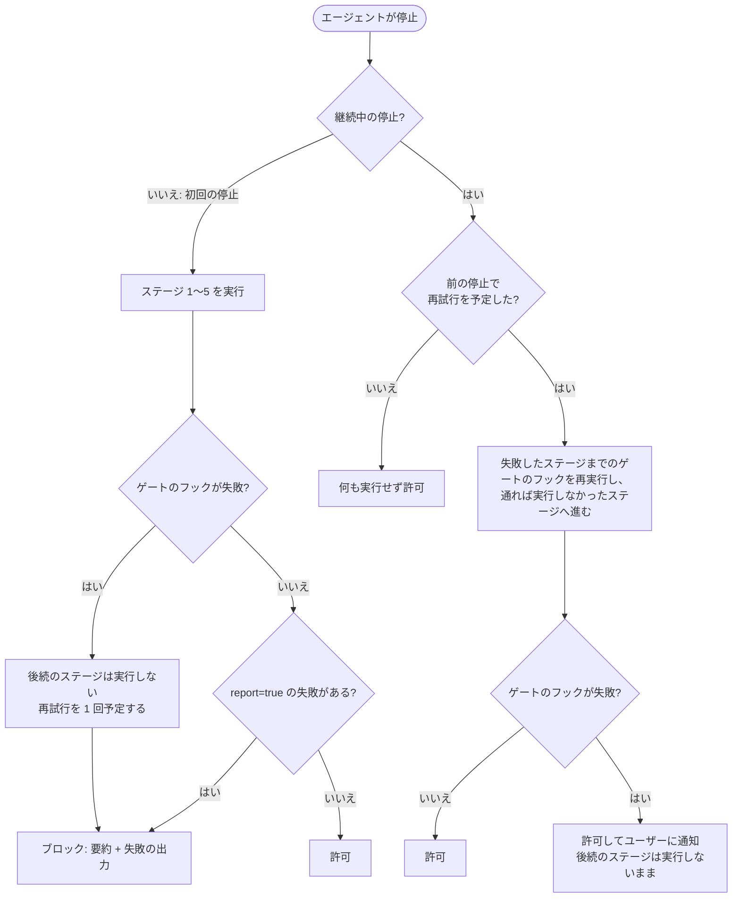

# 設定

デフォルトの場所: `~/.config/claw-hooks/config.toml`（全プラットフォーム共通）

```toml
# コマンドブロック
rm_block = true                    # rm/rmdir/del/eraseをブロック（デフォルト: true）
kill_block = true                  # kill/pkill/killall/taskkillをブロック（デフォルト: true）
dd_block = true                    # ddコマンドをブロック（デフォルト: true）

# カスタムメッセージ（推奨: safe-rm/safe-killツールと併用）
# safe-rm: https://github.com/owayo/safe-rm
# safe-kill: https://github.com/owayo/safe-kill
rm_block_message = "🚫 Use safe-rm instead: safe-rm <file> (validates Git status and path containment). Only clean/ignored files in project allowed."
kill_block_message = "🚫 Use safe-kill instead: safe-kill <PID> or safe-kill -n <name> (like pkill). Use -s <signal> for signal."
dd_block_message = "🚫 dd command blocked for safety."

# デバッグログ
debug = false
# log_path = "~/.config/claw-hooks/logs"  # デフォルト: config.tomlと同じディレクトリ
# 先頭の "~" はホームディレクトリへ展開されます。展開しない相対パスはフックプロセスの
# 作業ディレクトリ（= 編集中のリポジトリ）を基準に解決されてしまうためです。
# デバッグログにはフックイベントの概要と実行ファイルの basename のみを記録します。
# フックの引数、実行ファイルのディレクトリ、ファイル本文、エージェントメッセージは保存しません

# フックコマンドタイムアウト（秒）（デフォルト: 60、最大: 86400）
# report=true のStopフックと拡張子フックコマンドに適用されます。
# このタイムアウトを超えたコマンドはkill（SIGKILL）され、失敗として報告されます。
# report=false のStopフックはデタッチ起動され、完了を待ちません。
# コマンドフックの判定器には使いません（判定器 1 回の時間は各フックの timeout で決まります）。
# hook_timeout = 60

# 出力最大長（文字数）（デフォルト: 1000、0 = 無制限）
# AIエージェントのコンテキストウィンドウ溢れを防止
# output_max_length = 1000

# カスタムコマンドフィルター（正規表現対応）
[[custom_filters]]
command = "yarn"
message = "`yarn`の代わりに`pnpm`を使用してください"

# argsモード: コマンド（正規表現） + 引数マッチング
[[custom_filters]]
command = "npm"
args = ["install", "i", "add"]         # ブロック対象: npm install, npm i, npm add
message = "`npm`の代わりに`pnpm`を使用してください"

[[custom_filters]]
command = "pip3?"                       # 正規表現: pip または pip3 にマッチ
args = ["install", "uninstall"]
message = "`uv pip`を使用してください"

# 正規表現のみモード（argsを指定しない場合）
[[custom_filters]]
command = "python[23]? -m pip"         # より複雑なパターン
message = "`uv pip`を使用してください"

[[custom_filters]]
command = "docker"
args = ["rm", "rmi", "system prune"]   # ブロック対象: docker rm, docker rmi, docker system prune
message = "ユーザーに直接実行を依頼してください"

# コマンドフック: シェルコマンド中のプログラムの呼び出しを、実行前に外部の判定器へ渡す
# （グローバル設定専用。詳細は後述の「コマンドフック」）
# [[command_hooks]]
# command = "gws"                  # プログラム名（basename・拡張子・大文字小文字を正規化して照合）
# run = "noslop hook command"      # 判定器のコマンドライン（シェルを介さず起動。Windows は cmd /c 経由）
# timeout = 5                      # 判定器 1 回あたりの秒数（デフォルト: 5）
# on_error = "allow"               # 判定器が失敗したとき: "allow"（デフォルト）または "block"

# 拡張子フック（ファイル書き込み/編集時にトリガー）
# マップ形式: ".ext" = ["cmd1 {file}", "cmd2 {file}"]
# 条件付きのテーブル（condition は Stop フックと同じ）でも書け、入っている環境でだけ
# 動かしたい任意のツールに使います（後述の「条件付きのエントリ」を参照）
# "*" のキーは編集したすべてのファイルに当たり、拡張子のないファイル（Makefile）や
# ドットファイル（.gitignore）も対象です。1 つのファイルでは、拡張子のキーのコマンドを
# 書いた順に実行してから "*" のコマンドを書いた順に実行するため、"*" のリンターには
# フォーマッターが書き換えた後の内容が渡ります。"*" を表のどこに書いても順序は同じです。
# "*" に何を書くとよいかは、後述の「拡張子フックのルール」を参照してください
# 出力（stdout/stderr）は、対応するフックランタイムでは additionalContext としてAIエージェントに送信
# 各コマンドテンプレートは {file} をちょうど1回含める必要があります
# 親ディレクトリ遡りパス（../）は安全のため拒否されます
# シェルのリダイレクトメタ文字（<, >）を含むパスは安全のため拒否されます
# タブ/改行/NUL は引数分割や不正なパスを防ぐため拒否されます
# `cmd /c` のメタ文字（%, !, ^, "）は、Windows での変数展開インジェクションを防ぐため全環境で拒否されます
[extension_hooks]
".css" = ["biome format --write {file}", "biome lint --write {file}"]
".go" = [
  "gofmt -w {file}",
  { command = "golangci-lint run {file}", condition = { command_exists = "golangci-lint" } },
]
".py" = ["ruff format --check {file}", "ruff check --preview --select=I,F,DOC {file}"]
".rs" = ["rustfmt {file}"]
".ts" = ["biome check {file}"]
".tsx" = ["biome check {file}"]
"*" = ["noslop hook file {file}"]

# Stopフック（エージェントループ終了時にトリガー）
# 配列内のすべてのコマンドは並列実行されます。
# conditionなしのフックはデフォルトで report=false となりデタッチ起動されます。
# stdout/stderr は破棄されるため、必要ならコマンド側でリダイレクトしてください。
# ステージは順に実行します（stage = 1-5、デフォルト 5）。report=true のフックが失敗すると
# 後続のステージは実行しません。そのフックに gate = false を書くと、失敗を返しつつ後続も実行します。
# [[stop_hooks]]
# commands = ["afplay /System/Library/Sounds/Glass.aiff"]  # macOS通知音

# [[stop_hooks]]
# commands = ["notify-send 'エージェント完了'"]  # Linux通知

# 条件付きStopフック（Stop時にプロジェクト全体のlintを実行）
# プロジェクト構成ファイルの存在とツールの利用可能性を検出し、lint/typecheckを実行。
# 失敗時は、Stop時フィードバックに対応したエージェントでは結果をAIへ返し、
# エージェントが問題を修正します（Windsurf と Grok CLI はベストエフォート）。
# conditionフィールド（AND条件）: file_exists, file_not_exists, command_exists, command_not_exists
[[stop_hooks]]
commands = ["cargo clippy --all-targets --all-features -- -D warnings", "cargo fmt --check"]
condition = { file_exists = "Cargo.toml" }

[[stop_hooks]]
commands = ["pnpm exec tsc --noEmit"]
condition = { file_exists = "tsconfig.json" }

[[stop_hooks]]
commands = ["ruff format .", "ruff check --preview --fix --select=I,F,DOC --unsafe-fixes"]
condition = { file_exists = "pyproject.toml", command_exists = "ruff" }

[[stop_hooks]]
commands = ["biome check --write ."]
condition = { file_exists = "package.json" }
```

## プロジェクトごとの設定

claw-hooksはデフォルトでグローバル設定ファイル（`~/.config/claw-hooks/config.toml`）を使用します。プロジェクトごとに動作をカスタマイズする方法は3つあります:

**1. `.claw-hooks.toml` — 自動検出されるプロジェクト設定（推奨）**

プロジェクトルートに `.claw-hooks.toml` を配置するだけです。claw-hooksはカレントディレクトリ直下の `.claw-hooks.toml` を自動検出し、グローバル設定とマージします。`--config` フラグは不要です。

```toml
# my-project/.claw-hooks.toml

# このプロジェクトで必要なガードを有効化する（有効化は常に許可される）
dd_block = true

# グローバルのフィルターに追加する
[[custom_filters]]
command = "yarn"
message = "Use pnpm instead"
```

**マージルール。** `.claw-hooks.toml` は「エージェントが clone してきたリポジトリの中のファイル」でもあり得るため、**未信頼の入力**として扱います。プロジェクト設定は防御を**強める**ことはできますが、弱めることはできず、新しいコマンド実行を持ち込むこともできません。

| フィールド | ルール | 動作 |
|-----------|--------|------|
| `rm_block`, `kill_block`, `dd_block` | **有効化のみ** | `true` は反映。`false` への上書きは警告を出して無視 |
| `custom_filters` | **追加のみ** | プロジェクトの定義を追加。グローバルの削除・置換は不可 |
| `stop_hooks` | **無視** | エージェント停止時に任意コマンドが走るため |
| `extension_hooks` | **無視** | ファイル編集のたびに任意コマンドが走るため |
| `command_hooks` | **無視** | 一致したシェルコマンドの実行前に任意コマンドが走るため |
| `*_block_message`, `hook_timeout`, `output_max_length` | **上書き** | プロジェクトの値が優先（いずれもブロック判定を弱めない） |
| `debug`, `log_path`, `nano_buddy` | **グローバル専用** | エラーとして拒否 |

省略されたフィールドはグローバルの値を維持します。無視した項目は警告として報告されるため、「設定したのに効かない」状態が見えないまま残ることはありません。`stop_hooks`・`extension_hooks`・`command_hooks` は適用されずに破棄されるため、どんな形で書かれていても受け取り、**内容の検証も行いません**。書式が壊れた項目も、書き損じた `condition` のような未知のフィールドも、`stop_hooks = "x"` のように型の違う値も、正しい項目と同じように警告を出して無視します。設定読み込み全体を失敗させることはありません（失敗させると、clone したリポジトリに置かれた 2 行でそのディレクトリの全コマンドが deny になってしまいます）。グローバルの `config.toml` は、`condition` の未知のフィールドも含めて厳密に検証します。

`claw-hooks check` で検証できます — プロジェクト設定の有無と妥当性に加えて、無視される項目と未知の（タイポした）キーを報告します（[設定の検証](#設定の検証) を参照）。

> **プロジェクト単位のフォーマッター・リンター。** `extension_hooks` と `stop_hooks` はグローバルの `config.toml` に書き、`condition = { file_exists = "…" }` で対象を絞ってください（拡張子フックのエントリはテーブル形で条件を書けます。[条件付きのエントリ](#条件付きのエントリ) を参照）。プロジェクトごとに挙動を変えつつ、「リポジトリ側が実行内容を決められる」状態を避けられます。プロジェクト設定に書いたものは無視され、`claw-hooks check` が報告します。

> **`hook_timeout = 0` は拒否します。** 「無制限」の意味ではなく（`0` を無制限として扱うのは `output_max_length` だけです）、全フックが即座にタイムアウトする設定になります。claw-hooks は不正な設定でフェイルクローズするため、この設定があるとすべてのコマンドが拒否されます。`claw-hooks check` が原因を指摘します。

> **カスタムフィルターはコマンド名を正規化します。** 組み込みの `rm`/`kill`/`dd` フィルターと同じ扱いで、`command = "npm"` のフィルターは `/usr/bin/npm` / `./npm` / `NPM` / `npm.cmd` にもマッチします。

**2. `--config` — 設定ファイルの完全置換**

`--config` を使用して完全な設定ファイルを指定し、グローバル設定を完全に置き換えます:

```toml
# my-project/.claude/claw-hooks.toml
rm_block = true
kill_block = true
dd_block = false  # このプロジェクトでは dd を許可

[extension_hooks]
".rs" = ["rustfmt {file}"]
```

```json
// my-project/.claude/settings.json
{
  "hooks": {
    "PreToolUse": [{
      "matcher": "Bash|PowerShell",
      "hooks": [{ "type": "command", "command": "claw-hooks hook --config .claude/claw-hooks.toml" }]
    }],
    "PostToolUse": [{
      "matcher": "Write|Edit|MultiEdit|NotebookEdit",
      "hooks": [{ "type": "command", "command": "claw-hooks hook --config .claude/claw-hooks.toml" }]
    }],
    "Stop": [{
      "matcher": "",
      "hooks": [{ "type": "command", "command": "claw-hooks hook --config .claude/claw-hooks.toml" }]
    }]
  }
}
```

**3. 条件付きStopフック — プロジェクト自動検出**

`file_exists` 条件付きのStopフックは、作業ディレクトリに基づいてプロジェクトタイプを自動判定します。単一のグローバル設定で複数のプロジェクトタイプに対応できます:

```toml
# ~/.config/claw-hooks/config.toml

# Rustプロジェクトのみで実行（Cargo.toml が存在する場合）
[[stop_hooks]]
commands = ["cargo clippy -- -D warnings"]
condition = { file_exists = "Cargo.toml" }

# TypeScriptプロジェクトのみで実行（tsconfig.json が存在する場合）
[[stop_hooks]]
commands = ["pnpm exec tsc --noEmit"]
condition = { file_exists = "tsconfig.json" }
```

3つのアプローチはすべて組み合わせ可能です。グローバル設定で共通ルールを定義し、`.claw-hooks.toml` でプロジェクト固有の上書きを行い、条件付きStopフックでプロジェクトタイプの自動検出を活用できます。

## 条件付きStopフック（プロジェクト全体Lint）

`condition`フィールドを持つStopフックは、プロジェクトの構成ファイルに応じてlint/typecheckコマンドを実行します。`commands`配列内のすべてのコマンドは**並列実行**されます。失敗したコマンドの出力はすべて収集され、AIエージェントにブロック理由としてまとめて返されます。失敗したフックは、`gate = false` を書かない限り後続のステージの実行も止めます。エージェントに何が伝わり、実行しなかったステージがいつ動くかは [Stopフックの失敗と再試行](#stopフックの失敗と再試行) で説明します。

**タイムアウトの扱い:** `hook_timeout` は最大 `86400` 秒まで指定できます。報告対象のStopフック（`report = true`）では、`hook_timeout` を超えたコマンドを claw-hooks がプロセスツリーごと強制終了（SIGKILL）し、タイムアウトをブロック理由として返します。直接の子プロセスが終了しても、バックグラウンド孫プロセスが stdout/stderr パイプを保持している場合もタイムアウト扱いにするため、`sh -c 'sleep 60 &'` のようなコマンドでフックタイムアウトを回避できません。通常のコマンド失敗（終了コード `124` を自ら返す場合を含む）も引き続きブロック対象です。`report = false` のStopフックは stdin/stdout/stderr を null にしてデタッチ起動されるため、claw-hooks は完了待ちも `hook_timeout` の強制も行いません。必要ならコマンド自体を timeout ツールで包んでください。

ただし Windsurf と Grok CLI は例外です。Windsurf の `post_cascade_response` は非同期の事後フックであり、Grok も `PreToolUse` 以外はすべて stdout が無視される事後フックです。どちらも Stopフック自体は実行されますが、失敗はベストエフォート扱いとなり、AI エージェントへのブロックとしては返されません。

**Stopフックのフィールド:**

| フィールド | 型 | デフォルト | 説明 |
|-----------|------|-----------|------|
| `commands` | `string[]` | (必須) | 実行するコマンド（同じstage内で並列実行） |
| `condition` | `object` | (なし) | 実行条件（AND条件: `file_exists`, `file_not_exists`, `command_exists`, `command_not_exists`） |
| `stage` | `1-5` | `5` | 実行順序。小さいstageが先に実行される。同じstage内のフックは並列実行。 |
| `report` | `bool` | (自動) | 結果をAIエージェントに返すかどうか。デフォルト: `condition`ありなら`true`、なしなら`false`。 |
| `gate` | `bool` | `true` | このフックが失敗したとき、後続のステージの実行を止めるかどうか。効くのは結果を返すフック（`report = true`）だけ。`false` にすると、失敗はエージェントに返しつつ後続のステージも実行する。`report = false` のフックに `gate = true` を書くと、結果を確かめないフックなので `claw-hooks check` が警告する。 |
| `session_scope` | `"primary"` \| `"delegated"` \| `"all"` | `"primary"` | このフックを実行するセッション種別。`primary` = メインセッションのみ、`delegated` = 委譲エージェントセッション（Claude Code の teammate 等）のみ、`all` = 両方。 |

**conditionフィールド**（AND条件 — 指定されたすべての条件が真である必要があります）:

| フィールド | 説明 |
|-----------|------|
| `file_exists` | 作業ディレクトリにこのファイルが存在する場合のみ実行 |
| `file_not_exists` | 作業ディレクトリにこのファイルが **存在しない** 場合のみ実行（例: 「このロックファイルが無い時のフォールバック」）|
| `command_exists` | このコマンドがPATH上に存在する場合のみ実行（Windows の `PATHEXT` を考慮。Unix では実行ビットが必要。`./tool` や `/usr/bin/tool` のような明示パスも判定可能） |
| `command_not_exists` | このコマンドがPATH上に **存在しない** 場合のみ実行 |

条件は、そのステージを始める直前に評価します。そのため、前のステージが作ったファイルを条件に使えます。`condition` の未知のフィールドと空文字列は設定エラーです。権限不足などでファイルの有無を確かめられず、条件を評価できなかった場合、ゲートのフック（後述）は失敗として扱い、その出力は `could not evaluate condition.<field> (<error>)` になります。それ以外のフックは、デバッグログに警告を残して実行しません。評価できなかった条件を「満たさない」とみなすと、必須の検査が黙って飛ばされ、その後ろのステージが走ってしまうためです。

> **挙動の変更（v26.9.104 より後）。** `condition` の未知のフィールドは、Stop フックでも拡張子フックでも設定エラーになりました。以前は `command_exits` のような書き損じが無視され、条件の無いフックとして実行されていました。更新したら `claw-hooks check` を実行してください。グローバル設定が不正なあいだ、claw-hooks はすべてのコマンドを拒否します。

```toml
# ステージベースの実行: 分析 → lint → コミット
[[stop_hooks]]
commands = ["astro-sight review --dir . --git --hook"]
stage = 1        # 最初に実行
report = true    # 結果をAIに返す。失敗するとステージ 2〜5 を実行しない

[[stop_hooks]]
commands = ["noslop hook git-diff --max-chars 900"]
stage = 1
report = true
gate = false     # 結果はAIに返すが、後続のステージは止めない

[[stop_hooks]]
commands = ["cargo clippy --all-targets --all-features -- -D warnings", "cargo fmt --check"]
condition = { file_exists = "Cargo.toml" }
stage = 3
# report 未指定 → condition あり → true（デフォルト）

[[stop_hooks]]
commands = ["pnpm exec tsc --noEmit"]
condition = { file_exists = "tsconfig.json" }
stage = 3

[[stop_hooks]]
commands = ["git-sc --all --yes --quiet"]
# stage 未指定 → 5（最後）。ステージ 1〜4 のゲートのフックがどれも失敗しなかったときだけ実行
# report 未指定 → condition なし → false（fire-and-forget）
```

**ステージの実行順序:** ステージは 1 から 5 の順に 1 つずつ実行し、同じステージ内のフックは並列に実行します。次のステージに進むのは、いま実行中のステージで `report = true` のフックがすべて終わってからです。`report = true` のフックが失敗すると（コマンドが 0 以外で終了した、`hook_timeout` を超えた、起動できなかった）、同じステージの残りのフックは最後まで実行し、そのうえで後続のステージは実行しません。ただし、失敗したフックに `gate = false` を書いてある場合は後続も実行します。`gate` が `false` でない `report = true` のフックは失敗すると後続を止めるので、以下ではゲートのフックと呼びます。`report = false` のフックはステージの開始時に起動するだけで完了を待たないため、後続のステージを止めることはありません。

設定するときは、次の 3 点に気を付けてください。

- **検査とコミットは別のステージに置いてください。** 同じステージのフックは一斉に起動するため、検査と同じステージに置いたコミットは、検査が失敗した時点でもう動き始めています。
- **後続のステージを、デタッチ起動のフックに依存させないでください。** `report = false` のフックはステージの完了待ちに含まれません。そうして起動したフォーマッターは、次のステージが検査しているあいだもファイルを書き換えているかもしれません。
- **後続のステージが頼りにする検査には `command_exists` を付けないでください。** ツールが入っていない環境では条件でフックが飛ばされ、ステージは成功扱いになり、後ろのステージのコミットが検査なしで動きます。条件を付けなければ、ツールが無いことは起動失敗になり、後続のステージを止めます。条件は、入っていなくてもよいツールのためのものです。

> **挙動の変更（v26.9.104 より後）。** `report = true` のフックが失敗すると、後続のステージを実行しなくなりました。以前は失敗しても全ステージを実行していたため、ステージ 5 の `git-sc` が、ステージ 1 の検査で落ちた変更を、エージェントが失敗を知る前にコミットし push まで済ませることがありました。以前の動作に戻したいフックには `gate = false` を書いてください。

**レポート動作:** `report = true`（または`condition`によるデフォルト`true`）の場合、コマンド失敗はAIエージェントにブロック理由として返されます。ブロック理由の先頭には、失敗したステージと実行しなかったステージの要約が付きます。`report = false`（または`condition`なしによるデフォルト`false`）の場合、コマンドは fire-and-forget 方式で起動され、Hook応答をブロックしません。デタッチコマンドは stdin/stdout/stderr が null になるため、spawn 失敗はログに残りますが、コマンド出力と終了ステータスは収集されません。Windsurf と Grok CLI の Stop フックは常にベストエフォートです（Windsurf は基盤側が非同期、Grok は stdout が無視されるため）。

**セッションスコープ（エージェントセッションの抑止）:** claw-hooks は委譲エージェントのセッションとメインセッションを自動で判別します: 委譲側の Stop ペイロードには空白でない `agent_id` と `agent_type` の両方が含まれます（公式仕様では `agent_id` は「サブエージェント呼び出しの内側で発火したときだけ入る」と定義されています）。`--agent` で起動したメインセッションにも `agent_type` は入り得ますが、サブエージェント固有の `agent_id` は無いためメイン扱いを維持します。デフォルト（`session_scope = "primary"`）では Stop フックは**メインセッションの停止時のみ**実行されるため、大量の teammate が通知スパム・重複 lint・並列 `git` 自動コミットのレースを引き起こすことはありません。常に実行したいフックには `session_scope = "all"` を、エージェントセッション専用のフック（teammate ごとのクリーンアップ等）には `"delegated"` を指定します。判別フィールドが欠落・空白・非文字列の場合と、セッション種別のシグナルを持たないエージェント（Cursor / Windsurf / Codex CLI / Antigravity / Grok CLI）はメインセッションとして扱われます。

> **agent team の teammate はスコープ外です。** teammate はインプロセスで動き、完了は Claude Code の別イベント `TeammateIdle` で通知されますが、claw-hooks はこれを意図的に扱いません。このイベントにはループカウンタ（`stop_hook_active` / `loop_count` に相当するもの）が無く、失敗を伝える唯一の手段が「teammate に作業を継続させる」ことなので、恒久的に失敗する lint があると無限ループになります。**したがって teammate の idle 時には停止時 lint も通知も実行されません。**

```toml
# メインセッションの停止時のみ実行（デフォルト — フィールド指定不要）
[[stop_hooks]]
commands = ["cargo clippy --all-targets --all-features -- -D warnings"]
condition = { file_exists = "Cargo.toml" }

# メインセッションと委譲エージェントセッションの両方で実行
[[stop_hooks]]
commands = ["collect-metrics"]
report = false
session_scope = "all"
```

```toml
# その他の例:

# Python: pyproject.toml があり ruff がインストール済みの場合に ruff format/check を実行
[[stop_hooks]]
commands = ["ruff format .", "ruff check --preview --fix --select=I,F,DOC --unsafe-fixes"]
condition = { file_exists = "pyproject.toml", command_exists = "ruff" }

# JavaScript/TypeScript: package.json がある場合に biome check を実行
[[stop_hooks]]
commands = ["biome check --write ."]
condition = { file_exists = "package.json" }
```

## Stopフックの失敗と再試行

`report = true` の Stop フックが失敗すると、claw-hooks は失敗をブロック理由としてエージェントに返し、エージェントはそれを直す作業を続けます。Claude Code と Codex CLI ではブロック理由がエージェントへの次の指示になり、Cursor ではフォローアップのメッセージとして送られます。失敗したのがゲートのフックなら、後続のステージも実行しません（[条件付きStopフック](#条件付きstopフックプロジェクト全体lint) の「ステージの実行順序」を参照）。この節では、エージェントに何が伝わるか、実行しなかったステージがいつ動くかを説明します。



再試行を予定するのは、継続中の停止を知らせてくるエージェントだけです（[次の停止での 1 回だけの再試行](#次の停止での-1-回だけの再試行) を参照）。それ以外のエージェントでは、図の「再試行を 1 回予定する」を行いません。

### ブロック理由

ブロック理由は要約で始まり、空行を挟んで、失敗した各フックの出力が続きます。

```text
Stop hooks failed: stage 1 [astro-sight, noslop].
Not run because a stage 1 hook failed: stage 5 [git-sc].
One retry is scheduled: at the next stop, the reported hooks up to stage 1 run again, and the stages that were not run start if they pass.

Stop hook failed: astro-sight
…

Stop hook failed: noslop
…
```

- 1 行目には、失敗したフックがあるステージを、ステージの順にすべて並べます。
- 2 行目は、ゲートのフックの失敗で後続のステージのフックを実行しなかったときだけ出ます。挙げるのは実行するはずだったそのフック、つまり `session_scope` が合い、その時点で条件を満たす（または条件を評価できない）フックです。
- 3 行目は、再試行を予定したときだけ出ます。
- フックは各コマンドの先頭の語、つまりプログラム名で示します。`git-sc --all --yes --quiet` なら `git-sc` です。1 つのステージに並べる名前は 8 個までで、それを超えた分は `and N more` とまとめます。

ブロック理由全体は `output_max_length`（デフォルト 1000 文字）で切り詰め、先頭を残します。lint の長い出力が途中で切れても、要約は残ります。

### 次の停止での 1 回だけの再試行

ブロックを受けたエージェントは失敗を直し、もう一度停止します。この 2 回目の停止は *継続中の停止* で、Claude Code と Codex CLI では `stop_hook_active: true`、Cursor では `loop_count` が 1 になります。claw-hooks は継続中の停止では通常 Stop フックを実行しません。実行して再びブロックを返すと、エージェントがいつまでも止まれなくなるおそれがあるためです。ただ、それだけだと、実行しなかったステージ（たとえばコミット）は、エージェントがすべて直した後でも、次のターンが終わるときの停止まで待たされます。

そこで、ゲートのフックの失敗で後続のステージのフックを実行しなかったときは、その継続中の停止に 1 回だけ再試行を予定します。

1. 失敗したステージと、それより前のステージのゲートのフックを、もう一度実行します。それらのステージにある `gate = false` のフックとデタッチ起動のフックは、初回の停止で実行済みなので再実行しません。
2. すべて通れば、実行しなかったステージを始めます。条件を満たすフックは、デタッチ起動のものも含めてすべて実行し、エージェントの停止を許可します。
3. 再試行の途中でゲートのフックが失敗した場合は、前回も失敗したものか、実行していなかったステージのものかにかかわらず、その後ろのステージを実行せず、停止は許可します。再試行ではブロックを返さないので、ループは起こりません。代わりにユーザーに通知し（後述）、次の再試行は予定しません。

実行していなかったステージの `gate = false` のフックが再試行の中で失敗した場合は、デバッグログに残すだけです。再試行は 1 回だけで、ブロックの直後の継続中の停止でしか行いません。その後の継続中の停止では、従来どおり何も実行しません。2 回の停止のあいだに `[[stop_hooks]]` の設定が変わっていた場合は、フックを実行せず、再試行を見送ったことをユーザーに通知します。使われずに残った再試行の予定は、次の初回の停止で破棄します。初回の停止ではどのみち全ステージを実行するためです。

再試行を予定するのは、次の条件をすべて満たす場合だけです。満たさない場合はブロック理由に 3 行目が付かず、実行しなかったステージは次のターンの停止まで待ちます。

- エージェントが Claude Code、Codex CLI、Cursor のいずれかであること。ほかのエージェントは、停止が継続中のものかどうかを claw-hooks に知らせてきません（後述）。
- エージェントがセッション ID を送ってきたこと。Claude Code と Codex CLI では `session_id`、Cursor では `conversation_id` です。
- 委譲エージェントではなく、メインセッションの停止であること（前述の `session_scope` を参照）。
- 再試行の記録を claw-hooks の状態ディレクトリに書き込めたこと。状態ディレクトリは、macOS では `~/Library/Caches/claw-hooks`、Linux では `~/.cache/claw-hooks`、Windows では `%LOCALAPPDATA%\claw-hooks` です（[状態ファイル](cli-reference.ja.md#状態ファイル) を参照）。

### ユーザーへの通知

再試行が失敗したとき、または見送ったときは、claw-hooks は停止を許可したうえでユーザーに知らせます。エージェントには何も返しません。返すと、作業を続けるよう求めることになるからです。

```text
claw-hooks: stop hook retry failed at stage 1 [astro-sight]. Not run: stage 5 [git-sc]. No further retry is scheduled.
claw-hooks: the stop hook configuration changed after the failed stop, so the scheduled retry was skipped. Later stages were not run.
```

| エージェント | 通知の表示 |
|---|---|
| Claude Code、Codex CLI | `{"systemMessage":"…"}` として、ユーザー向けの警告で表示されます。判定を持たず会話も続けないので、エージェントはそのまま停止します |
| Cursor | 表示されません。Cursor の stop の出力には `followup_message` しか無く、これに載せるとエージェントへの新しいメッセージとして送られてしまうためです。通知はデバッグログに残します |

macOS で `nano_buddy = true` にしている場合は、NanoBuddy も結果を吹き出しで表示します。

### Windsurf、Grok CLI、Antigravity CLI

ゲートはどのエージェントでも同じように働き、ゲートのフックが失敗すると後続のステージを実行しません。ただ、この 3 つのエージェントは停止が継続中のものかどうかを知らせてこないため、再試行は予定しません。

- **Windsurf と Grok CLI** は Stop フックを事後フックとして実行するため、失敗はエージェントに返りません。実行しなかったステージは、検査が通る次の停止で動きます。それまでのあいだ、どのステージを実行しなかったかはデバッグログに残ります。
- **Antigravity CLI** は失敗を `"decision":"continue"` で返し、その次の停止は新しい初回の停止として届くので、全ステージをもう一度実行します。Antigravity ではループと新しい停止を claw-hooks が見分けられないため、`report = true` のフックには自前の終了条件を持たせてください（[エージェント統合](integrations.ja.md#antigravity-cli) を参照）。

## Stopフックの環境変数

claw-hooksはStopフックの子プロセスに以下の環境変数を渡します:

| 変数名 | 説明 |
|--------|------|
| `CLAW_HOOKS_STOP_ACTIVE` | 常に `1` に設定。子プロセスが別のclaw-hooks Stopイベントをトリガーした際の再帰実行を防止します。 |
| `CLAW_HOOKS_AGENT_MESSAGE` | AIエージェントが停止前に残した最後のメッセージ（利用可能な場合）。エージェントが何を作業していたかの情報を含みます。 |

**`CLAW_HOOKS_AGENT_MESSAGE`** の取得元:
- **Claude Code**: Stopイベントの `last_assistant_message` フィールド
- **Windsurf**: `post_cascade_response` イベントの `response` フィールド（`post_cascade_response_with_transcript` には応答本文がなく、トランスクリプトは読み込まない）
- **Cursor**: 利用不可

これはエージェントのコンテキストを活用できるツールに有用です。例えば、[git-sc](https://github.com/owayo/git-smart-commit)はこの情報を使ってより正確なコミットメッセージを生成します:

```toml
[[stop_hooks]]
commands = ["git-sc --all --yes --quiet"]
```

git-scがStopフックとして実行されると、`CLAW_HOOKS_AGENT_MESSAGE` を読み取り、エージェントのコンテキストをAIプロンプトに含めます。これにより、単なるdiffの説明ではなく、変更の意図を反映したコミットメッセージが生成されます。

## カスタムフィルターの動作

カスタムフィルターは2つのモードをサポートしています:

**正規表現モード**（デフォルト）: `command`のみ指定した場合、正規表現パターンとして扱われます。

```toml
[[custom_filters]]
command = "python[23]? -m pip"    # 複雑な正規表現パターン
message = "uv pipを使用してください"
```

**argsモード**: `args`を指定した場合、`command`は正規表現パターンとしてコマンド名に対してマッチされ、argsのいずれかにマッチするとフィルターが発動します。

```toml
[[custom_filters]]
command = "npm"                    # 正規表現パターン（コマンド名）
args = ["install", "i", "add"]     # 第1引数がこれらのいずれかにマッチ
message = "pnpmを使用してください"

[[custom_filters]]
command = "pip3?"                  # pip と pip3 両方にマッチ
args = ["install", "uninstall"]    # 第1引数がこれらのいずれかにマッチ
message = "uv pipを使用してください"
```

`args` の各項目は、コマンド直後の第1引数または引数列に一致します。たとえば `args = ["system prune"]` は `docker system prune -af` に一致し、`docker system df` には一致しません。args モードのコマンド名パターンは名前全体と照合し、`pip|pip3` の各選択肢にも同じ制約が掛かります。正規表現のみのモードでは、パターン自体が `^` で始まっていても、すべての選択肢をコマンド先頭に固定します。

両モードとも `;`、`&&`、`||`、`|` でチェーンされたコマンドも検出します:

```bash
# ブロック: セミコロンの後の yarn を検出
echo "install"; yarn install
# → {"hookSpecificOutput":{"hookEventName":"PreToolUse","permissionDecision":"deny","permissionDecisionReason":"`yarn`の代わりに`pnpm`を使用してください"}}

# 許可: "yarn" はクォート内（コマンドではない）、pnpm は OK
echo "not yarn install"; pnpm install
# → {}
```

クォート内のコマンドは無視されます（引数であり、コマンドではないため）。

## コマンドフック

コマンドフックは、シェルコマンドの中にある特定のプログラムの呼び出しを、コマンドの実行前に 1 つずつ外部の判定器へ渡します。判定器はコマンドを拒否するか、エージェントへ補足を返すか、何もしないかを決めます。呼び出しは危険コマンドの検出と同じパーサーで探すため、ラッパー越しの呼び出し（`sudo gws …`）や `bash -c '…'` の中の呼び出しも見つかります。判定器が受け取るのはその呼び出しの引数だけで、クォートを外した形で渡します。コマンド文字列そのものは渡しません。

```toml
[[command_hooks]]
command = "gws"
run = "noslop hook command"
timeout = 5
on_error = "allow"
```

| フィールド | 型 | デフォルト | 説明 |
|-----------|------|-----------|------|
| `command` | `string` | (必須) | 対象のプログラム名。正規表現ではなく名前で、空白は含められない |
| `run` | `string` | (必須) | 判定器のコマンドライン |
| `timeout` | `integer` | `5` | 判定器 1 回あたりの秒数（`1`〜`86400`） |
| `on_error` | `"allow"` \| `"block"` | `"allow"` | 判定器が失敗したときの扱い（後述） |

**照合。** `command` と各呼び出しのプログラム名は、どちらも組み込みフィルターと同じ正規化（basename を取り、拡張子 `.exe` / `.cmd` / `.bat` / `.com` を外し、小文字にする）をしてから完全一致で比べます。そのため `command = "gws"` は `gws`・`/usr/local/bin/gws`・`GWS`・`gws.exe` に一致し、`command` にパスを書いても basename だけで照合されます。`$CMD args` のようにプログラム名が実行時まで決まらない呼び出しは、どのフックにも一致しません。

**判定器の起動。** `run` はシェルと同じ規則（クォートとバックスラッシュを解釈する）で語に分けます。Linux と macOS ではシェルを介さずにプログラムを直接起動するため、`run` に書いたパイプ・リダイレクト・変数・グロブは解釈されません。Windows では、拡張子フックや Stop フックと同じく `cmd /c` を経由して起動し、`.cmd` / `.bat` のラッパーも解決できるようにしています。どの環境でも、調べる呼び出しの中身は stdin でだけ渡し、判定器のコマンドラインには載せません。

**失敗の扱い。** 判定器が `0` と `2` 以外の終了コードで終わる、シグナルで終了する、起動できない、時間切れになる、のいずれかを失敗とみなします。`on_error = "allow"` のときはコマンドを通し、失敗はデバッグログに警告として残すだけです。lint のような助言のための判定器が壊れても、エージェントの作業は止まりません。`on_error = "block"` のときは `[noslop] command hook failed: timed out after 5s` のような理由でコマンドを拒否します。

**タイムアウト。** 判定器 1 回の時間は、そのフックの `timeout` だけで決まります。コマンドフックは `hook_timeout` を使いません。`hook_timeout` はプロジェクトの `.claw-hooks.toml` から上書きできるので、判定器の時間予算に使うと、リポジトリ側が `on_error = "allow"` の判定器をわざと時間切れにしてコマンドを素通りさせられるからです。1 回のフックイベントで判定器を走らせるのは最大 32 回なので、1 つのコマンドの検査にかかる時間は最大でも `timeout` の 32 回分（既定なら 160 秒）です。

**グローバル設定専用。** プロジェクトの `.claw-hooks.toml` に書いた `command_hooks` は警告を出して無視し、内容の検証もしません。判定器は任意のコマンドで、一致したシェルコマンドの実行前に毎回走るため、`stop_hooks` / `extension_hooks` と同じ扱いにしています（[プロジェクトごとの設定](#プロジェクトごとの設定) を参照）。

判定器が受け取る JSON、終了コードの読み方、補足が届くエージェント、判定器を走らせる順序と上限: [コマンドフックのプロトコル](cli-reference.ja.md#コマンドフックのプロトコル)

## 拡張子フックのルール

- キーは `.` で始まる拡張子（`".rs"`）か `"*"` のどちらかです。glob やファイル名のキーは無く、`"*.rs"`・`"**"`・`"*.{yml,yaml}"`・ドットの無い `"rs"`・`"Makefile"` のようなキーは設定エラーになります（`claw-hooks check` が失敗します）。
- 拡張子は大文字と小文字を区別して照合するため、`.RS` は `".rs"` に当たりません。`.gitignore` のようなドットファイルは拡張子を持たない扱いなので、当たるのは `"*"` だけです。
- `"*"` は編集したすべてのファイルに当たります。拡張子のないファイル（`Makefile`・`Dockerfile`）やドットファイル（`.gitignore`・`.env`）も対象です。
- 1 つのファイルでは、一致した拡張子のキーのコマンドを書いた順に実行し、その後に `"*"` のコマンドを書いた順に実行します。`"*"` のリンターには、フォーマッターが書き換えた後の内容が渡ります。TOML の表で `"*"` をどこに書いても、この順序は変わりません。1 回の編集で複数のファイルが変わる場合（Codex の `apply_patch`）は、ファイルごとにこの順で実行します。
- 同じコマンドを拡張子のキーと `"*"` の両方に書くと、書いたとおり 2 回実行します（重複は除きません）。エントリが完全に一致する場合、つまりコマンドの文字列も条件も同じ場合は `claw-hooks check` が警告を出し（設定は有効なままです）、フックの実行時にもデバッグログに同じ警告が残ります。`"*"` へ移したコマンドを拡張子のキーから消し忘れたとき、これで気付けます。
- 各コマンドテンプレートには `{file}` プレースホルダーを 1 つだけ含めます。`{file}` を実行ファイルの位置には置けません。
- エントリは、コマンドの文字列か、条件を満たすときだけコマンドを実行するテーブル `{ command = "…", condition = { … } }` のどちらかです（[条件付きのエントリ](#条件付きのエントリ) を参照）。テーブルにほかのフィールドは書けません。
- 起動できなかったコマンドは、プログラム名と原因を付けて返します。見つからないプログラムの通知はセッションにつき 1 回です（[コマンドを起動できないとき](#コマンドを起動できないとき) を参照）。
- 保存後・編集後イベントのみ: Claude `PostToolUse` (`Write`/`Edit`/`MultiEdit`/`NotebookEdit`)、Cursor `afterFileEdit`、Windsurf `post_write_code`、Codex `PostToolUse` + `apply_patch`、Grok `PostToolUse`（`toolInput` にファイルパスを含むもの）、Antigravity `PostToolUse`（hook エントリに `--event PostToolUse` を指定した場合。編集対象は `toolCall.args.TargetFile` から取得）。Antigravity の事後フック出力は `{}` 固定のため診断を返せません。lint の本文が必要な場合は Stop hooks を使ってください。
- Codex の `PostToolUse` + `Bash` はパススルー。`apply_patch` は変更ファイルパスを抽出して拡張子フックに渡します（削除のみの patch はスキップ）。
- Grok の `PostToolUse` は `toolInput` に `file_path` / `filePath` があればフックを実行するため、フォーマッターによるファイル書き換えは通常どおり行われます。ただし Grok は事後フックの stdout を無視するので、lint の本文自体はエージェントに返りません。
- パスに `../` を含むもの、`-` で始まるもの、`` ` ``・`$`・`|`・`&`・`;`・`<`・`>`・`%`・`!`・`^`・`"`・タブ・改行・NUL のいずれかを含むものは拒否します。拒否したファイルではコマンドを 1 つも起動せず、エージェントにはそのファイルについて `[ERROR] <理由>` を 1 件だけ返します（コマンドの数だけ並べません）。必須フィールドを欠くペイロードはフェイルクローズドで拒否。
- `hook_timeout` はコマンドごとに適用し、エージェントへ返す出力は `output_max_length` で切り詰めます。
- 成功時の no-op 定型通知はエージェントへ返しません。ファイル書き換え、警告、失敗を示す出力は保持し、コマンドラベルには展開済みファイルパスや引数要約ではなく設定上のプログラム名だけを表示します。
- 拡張子フックは `"*"` も含めてグローバル設定からだけ読みます。プロジェクトの `.claw-hooks.toml` に書いた `extension_hooks` は警告を出して無視します（[プロジェクトごとの設定](#プロジェクトごとの設定) を参照）。

> **`"*"` に向くツール。** `"*"` は、どのファイルを検査するかを自分で決め、対象外のファイルや指摘のないファイルでは何も出力しないツール（例: `noslop hook file {file}`）を全ファイルに当てるためのものです。こうしたツールなら、対象とする拡張子の一覧をツールの設定だけに書けばよく、claw-hooks の設定と 2 か所で持たずに済みます。一方で `"*"` のコマンドは編集のたびに起動し、バイナリファイルや巨大なファイルも渡されます。対象外のファイルではすぐに終わるツールを選んでください。

### 条件付きのエントリ

```toml
[extension_hooks]
".go" = [
  "gofmt -w {file}",
  { command = "golangci-lint run {file}", condition = { command_exists = "golangci-lint" } },
]
```

テーブル形の `condition` は Stop フックと同じもので、`file_exists`・`file_not_exists`・`command_exists`・`command_not_exists` をすべて満たすときに実行します。相対パスは、Stop フックと同じくフックプロセスの作業ディレクトリを基準に解決します。条件は、編集したファイルごとに、そのコマンドを実行する直前に確かめます。満たさないときはそのコマンドだけを飛ばし、エージェントには何も返しません。同じファイルのほかのコマンドは通常どおり実行します。ファイルの有無を確かめられず条件を評価できないときも、そのコマンドは実行せず、デバッグログに警告を残します。テーブルと `condition` の未知のフィールド、`condition` の空文字列は設定エラーです。`condtion` や `command_exits` のような書き損じを見逃すと、そのコマンドが無条件で実行されてしまうためです。

条件は、入っている環境と入っていない環境がある任意のツールに付けてください。ツールが無い環境では黙って飛ばされます。反対に、どの環境にもあるはずのツールには条件を付けないでください。付けなければ、ツールが無いときにそのことがエージェントに伝わり（後述）、検査が黙って行われないままになるのを防げます。

### コマンドを起動できないとき

コマンドを起動できなかったときは、そのコマンドの出力の代わりに、プログラム名と原因を書いた 1 行をエージェントに返します。同じファイルのほかのコマンドは通常どおり実行して結果を返すので、リンターが 1 つ見つからないだけで、その拡張子のフックが全部壊れたように見えることはありません。

| 原因 | エージェントに返す文 |
|---|---|
| プログラム名にパスの区切り文字が無く、`PATH` に見つからない | `[golangci-lint] not started: command not found in PATH` |
| プログラムがパス（`/` か `\` を含む）で、そこに何も無い | `[lint] not started: command not found at the configured path` |
| プログラムは見つかった（または確かめられなかった）のに、起動すると「見つからない」になった。`#!` のインタープリターが無いスクリプトなど | `[lint] not started: executable or required interpreter not found` |
| ファイルを実行する権限が無い | `[lint] not started: permission denied` |
| そのほかの起動失敗 | `[lint] not started: <エラーの種類>` |
| 起動はしたが、結果を受け取れなかった | `[lint] execution result unavailable: failed to wait for the process` |

ラベルはプログラムのファイル名だけで、ディレクトリや編集したファイルのパスは含めません。デバッグログにも、ラベル、エラーの種類、OS のエラーコードしか残しません。

**見つからないプログラムの通知はセッションにつき 1 回です。** プログラムが無いと確かめられた最初の 2 つの原因では、その状態に最初に当たった編集で文を返し、末尾に `. This notice is not repeated in this session.` を付けます。たとえば `[golangci-lint] not started: command not found in PATH. This notice is not repeated in this session.` です。同じセッションのそれ以降の編集では、そのプログラムについて何も返さず、デバッグログに残すだけです。コマンドの起動は編集のたびに試みるため、セッションの途中でツールを入れれば、次の編集から動きます。ほかの原因は編集のたびに返します。これらは、プログラムが単に入っていないことを示すものではありません。ツールはあるのに動かせない可能性があり、直るまで知らせ続ける意味があるからです。

「同じプログラム」とは、エージェント、セッション、設定に書いたプログラム（クォートを外したもの）が同じことを指します。`./bin/lint` のような相対パスでは、作業ディレクトリも同じである必要があります。そのため、`".go"` と `"*"` の両方に書いた `golangci-lint` の通知は 1 回にまとまり、`golangci-lint` と `/usr/local/bin/golangci-lint` は別のプログラムとして扱います。セッションはエージェントのペイロードから取り、通知がエージェントに届くのは、拡張子フックの出力が届くエージェントだけです。

| エージェント | セッション ID | 通知の行き先 |
|---|---|---|
| Claude Code | `session_id` | `additionalContext` |
| Codex CLI | `session_id` | `additionalContext` |
| Windsurf | `post_write_code` の `trajectory_id` | exit 2 + stderr |
| Cursor | `conversation_id` | 届かない（`afterFileEdit` に出力スキーマが無い） |
| Grok CLI | `sessionId` | 届かない（事後フックの stdout は無視される） |
| Antigravity CLI | `conversationId`（ある場合） | 届かない（出力は `{}` 固定） |

セッション ID が無いときや、状態ディレクトリを使えないときは、末尾の一文を付けずに編集のたびに返します（1 回の編集の中では 1 回です）。

記録は claw-hooks の状態ディレクトリに置きます。macOS は `~/Library/Caches/claw-hooks`、Linux は `$XDG_CACHE_HOME/claw-hooks`（既定は `~/.cache/claw-hooks`）、Windows は `%LOCALAPPDATA%\claw-hooks` です（[状態ファイル](cli-reference.ja.md#状態ファイル) を参照）。この「1 回」は厳密な保証ではありません。記録するのは文を作った時点で、エージェントが読んだ時点ではないため、`output_max_length` で出力が切れて届かなかった場合も繰り返しません。また、キャッシュの削除や 7 日の期限切れで記録が消えると、もう一度だけ通知が出ます。状態を失って起きるのは通知が再び出ることだけで、通知が隠れることはありません。

Windows ではフックを `cmd /c` 経由で起動するため、プログラムが無くても `cmd` 自体は起動します。この場合の失敗は `cmd` のメッセージ（`'golangci-lint' is not recognized as an internal or external command, …`。表示言語によって変わります）として、通常どおり `[label]` を付けて編集のたびに返ります。終了コード 9009 は「見つからない」として扱いません。実際のプログラムも 9009 で終了し得るためです。

## 設定の検証

`claw-hooks check` は、フックの呼び出しと同じ手順で設定を読み込み（グローバル設定か `--config` の設定に、カレントディレクトリの `.claw-hooks.toml` をマージします）、検証します。設定が正しければ `Configuration is valid.` を出して `0` で終了し、正しくなければエラーを出して `1` で終了します。

警告は stderr に `warning: …` の行で出します（デバッグログが有効ならログにも残します）。警告があっても `check` は失敗しません。

- 未知のトップレベルのキー（書き損じた `rm_blok` など）
- 無視されるプロジェクト設定の項目（[プロジェクトごとの設定](#プロジェクトごとの設定) を参照）
- 拡張子のキーと `"*"` の両方にある同じエントリ（[拡張子フックのルール](#拡張子フックのルール) を参照）
- 結果を返さない Stop フックの `gate = true`: `stop_hooks[<i>]: gate = true has no effect because the hook is not reported (report = false starts it detached, so its result is never checked)`
- `PATH` に無いフックのプログラム:

```text
warning: extension_hooks[".go"] command[1]: "golangci-lint" was not found in PATH (checked in this shell; the agent's hook environment may differ)
warning: stop_hooks[2] commands[0]: "git-sc" was not found in PATH (checked in this shell; the agent's hook environment may differ)
warning: command_hooks[0].run: "noslop" was not found in PATH (checked in this shell; the agent's hook environment may differ)
```

プログラムの確認では、拡張子フックの各エントリ、Stop フックの各コマンド、コマンドフックの `run` から先頭の語を取り出し、`command_exists` と同じ規則で探します。`./tool` のような明示パスはファイルとして確かめ、警告も `in PATH` ではなく `was not found at the configured path` と書きます。プログラムを実行することはありません。ラッパーの中身も推測せず、`sh -c '…'` や `env …` では `sh` や `env` だけを確かめます。エントリ自身の条件がこのシェルでそのエントリを飛ばす場合は警告しません。`command_exists` が指すコマンドも見つからない場合と、`command_not_exists` が指すコマンドが見つかる場合です。`file_exists` と `file_not_exists` はフックを動かすディレクトリで決まるので、ここでは評価しません。この確認を行うのは `claw-hooks check` のときだけで、フックの呼び出しでは行いません。使うのは `check` を実行したシェルの `PATH` です。エージェントは別の `PATH` でフックを起動することがあります（macOS の Dock から起動したアプリはシェルのプロファイルを読みません）。そのため、ここで警告が出なくても、エージェントがすべてのプログラムを見つけられるとは限りません。
