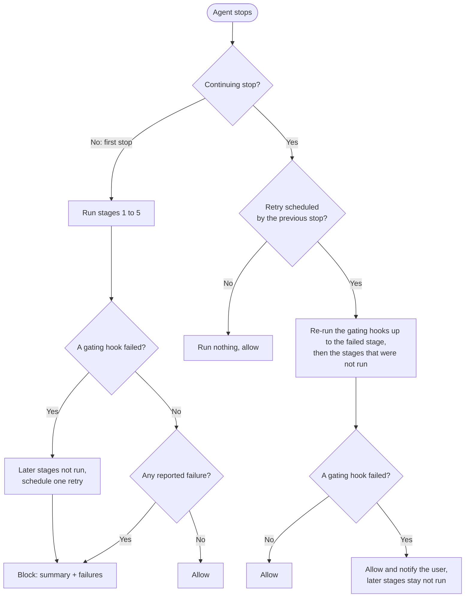

# Configuration

Default location: `~/.config/claw-hooks/config.toml` (all platforms)

```toml
# Command blocking
rm_block = true                    # Block rm/rmdir/del/erase (default: true)
kill_block = true                  # Block kill/pkill/killall/taskkill (default: true)
dd_block = true                    # Block dd command (default: true)

# Custom messages (recommended: use with safe-rm/safe-kill tools)
# safe-rm: https://github.com/owayo/safe-rm
# safe-kill: https://github.com/owayo/safe-kill
rm_block_message = "🚫 Use safe-rm instead: safe-rm <file> (validates Git status and path containment). Only clean/ignored files in project allowed."
kill_block_message = "🚫 Use safe-kill instead: safe-kill <PID> or safe-kill -n <name> (like pkill). Use -s <signal> for signal."
dd_block_message = "🚫 dd command blocked for safety."

# Debug logging
debug = false
# log_path = "~/.config/claw-hooks/logs"  # default: same directory as config.toml
# A leading "~" is expanded to the home directory. A relative path would otherwise be
# resolved against the hook process's working directory, i.e. the repository being edited.
# Debug logs record hook event summaries and executable basenames only. Hook arguments,
# executable directories, file contents, and agent messages are not written.

# Hook command timeout in seconds (default: 60, max: 86400)
# Applies to reported stop hooks and extension hook commands.
# Commands exceeding this timeout will be killed (SIGKILL) and reported as failures.
# report=false stop hooks are started detached and are not waited on.
# Not used by command hooks: each checker run is limited by its own timeout.
# hook_timeout = 60

# Output max length in characters (default: 1000, 0 = unlimited)
# Prevents AI agent context window overflow from large lint/typecheck output
# output_max_length = 1000

# Custom command filters (regex supported)
[[custom_filters]]
command = "yarn"
message = "Use `pnpm` instead of `yarn`"

# Args mode: command (regex) + args matching
[[custom_filters]]
command = "npm"
args = ["install", "i", "add"]         # Blocks: npm install, npm i, npm add
message = "Use `pnpm` instead of `npm`"

[[custom_filters]]
command = "pip3?"                       # Regex: matches pip or pip3
args = ["install", "uninstall"]
message = "Use `uv pip` instead"

# Regex-only mode (when args is not specified)
[[custom_filters]]
command = "python[23]? -m pip"         # More complex patterns
message = "Use `uv pip` instead"

[[custom_filters]]
command = "docker"
args = ["rm", "rmi", "system prune"]   # Blocks: docker rm, docker rmi
message = "Ask the user to run this command manually"

# Command hooks: pass each call of a program in a shell command to an external checker
# before the command runs (global config only; see "Command Hooks" below)
# [[command_hooks]]
# command = "gws"                  # program name (basename, extension and case are normalized)
# run = "noslop hook command"      # checker command line (no shell; cmd /c on Windows)
# timeout = 5                      # seconds per checker run (default: 5)
# on_error = "allow"               # "allow" (default) or "block" when the checker fails

# Extension hooks (triggered on file write/edit)
# Map format: ".ext" = ["cmd1 {file}", "cmd2 {file}"]
# An entry can also be a table with a condition (the same fields as stop hooks),
# so an optional tool runs only where it is installed (see "Conditional Entries" below)
# The "*" key matches every edited file, including files without an extension
# (Makefile) and dotfiles (.gitignore). For each file, the commands of its extension
# run first in the order written, then the "*" commands in the order written, so a
# linter under "*" sees the formatter's rewrite. Where "*" sits in the table does
# not matter. See "Extension Hook Rules" below for what to run under "*".
# Output (stdout/stderr) is passed as additionalContext where the hook runtime supports it
# Each command template must contain exactly one {file}
# Parent-directory traversal paths (../) are rejected for safety
# Shell redirection metacharacters (<, >) in file paths are rejected for safety
# Tabs/newlines/NUL are rejected to prevent argument splitting and malformed paths
# cmd metacharacters (%, !, ^, ") are rejected on every platform; under Windows' cmd /c they would expand variables
[extension_hooks]
".css" = ["biome format --write {file}", "biome lint --write {file}"]
".go" = [
  "gofmt -w {file}",
  { command = "golangci-lint run {file}", condition = { command_exists = "golangci-lint" } },
]
".py" = ["ruff format --check {file}", "ruff check --preview --select=I,F,DOC {file}"]
".rs" = ["rustfmt {file}"]
".ts" = ["biome check {file}"]
".tsx" = ["biome check {file}"]
"*" = ["noslop hook file {file}"]

# Stop hooks (triggered when agent loop ends)
# All commands in the array are executed in parallel.
# Hooks without a condition default to report=false and are started detached;
# stdout/stderr are discarded, so redirect output yourself if needed.
# Stages run in order (stage = 1-5, default 5). When a reported hook fails, the later
# stages do not run; gate = false on that hook returns the failure without stopping them.
# [[stop_hooks]]
# commands = ["afplay /System/Library/Sounds/Glass.aiff"]  # macOS notification sound

# [[stop_hooks]]
# commands = ["notify-send 'Agent completed'"]  # Linux notification

# Conditional stop hooks (project-wide lint on stop)
# Detects project type by file existence and tool availability.
# On failure, the result is returned to the AI agent so it can fix the issues
# on runtimes that support stop-time feedback (Windsurf and Grok CLI remain best-effort).
# condition fields (AND logic): file_exists, file_not_exists, command_exists, command_not_exists
[[stop_hooks]]
commands = ["cargo clippy --all-targets --all-features -- -D warnings", "cargo fmt --check"]
condition = { file_exists = "Cargo.toml" }

[[stop_hooks]]
commands = ["pnpm exec tsc --noEmit"]
condition = { file_exists = "tsconfig.json" }

[[stop_hooks]]
commands = ["ruff format .", "ruff check --preview --fix --select=I,F,DOC --unsafe-fixes"]
condition = { file_exists = "pyproject.toml", command_exists = "ruff" }

[[stop_hooks]]
commands = ["biome check --write ."]
condition = { file_exists = "package.json" }
```

## Per-Project Configuration

claw-hooks uses a global configuration file (`~/.config/claw-hooks/config.toml`) by default. You can customize behavior per project in three ways:

**1. `.claw-hooks.toml` — Auto-detected project config (recommended)**

Place a `.claw-hooks.toml` in your project root. claw-hooks automatically detects it in the current working directory and merges it with the global config. No `--config` flag needed.

```toml
# my-project/.claw-hooks.toml

# Turn on a guard this project needs (enabling is always allowed)
dd_block = true

# Add project-specific filters on top of the global ones
[[custom_filters]]
command = "yarn"
message = "Use pnpm instead"
```

**Merge rules.** A `.claw-hooks.toml` is also "a file inside a repository your agent just cloned", so it is treated as untrusted input: a project config may **strengthen** protection but never weaken it, and it can never introduce a new command execution.

| Field | Rule | Behavior |
|-------|------|----------|
| `rm_block`, `kill_block`, `dd_block` | **Enable only** | `true` is honored; `false` is ignored with a warning |
| `custom_filters` | **Add only** | Project entries are appended; global entries are never removed or replaced |
| `stop_hooks` | **Ignored** | Would run arbitrary commands when the agent stops |
| `extension_hooks` | **Ignored** | Would run arbitrary commands on every file edit |
| `command_hooks` | **Ignored** | Would run arbitrary commands before matching shell commands |
| `*_block_message`, `hook_timeout`, `output_max_length` | **Replace** | Project value takes precedence (none of these weaken a decision) |
| `debug`, `log_path`, `nano_buddy` | **Global only** | Rejected as an error |

Omitted fields keep the global value. Ignored entries are reported as warnings, so a setting that has no effect is visible rather than silently dropped. Because `stop_hooks`, `extension_hooks`, and `command_hooks` are discarded rather than applied, they are accepted in any shape and are **not validated** — a malformed entry, an unknown field such as a mistyped `condition`, or even a value of the wrong type (`stop_hooks = "x"`) is ignored with a warning like a well-formed entry, instead of failing the whole config load, which would otherwise let two lines in a cloned repository deny every command in that directory. The global `config.toml` is validated strictly, unknown fields in `condition` included.

Validate with `claw-hooks check` — it reports whether a project config was found, whether it's valid, which entries are ignored, and any unknown (mistyped) keys (see [Checking the Configuration](#checking-the-configuration)).

> **Per-project formatters and linters.** Declare `extension_hooks` and `stop_hooks` in the global `config.toml` and target them with `condition = { file_exists = "…" }` (an extension hook entry takes a condition in its table form; see [Conditional Entries](#conditional-entries)) — that gives per-project behavior without letting a repository decide what runs on your machine. Entries in a project config are ignored and reported by `claw-hooks check`.

> **`hook_timeout = 0` is rejected.** It does not mean "unlimited" (only `output_max_length` uses `0` that way) — it would make every hook time out instantly. Because claw-hooks fails closed on an invalid config, a config with it denies every command until it is fixed; `claw-hooks check` names the problem.

> **Custom filters normalize the command name** the same way the built-in `rm`/`kill`/`dd` filters do, so `/usr/bin/npm`, `./npm`, `NPM` and `npm.cmd` all match a `command = "npm"` filter.

**2. `--config` — Full config replacement**

Use `--config` to specify a complete configuration file, replacing the global config entirely:

```toml
# my-project/.claude/claw-hooks.toml
rm_block = true
kill_block = true
dd_block = false  # Allow dd in this project

[extension_hooks]
".rs" = ["rustfmt {file}"]
```

```json
// my-project/.claude/settings.json
{
  "hooks": {
    "PreToolUse": [{
      "matcher": "Bash|PowerShell",
      "hooks": [{ "type": "command", "command": "claw-hooks hook --config .claude/claw-hooks.toml" }]
    }],
    "PostToolUse": [{
      "matcher": "Write|Edit|MultiEdit|NotebookEdit",
      "hooks": [{ "type": "command", "command": "claw-hooks hook --config .claude/claw-hooks.toml" }]
    }],
    "Stop": [{
      "matcher": "",
      "hooks": [{ "type": "command", "command": "claw-hooks hook --config .claude/claw-hooks.toml" }]
    }]
  }
}
```

**3. Conditional stop hooks — Automatic project detection**

Stop hooks with `file_exists` conditions automatically adapt to the project type based on the working directory. A single global config can handle multiple project types:

```toml
# ~/.config/claw-hooks/config.toml

# Runs only in Rust projects (where Cargo.toml exists)
[[stop_hooks]]
commands = ["cargo clippy -- -D warnings"]
condition = { file_exists = "Cargo.toml" }

# Runs only in TypeScript projects (where tsconfig.json exists)
[[stop_hooks]]
commands = ["pnpm exec tsc --noEmit"]
condition = { file_exists = "tsconfig.json" }
```

All three approaches can be combined: use the global config for shared rules, `.claw-hooks.toml` for project-specific overrides, and conditional stop hooks for automatic project-type detection.

## Conditional Stop Hooks (Project-wide Lint)

Stop hooks with a `condition` field run lint/typecheck commands based on the project type. All commands in the `commands` array are executed **in parallel**. When any command fails (non-zero exit), all failure outputs are collected and returned to the AI agent as a block reason, prompting it to fix the issues. A failing hook also keeps the later stages from running unless it sets `gate = false`; what the agent is told and when those stages get to run are covered in [Stop Hook Failures and Retry](#stop-hook-failures-and-retry).

**Timeout handling:** `hook_timeout` accepts values up to `86400` seconds. For reported stop hooks (`report = true`), when a command exceeds `hook_timeout`, claw-hooks kills the process tree (SIGKILL) and returns the timeout as a block reason. A direct child that exits while a background grandchild still keeps stdout/stderr pipes open is also treated as timed out, so commands like `sh -c 'sleep 60 &'` cannot bypass the hook timeout. Normal command failures — including those that explicitly exit with code `124` — also block as usual. `report = false` stop hooks are started detached with stdin/stdout/stderr set to null, so claw-hooks does not wait for them or enforce `hook_timeout`; wrap the command itself with a timeout tool if needed.

Windsurf and Grok CLI are the exceptions here: Windsurf's `post_cascade_response` is an asynchronous post-hook, and every Grok event except `PreToolUse` is a post-hook whose stdout the agent ignores. On both, stop hooks still run but failures are treated as best-effort and are not surfaced back to the agent as a block.

**Stop hook fields:**

| Field | Type | Default | Description |
|-------|------|---------|-------------|
| `commands` | `string[]` | (required) | Commands to execute (in parallel within the same stage) |
| `condition` | `object` | (none) | Execution condition (AND logic: `file_exists`, `file_not_exists`, `command_exists`, `command_not_exists`) |
| `stage` | `1-5` | `5` | Execution order. Lower stages run first. Hooks in the same stage run in parallel. |
| `report` | `bool` | (auto) | Whether to report results to the AI agent. Default: `true` if `condition` is set, `false` otherwise. |
| `gate` | `bool` | `true` | Whether a failure of this hook keeps the later stages from running. Takes effect only on a reported hook (`report = true`); with `false`, the failure is still returned to the agent but the later stages run. `claw-hooks check` warns about `gate = true` on a `report = false` hook, whose result is never checked. |
| `session_scope` | `"primary"` \| `"delegated"` \| `"all"` | `"primary"` | Which session kind runs this hook. `primary` = main session only, `delegated` = delegated agent sessions (e.g. Claude Code teammates) only, `all` = both. |

**Condition fields** (AND logic — all specified conditions must be true):

| Field | Description |
|-------|-------------|
| `file_exists` | Run only when this file exists in the working directory |
| `file_not_exists` | Run only when this file does NOT exist in the working directory (useful for fallbacks such as "no lockfile of type X here") |
| `command_exists` | Run only when this command is available in PATH (Windows `PATHEXT` is respected; on Unix the file must have an executable bit; explicit paths like `./tool` or `/usr/bin/tool` are also supported) |
| `command_not_exists` | Run only when this command is NOT available in PATH |

A condition is evaluated right before its stage starts, so it can test for a file that an earlier stage created. Unknown fields in `condition` and empty strings are configuration errors. When a condition cannot be evaluated — the existence of the file cannot be checked, for example because of a permission error — a gating hook (below) counts as failed, with `could not evaluate condition.<field> (<error>)` as its output, and any other hook is skipped with a warning in the debug log. Treating the error as "condition not met" would let a required check be skipped and the stages after it run.

> **Behavior change (after v26.9.104).** Unknown fields in `condition` are now a configuration error, for stop hooks and extension hooks alike. A typo such as `command_exits` used to be ignored, so the hook ran as if it had no condition. Run `claw-hooks check` after upgrading: an invalid global config makes claw-hooks deny every command until it is fixed.

```toml
# Stage-based execution: analysis → lint → commit
[[stop_hooks]]
commands = ["astro-sight review --dir . --git --hook"]
stage = 1        # Run first
report = true    # Return results to AI; a failure keeps stages 2-5 from running

[[stop_hooks]]
commands = ["noslop hook git-diff --max-chars 900"]
stage = 1
report = true
gate = false     # Return results to AI, but do not stop the later stages

[[stop_hooks]]
commands = ["cargo clippy --all-targets --all-features -- -D warnings", "cargo fmt --check"]
condition = { file_exists = "Cargo.toml" }
stage = 3
# report not set → condition present → true (default)

[[stop_hooks]]
commands = ["pnpm exec tsc --noEmit"]
condition = { file_exists = "tsconfig.json" }
stage = 3

[[stop_hooks]]
commands = ["git-sc --all --yes --quiet"]
# stage not set → 5 (last): runs only when no gating hook in stages 1-4 failed
# report not set → no condition → false (fire-and-forget)
```

**Stage execution order:** Stages run one after another, from 1 to 5, and all hooks in the same stage run in parallel. The next stage begins only after every reported hook of the current stage has finished. When a reported hook fails — its command exits non-zero, runs past `hook_timeout`, or cannot be started — the rest of its stage still runs to the end, and then the later stages are not run, unless that hook sets `gate = false`. Hooks that stop the later stages this way are called *gating* hooks below: every `report = true` hook whose `gate` is not `false`. `report = false` hooks are started when their stage begins and are never waited on, so they cannot stop the later stages.

Three consequences are worth planning for:

- **Put a check and a commit in different stages.** Hooks in one stage start together, so a commit in the same stage as a check has already started by the time the check fails.
- **Do not make a later stage depend on a detached hook.** A `report = false` hook is not part of its stage's wait, so a formatter started that way can still be rewriting files while the next stage checks them.
- **Do not put `command_exists` on a check that later stages rely on.** When the tool is not installed, the condition skips the hook, the stage passes, and a commit in a later stage runs without the check. Without a condition, a missing tool is a start failure, which stops the later stages. Conditions are for optional tools.

> **Behavior change (after v26.9.104).** A failing `report = true` hook now keeps the later stages from running. Previously every stage ran regardless, so a `git-sc` hook in stage 5 could commit, and push, changes that a stage 1 check had just rejected, before the agent even saw the failure. To keep the old behavior for a hook, set `gate = false` on it.

**Report behavior:** When `report = true` (or defaulting to true via `condition`), command failures are collected and returned to the AI agent as a block reason, which starts with a summary of the failed stages and the stages that were not run. When `report = false` (or defaulting to false without `condition`), commands are started fire-and-forget style and do not block the hook response. Detached commands run with stdin/stdout/stderr set to null; spawn failures are logged, but command output and exit status are not collected. On Windsurf and Grok CLI stop hooks, failures are always best-effort — the underlying hook is asynchronous (Windsurf) or its stdout is ignored (Grok).

**Session scope (agent-session suppression):** claw-hooks tells a delegated agent session from the main one automatically: a delegated Stop payload carries both non-blank `agent_id` and `agent_type` fields (`agent_id` is documented as present only when the hook fires inside a subagent call). A main session launched with `--agent` can also carry `agent_type`, but it does not carry the subagent-specific `agent_id`, so it remains primary. By default (`session_scope = "primary"`), stop hooks run **only when the main session stops**, so a fleet of teammates does not trigger notification spam, redundant lints, or racing parallel `git` auto-commits. Set `session_scope = "all"` on a hook to restore the old run-everywhere behavior, or `"delegated"` for hooks that should run only for agent sessions (e.g. per-teammate cleanup). Missing, blank, or non-string discriminator fields fall back to primary; agents without a session-kind signal (Cursor, Windsurf, Codex CLI, Antigravity, Grok CLI) are also treated as the main session.

> **Agent-team teammates are out of scope.** Teammates run in-process and announce completion through Claude Code's separate `TeammateIdle` event, which claw-hooks deliberately does not handle: that event carries no loop counter (no `stop_hook_active`, no `loop_count`), and its only way to report a failure is "keep the teammate working", which a permanently failing lint would turn into an endless loop. **Stop-time lint and notifications therefore do not run when a teammate goes idle.**

```toml
# Runs only when the main session stops (default — no field needed)
[[stop_hooks]]
commands = ["cargo clippy --all-targets --all-features -- -D warnings"]
condition = { file_exists = "Cargo.toml" }

# Runs for both the main session and delegated agent sessions
[[stop_hooks]]
commands = ["collect-metrics"]
report = false
session_scope = "all"
```

```toml
# More examples:

# Python: run ruff format/check when pyproject.toml exists and ruff is installed
[[stop_hooks]]
commands = ["ruff format .", "ruff check --preview --fix --select=I,F,DOC --unsafe-fixes"]
condition = { file_exists = "pyproject.toml", command_exists = "ruff" }

# JavaScript/TypeScript: run biome check when package.json exists
[[stop_hooks]]
commands = ["biome check --write ."]
condition = { file_exists = "package.json" }
```

## Stop Hook Failures and Retry

When a reported stop hook fails, claw-hooks returns the failure to the agent as a block reason and the agent keeps working to fix it: on Claude Code and Codex CLI the reason becomes the agent's next instruction, and on Cursor it is sent as a follow-up message. A failing gating hook also keeps the later stages from running (see *Stage execution order* under [Conditional Stop Hooks](#conditional-stop-hooks-project-wide-lint)). This section covers what the agent is told, and when the stages that were not run get their turn.



A retry is scheduled only on the agents that report a continuing stop (see [One Retry at the Next Stop](#one-retry-at-the-next-stop)); elsewhere the "schedule one retry" step is left out.

### The Block Reason

The block reason starts with a summary, followed by a blank line and the output of each failed hook:

```text
Stop hooks failed: stage 1 [astro-sight, noslop].
Not run because a stage 1 hook failed: stage 5 [git-sc].
One retry is scheduled: at the next stop, the reported hooks up to stage 1 run again, and the stages that were not run start if they pass.

Stop hook failed: astro-sight
…

Stop hook failed: noslop
…
```

- The first line lists every stage with a failed hook, in stage order.
- The second line appears only when a gating failure kept hooks in later stages from running. It names those hooks: the ones whose `session_scope` matches and whose condition holds at that moment (or cannot be evaluated).
- The third line appears only when a retry was scheduled.
- Hooks are named by program, the first word of each command, so `git-sc --all --yes --quiet` appears as `git-sc`. A stage lists at most 8 names, followed by `and N more`.

The whole reason is truncated to `output_max_length` (1000 characters by default) and keeps its beginning, so the summary survives even when a long lint output is cut off.

### One Retry at the Next Stop

After a block, the agent fixes the failures and stops again. That second stop is a *continuing* stop — `stop_hook_active: true` on Claude Code and Codex CLI, `loop_count` 1 on Cursor — where claw-hooks normally runs no stop hooks, because running them again could return another block and keep the agent going forever. Without an exception, the stages that were not run (a commit, say) would wait for the stop at the end of the next turn, even after the agent had fixed everything.

So when a gating failure keeps hooks in later stages from running, claw-hooks schedules one retry for that continuing stop:

1. The gating hooks in the failed stage and in the stages before it run again. Hooks with `gate = false` and detached hooks in those stages already ran at the first stop and do not run again.
2. If they all pass, the stages that were not run start — every hook in them whose condition holds, detached ones included — and the agent is allowed to stop.
3. If a gating hook fails during the retry, whether it failed before or sits in a stage that had not run, the stages after it are not run and the agent is still allowed to stop. The retry never returns a block, so it cannot start a loop; the user is notified instead (below), and no further retry is scheduled.

A hook with `gate = false` in a stage that had not run can also fail during the retry; that failure is only written to the debug log. The retry runs at most once, and only at the continuing stop right after the block: a later continuing stop runs nothing, as before. If the `[[stop_hooks]]` configuration changed between the two stops, no hook runs and the user is notified that the retry was skipped. A retry that was never used is discarded at the next first stop, which runs every stage again anyway.

A retry is scheduled only when all of the following hold. When it is not, the block reason has no third line, and the stages that were not run wait for the next turn's stop.

- The agent is Claude Code, Codex CLI, or Cursor. The other agents cannot tell claw-hooks that a stop is a continuing one (see below).
- The agent sent a session ID: `session_id` on Claude Code and Codex CLI, `conversation_id` on Cursor.
- The stop comes from the main session, not a delegated one (see `session_scope` above).
- claw-hooks could write the retry record to its state directory (`~/Library/Caches/claw-hooks` on macOS, `~/.cache/claw-hooks` on Linux, `%LOCALAPPDATA%\claw-hooks` on Windows; see [State Files](cli-reference.md#state-files)).

### Notices to the User

When the retry fails or is skipped, claw-hooks allows the stop and tells the user rather than the agent, because telling the agent would mean asking it to keep working:

```text
claw-hooks: stop hook retry failed at stage 1 [astro-sight]. Not run: stage 5 [git-sc]. No further retry is scheduled.
claw-hooks: the stop hook configuration changed after the failed stop, so the scheduled retry was skipped. Later stages were not run.
```

| Agent | How the notice is shown |
|---|---|
| Claude Code, Codex CLI | As `{"systemMessage":"…"}`, a warning for the user. It carries no decision and does not continue the conversation, so the agent still stops |
| Cursor | Not shown: Cursor's stop output has only `followup_message`, which would send the text back to the agent as a new message. The notice is written to the debug log |

On macOS with `nano_buddy = true`, NanoBuddy also shows the outcome in a speech bubble.

### Windsurf, Grok CLI, and Antigravity CLI

The gate works the same way on every agent: a failing gating hook keeps the later stages from running. These three agents send nothing that marks a stop as a continuing one, so no retry is scheduled:

- **Windsurf and Grok CLI** run stop hooks as post-hooks, so the failure is not returned to the agent. The stages that were not run start at the next stop where the checks pass; until then, the debug log records which stages were skipped.
- **Antigravity CLI** returns the failure with `"decision":"continue"`, and the following stop arrives as a new first stop, which runs every stage again. Give reported hooks an exit condition of their own there: claw-hooks cannot tell a loop from a new stop on Antigravity (see [Agent Integration](integrations.md#antigravity-cli)).

## Stop Hook Environment Variables

claw-hooks passes the following environment variables to stop hook child processes:

| Variable | Description |
|----------|-------------|
| `CLAW_HOOKS_STOP_ACTIVE` | Always set to `1`. Prevents recursive stop hook execution when a child process triggers another claw-hooks stop event. |
| `CLAW_HOOKS_AGENT_MESSAGE` | The AI agent's last message before stopping (if available). Contains what the agent was working on. |

**`CLAW_HOOKS_AGENT_MESSAGE`** is populated from:
- **Claude Code**: `last_assistant_message` field in the Stop event
- **Windsurf**: `response` field in the `post_cascade_response` event
- **Cursor**: Not available

This is useful for tools that benefit from knowing the agent's context. For example, [git-sc](https://github.com/owayo/git-smart-commit) uses this to generate more accurate commit messages:

```toml
[[stop_hooks]]
commands = ["git-sc --all --yes --quiet"]
```

When git-sc runs as a stop hook, it reads `CLAW_HOOKS_AGENT_MESSAGE` and includes the agent's context in the AI prompt, resulting in commit messages that reflect the intent of the changes rather than just the raw diff.

## Custom Filter Behavior

Custom filters support two modes:

**Regex mode** (default): When only `command` is specified, it's treated as a regex pattern.

```toml
[[custom_filters]]
command = "python[23]? -m pip"    # Complex regex pattern
message = "Use uv pip instead"
```

**Args mode**: When `args` is specified, `command` is treated as a regex pattern (matched against the command name) and any of the args triggers the filter.

```toml
[[custom_filters]]
command = "npm"                    # Regex pattern for command name
args = ["install", "i", "add"]     # First argument must match one of these
message = "Use pnpm instead"

[[custom_filters]]
command = "pip3?"                  # Matches both pip and pip3
args = ["install", "uninstall"]    # First argument must match one of these
message = "Use uv pip instead"
```

Both modes detect commands even when chained with `;`, `&&`, `||`, or `|`:

```bash
# Blocked: yarn is detected after semicolon
echo "install"; yarn install
# → {"hookSpecificOutput":{"hookEventName":"PreToolUse","permissionDecision":"deny","permissionDecisionReason":"Use `pnpm` instead of `yarn`"}}

# Allowed: "yarn" is inside quotes (not a command), pnpm is OK
echo "not yarn install"; pnpm install
# → {}
```

Commands inside quotes are ignored (they're arguments, not commands).

## Command Hooks

A command hook passes each call of one program in a shell command to an external checker before the command runs. The checker blocks the command, adds context for the agent, or does nothing. claw-hooks finds the calls with the same parser it uses for dangerous commands, so a call behind a wrapper (`sudo gws …`) or inside `bash -c '…'` is found as well. The checker receives the arguments of that one call after quote removal, not the command string.

```toml
[[command_hooks]]
command = "gws"
run = "noslop hook command"
timeout = 5
on_error = "allow"
```

| Field | Type | Default | Description |
|-------|------|---------|-------------|
| `command` | `string` | (required) | Program name to match. A name, not a regular expression, and it cannot contain whitespace |
| `run` | `string` | (required) | The checker's command line |
| `timeout` | `integer` | `5` | Seconds allowed for one checker run, from `1` to `86400` |
| `on_error` | `"allow"` \| `"block"` | `"allow"` | What to do when the checker fails (see below) |

**Matching.** `command` and the program name of each call are both normalized the way the built-in filters normalize names (basename, the `.exe` / `.cmd` / `.bat` / `.com` extension removed, lowercase) and must then be equal. `command = "gws"` therefore matches `gws`, `/usr/local/bin/gws`, `GWS` and `gws.exe`, and a path written in `command` matches by its basename alone. A call whose program name is only known at run time (`$CMD args`) matches no hook.

**Starting the checker.** `run` is split into words the way a shell splits them, honoring quotes and backslashes. On Linux and macOS the program is then started directly, without a shell, so pipes, redirections, variables and globs in `run` are not interpreted. On Windows it is started through `cmd /c`, as extension and stop hooks are, so that `.cmd` / `.bat` wrappers resolve. On every platform the call being checked reaches the checker only on stdin, never on its command line.

**Failures.** The checker fails when it exits with a code other than `0` or `2`, is killed by a signal, cannot be started, or runs out of time. With `on_error = "allow"`, the command goes through and the failure is recorded only as a warning in the debug log, so a broken advisory checker such as a linter does not stop the agent. With `on_error = "block"`, the command is blocked with a reason such as `[noslop] command hook failed: timed out after 5s`.

**Timeouts.** Each checker run is limited by its hook's own `timeout` alone. `hook_timeout` does not apply to command hooks: a project `.claw-hooks.toml` can override `hook_timeout`, so using it as the checkers' time budget would let a repository time out an `on_error = "allow"` checker and slip the command past it. A hook event makes at most 32 checker runs, so the checks for one command take at most 32 runs of `timeout` seconds each (160 seconds with the default).

**Global config only.** A `command_hooks` entry in a project `.claw-hooks.toml` is ignored with a warning and is not validated. A checker is an arbitrary command that would run before every matching shell command, so it gets the same treatment as `stop_hooks` and `extension_hooks` (see [Per-Project Configuration](#per-project-configuration)).

What the checker receives, how its exit code is read, which agents receive its context, and the order and limits of checker runs: [Command Hook Protocol](cli-reference.md#command-hook-protocol)

## Extension Hook Rules

- A key is either a file extension starting with `.` (`".rs"`) or `"*"`. There are no glob or file-name keys: any other key, such as `"*.rs"`, `"**"`, `"*.{yml,yaml}"`, `"rs"` (no dot), or `"Makefile"`, is a configuration error, and `claw-hooks check` fails on it.
- Extensions are matched case-sensitively, so `.RS` does not match `".rs"`. A dotfile such as `.gitignore` counts as having no extension, so only `"*"` applies to it.
- `"*"` applies to every edited file, including files without an extension (`Makefile`, `Dockerfile`) and dotfiles (`.gitignore`, `.env`).
- For each file, the commands of the matching extension key run first in the order written, then the `"*"` commands in the order written, so a linter under `"*"` sees the file after the formatter has rewritten it. Where `"*"` appears in the TOML table does not change this order. When one edit changes several files (Codex `apply_patch`), each file goes through this sequence on its own.
- A command listed under both an extension key and `"*"` runs twice, as written; duplicates are not removed. When the two entries are exactly equal — the same command string and the same condition — `claw-hooks check` prints a warning (the config is still valid), and the same warning goes to the debug log when the hook runs. This catches a command left under an extension key after it was moved to `"*"`.
- Each command template must contain exactly one `{file}` placeholder, and `{file}` cannot be the program itself.
- An entry is either a command string or a table `{ command = "…", condition = { … } }`, which runs the command only when the condition holds (see [Conditional Entries](#conditional-entries)). The table accepts no other fields.
- A command that cannot be started is reported with its program name and the cause, and a program that is missing is reported once per session (see [When a Command Cannot Be Started](#when-a-command-cannot-be-started)).
- Runs on post-save/post-edit only: Claude `PostToolUse` (`Write`/`Edit`/`MultiEdit`/`NotebookEdit`), Cursor `afterFileEdit`, Windsurf `post_write_code`, Codex `PostToolUse` with `apply_patch`, Grok `PostToolUse` with a file path in `toolInput`, and Antigravity `PostToolUse` when the hook entry passes `--event PostToolUse` (the edited path comes from `toolCall.args.TargetFile`). Antigravity's post-hook output is fixed at `{}`, so diagnostics can't be returned there — use Stop hooks when you need the lint text itself.
- Codex `PostToolUse` + `Bash` passes through; `apply_patch` is parsed for changed file paths (delete-only patches are skipped).
- Grok `PostToolUse` runs the hooks whenever `toolInput` carries `file_path` / `filePath`, so formatters still rewrite the file. Grok ignores post-hook stdout, though, so the lint text itself is not returned to the agent.
- A file path is rejected when it contains `../`, starts with `-`, or contains any of `` ` ``, `$`, `|`, `&`, `;`, `<`, `>`, `%`, `!`, `^`, `"`, a tab, a newline, or NUL. None of that file's commands start, and the agent receives a single `[ERROR] <reason>` for the file rather than one per command. Agent payloads missing required fields fail closed.
- `hook_timeout` applies to each command separately, and the output returned to the agent is truncated at `output_max_length`.
- Successful no-op formatter/linter notices are not returned to the agent. Output that reports a rewritten file, a warning, or a failure remains visible; command labels expose only the configured program name, not the expanded file path or argument summary.
- Extension hooks, `"*"` included, are read from the global config only. `extension_hooks` in a project `.claw-hooks.toml` is ignored with a warning (see [Per-Project Configuration](#per-project-configuration)).

> **What to run under `"*"`.** `"*"` is meant for a tool that decides for itself which files to check and prints nothing for files it skips or finds clean, such as `noslop hook file {file}`. With such a tool, the list of target extensions lives only in the tool's own configuration instead of in both places. Because `"*"` commands start on every edit and receive binary and very large files too, pick tools that finish quickly on files they do not handle.

### Conditional Entries

```toml
[extension_hooks]
".go" = [
  "gofmt -w {file}",
  { command = "golangci-lint run {file}", condition = { command_exists = "golangci-lint" } },
]
```

The table form takes the same `condition` as a stop hook: `file_exists`, `file_not_exists`, `command_exists`, and `command_not_exists`, all of which must hold, with relative paths resolved against the hook process's working directory as for stop hooks. The condition is checked right before its command would run, for each edited file. When it does not hold, only that command is skipped and nothing is returned to the agent; the other commands for the file run as usual. When it cannot be evaluated (the existence of a file cannot be checked), the command is skipped as well, with a warning in the debug log. Unknown fields, in the table or in `condition`, are configuration errors, and so is an empty string in `condition`: a mistyped `condtion` or `command_exits` would otherwise leave the command running unconditionally.

Use a condition for an optional tool, one that is installed on some machines and not on others: where it is missing, it is skipped quietly. Leave the condition off for a tool every machine is expected to have: where it is missing, the agent is told so (below), instead of the check silently not happening.

### When a Command Cannot Be Started

When a command cannot be started, the agent receives one line that names the program and the cause, in place of that command's output. The other commands for the file still run and report as usual, so a missing linter no longer looks like every hook for the extension broke:

| Cause | Returned to the agent |
|---|---|
| The program has no path separator and is not in `PATH` | `[golangci-lint] not started: command not found in PATH` |
| The program is a path (it contains `/` or `\`) and nothing exists there | `[lint] not started: command not found at the configured path` |
| The program was found, or could not be checked, yet starting it reported "not found" — for example a script whose `#!` interpreter is missing | `[lint] not started: executable or required interpreter not found` |
| The file may not be executed | `[lint] not started: permission denied` |
| Any other start failure | `[lint] not started: <error kind>` |
| The command started, but its result could not be collected | `[lint] execution result unavailable: failed to wait for the process` |

The label is the program's file name only, never its directory or the path of the edited file, and the debug log records only the label, the kind of error, and the OS error code.

**A missing program is reported once per session.** For the first two causes, where the program is known to be absent, the line is returned at the first edit that runs into it and ends with `. This notice is not repeated in this session.`, as in `[golangci-lint] not started: command not found in PATH. This notice is not repeated in this session.` Later edits in the same session return nothing for that program; only the debug log records them. claw-hooks still tries to start the command on every edit, so installing the tool in the middle of a session makes it work from the next edit on. The other causes are returned on every edit, because they do not show that the program is simply not installed: the tool may be there but unable to run, which is worth repeating until it is fixed.

"The same program" means the same agent, the same session, and the same program as written in the config (after quote removal); for a relative path such as `./bin/lint`, the working directory must match too. `golangci-lint` under `".go"` and under `"*"` therefore share one notice, while `golangci-lint` and `/usr/local/bin/golangci-lint` are two programs. The session comes from the agent's payload, and the notice reaches the agent only where extension hook output does:

| Agent | Session ID | Where the notice goes |
|---|---|---|
| Claude Code | `session_id` | `additionalContext` |
| Codex CLI | `session_id` | `additionalContext` |
| Windsurf | `trajectory_id` of `post_write_code` | exit 2 + stderr |
| Cursor | `conversation_id` | Nowhere: `afterFileEdit` has no output schema |
| Grok CLI | `sessionId` | Nowhere: post-hook stdout is ignored |
| Antigravity CLI | `conversationId`, when present | Nowhere: the output is fixed at `{}` |

Without a session ID, or when the state directory cannot be used, the notice is returned on every edit (still once per edit), without the closing sentence.

The record lives in claw-hooks' state directory: `~/Library/Caches/claw-hooks` on macOS, `$XDG_CACHE_HOME/claw-hooks` (by default `~/.cache/claw-hooks`) on Linux, and `%LOCALAPPDATA%\claw-hooks` on Windows (see [State Files](cli-reference.md#state-files)). The guarantee is deliberately loose. The notice is recorded when it is produced, not when the agent reads it, so it is not repeated even if the output was cut off by `output_max_length`. And a record that is deleted with the cache, or removed after 7 days, lets the notice come back once more; losing state can only make a notice appear again, never hide one.

On Windows, hooks are started through `cmd /c`, which itself starts even when the program is missing. The failure then comes back as `cmd`'s own message (`'golangci-lint' is not recognized as an internal or external command, …`) with the usual `[label]` prefix, on every edit. Exit code 9009 is not treated as "not found", because a real program can exit with it too.

## Checking the Configuration

`claw-hooks check` loads the configuration the same way a hook call does — the global config (or `--config`) merged with the `.claw-hooks.toml` of the current directory — and validates it. It exits `0` with `Configuration is valid.` when the config is valid, and `1` with the error when it is not.

Warnings are printed to stderr as `warning: …` lines (and written to the debug log when it is enabled). They do not make `check` fail:

- An unknown top-level key, such as a mistyped `rm_blok`.
- An entry in the project config that is ignored (see [Per-Project Configuration](#per-project-configuration)).
- An extension hook entry listed under both an extension key and `"*"` (see [Extension Hook Rules](#extension-hook-rules)).
- `gate = true` on a stop hook that is not reported: `stop_hooks[<i>]: gate = true has no effect because the hook is not reported (report = false starts it detached, so its result is never checked)`.
- A hook program that is not in `PATH`:

```text
warning: extension_hooks[".go"] command[1]: "golangci-lint" was not found in PATH (checked in this shell; the agent's hook environment may differ)
warning: stop_hooks[2] commands[0]: "git-sc" was not found in PATH (checked in this shell; the agent's hook environment may differ)
warning: command_hooks[0].run: "noslop" was not found in PATH (checked in this shell; the agent's hook environment may differ)
```

The program check looks at the first word of each extension hook entry, each stop hook command, and each command hook's `run`, and resolves it the way `command_exists` does, so an explicit path such as `./tool` is checked as a file and reported as `was not found at the configured path` rather than `in PATH`. It never runs the program, and it does not look inside a wrapper: for `sh -c '…'` or `env …`, only `sh` or `env` is checked. When the entry's own condition skips it in this shell — a `command_exists` naming a command that is missing as well, or a `command_not_exists` naming a command that is present — no warning is printed. File conditions (`file_exists`, `file_not_exists`) are not evaluated here, because they depend on the directory the hook runs in. The check runs only in `claw-hooks check`, never on a hook call, and it uses the `PATH` of the shell you run it from. An agent can start hooks with a different `PATH` (an app launched from the macOS Dock does not read your shell profile, for example), so a clean result does not guarantee that the agent finds every program.
